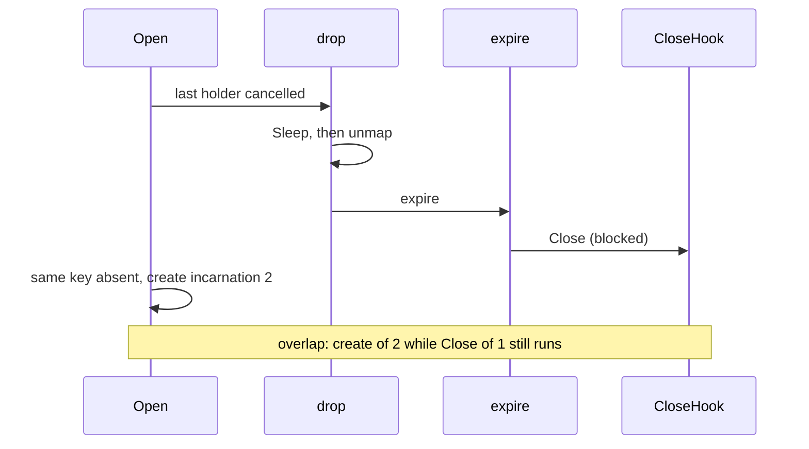

Developer review: in progress — 2026-09-13T05:59:39Z

## What this changes
**Operators.** None.

**Admin users.** None.

**Developers.** None.

**End users.** None.

## Motivation
The reclaim table stores one value per key and is supposed to Close that incarnation before a later Open creates the next one. On dest, zero grace (and expire after a positive grace) deletes the map entry first, then runs Close outside the table mutex. A concurrent Open sees the key gone and create()s while the previous Close hook is still running. Traefik reload is that sequence: the last New ctx is cancelled, then the next New Opens the same key.

Cost of not merging: two values for one key overlap — the old Close still in flight and a new create already started. A slow Close (database, file, Redis) can tear down the previous value after the next incarnation is live.

## Merge readiness
Prepare grounded the ticket and opened the stub PR. The failing overlap test and Close-before-unmap change are not in this diff. 1 item remains.

Priority: P1 — dest unmaps then Closes, so a reload Open can create the next value while the previous Close is still running
Reviewed head: 568a370
Owner decision: None.

## Review scores
| Measure | Result | What it means |
| --- | --- | --- |
| Overall readiness | 1/6 | CI not seen after push; prepare only |
| CI proof | 1/6 | pushed, checks not seen |
| Local tests proof | N/A | before implement; remote PR |
| Review resolution | 6/6 | OPEN PR, no review comments |

## Verification
| Check | Result | Evidence |
| --- | --- | --- |
| Branch | 2026-09-13-reclaim-bug-unmap-before-close pushed | git / origin |
| OpenSpec | none | `openspec/` |
| Pull request | https://github.com/david-garcia-garcia/traefik-middleware-utilities/pull/50 | pr-host List/Create |
| CI | not seen | pr-host CI |
| Local tests | none | handoff.yaml localTests |
| PR comments | no comments | none OPEN |

## Specs
None.

## Deviations from the ask
None.

## Follow-up issues
None.

## How this fits together
Local ticket `2026-09-13-reclaim-bug-unmap-before-close` is on that branch against `master`, stub PR #50. CI has not been seen yet.

## Explore Decisions
None.

## Before merge
- [P1] Close of an incarnation must finish before the key is absent for a new create (failing test first, then mapped `slotBusy` through Close)

## Findings
None.

## Axis review
None.

## Agent review details

### Review metrics
| Metric | Value | Why it matters |
| --- | --- | --- |
| Specs in this PR | none | Same list as ## Specs; do not paste diff --stat |
| Open reviewer comments walked | 0 FIX / 0 ANSWER / 0 open | Unanswered review is merge risk |
| Reviewed head | 568a370115cd4e9aefa5a909bc1e20e1c3c4c9af | Card must match the branch you measured |

### Stored data model
None.

### Technical review
Best possible solution: not in this diff; dest still unmaps then Closes. The agreed how is keep the key mapped `slotBusy` for the whole Close, then unmap and close(ready).

Do we have a high-confidence way to reproduce? Yes — `NewTable(0)`, Close hook signals then blocks, cancel last holder, Open the same key; create of incarnation 2 starts while Close of 1 is blocked (5/5 on dest).

Is this the best way to solve the issue? Yes — Open already waits on `slotBusy`; Close stays outside `t.mu`; zero grace still has no sleeping window.

### Evidence
What I checked:
- `origin/master` `1aee4b8` has `reclaim/` (`git ls-tree`)
- `reclaim/table.go` `drop` publishes `slotAsleep`, deletes at zero grace, then `expire`
- `reclaim/table.go` `expire` sets `slotGone`, deletes, then `dispose`/`runClose` outside `t.mu`
- `reclaim/table.go` `Open` creates when the key is absent; `slotBusy` waiters block on `ready`
- `reclaim/table_test.go` zero-grace tests do not fail on Close-vs-create overlap
- OPEN PR #50, comment inventory empty (GitHub MCP)

### Rank-up moves
None.
