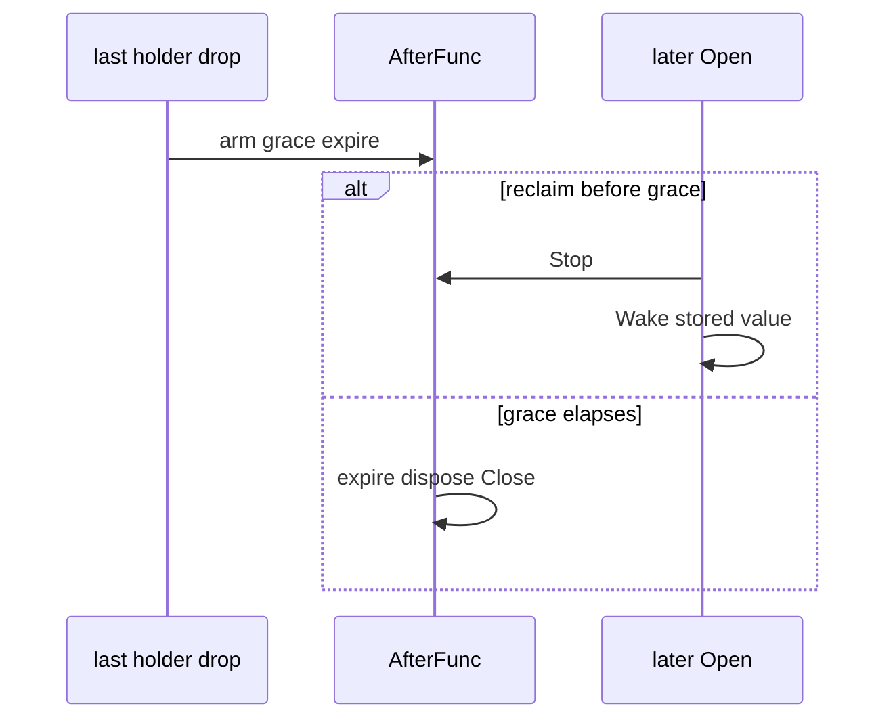

Developer review: ready for review — 2026-09-13T16:49:11Z

[sgsi-dev-ticket-status:2026-09-13-reclaim-bug-yaegi-grace-select]

## What this changes
**Operators.** None.

**Admin users.** None.

**Developers.** `reclaim` grace expire is a stdlib `time.AfterFunc` on the slot. `waitGraceOrWake` and the `woken` channel are gone. `TestYaegi_GraceExpireDoesNotHang` is the DestBranch hang.

**End users.** None.

## Motivation
Interpreted `reclaim` parked a grace waiter in Yaegi `_select`. On Go 1.21.13 a concurrent last-holder drop missed Close: `expire`, `dispose`, and `endMappedClose` never ran. A later `Open` could still reclaim. The Traefik plugin path arms `DefaultGrace` on every drop, so a missed timer leaked the stored value and its Close hook. Dest `go`+`select` is replaced with `AfterFunc`, the same fix as windowcounter PR #75.

## Merge readiness
Apply is on `master`. CI run 34769630345 succeeded. 0 items remain.

Priority: P1 — production Traefik plugin path can strand a grace waiter and never Close the stored value
Reviewed head: 3d96e06
Owner decision: None.

## Review scores
| Measure | Result | What it means |
| --- | --- | --- |
| Overall readiness | 6/6 | Ready |
| CI proof | 6/6 | All 8 checks succeeded — https://github.com/david-garcia-garcia/traefik-middleware-utilities/actions/runs/34769630345 |
| Local tests proof | N/A | Remote CI covers it |
| Review resolution | 6/6 | No PR comments |

## Verification
| Check | Result | Evidence |
| --- | --- | --- |
| Branch | 2026-09-13-reclaim-bug-yaegi-grace-select pushed | origin |
| OpenSpec | reclaim-afterfunc-grace archived | openspec/changes/archive/2026-09-13-reclaim-afterfunc-grace/ |
| Pull request | https://github.com/david-garcia-garcia/traefik-middleware-utilities/pull/80 | #80 |
| CI | build 34769630345 success https://github.com/david-garcia-garcia/traefik-middleware-utilities/actions/runs/34769630345 | 8/8 success |
| Local tests | passed | Go 1.21.13 watchdog `-count=10`; default 1.25.6 `./reclaim`; `go vet` clean |
| PR comments | no comments | none |

## Specs
- [std_go_reclaim_value-lifecycle](https://github.com/david-garcia-garcia/traefik-middleware-utilities/blob/2026-09-13-reclaim-bug-yaegi-grace-select/openspec/changes/archive/2026-09-13-reclaim-afterfunc-grace/proposal.md) — modified

## Deviations from the ask
None.

## Follow-up issues
None.

## How this fits together
Local spec → branch off `master` → PR #80. AfterFunc apply landed. CI 34769630345 green.

## Explore Decisions
None.

## Before merge
None.

## Findings
- [P1] Interpreted `waitGraceOrWake` missed the timer — fixed. Path: `reclaim/table.go` AfterFunc.

## Axis review
[Standards](https://github.com/david-garcia-garcia/traefik-middleware-utilities/blob/2026-09-13-reclaim-bug-yaegi-grace-select/devstate/2026/09/2026-09-13-reclaim-bug-yaegi-grace-select/codereview_standards.md) — 0 total, 0 pending, 0 completed
[Nitpicks](https://github.com/david-garcia-garcia/traefik-middleware-utilities/blob/2026-09-13-reclaim-bug-yaegi-grace-select/devstate/2026/09/2026-09-13-reclaim-bug-yaegi-grace-select/codereview_nitpicks.md) — 0 total, 0 pending, 0 completed
[Spec](https://github.com/david-garcia-garcia/traefik-middleware-utilities/blob/2026-09-13-reclaim-bug-yaegi-grace-select/devstate/2026/09/2026-09-13-reclaim-bug-yaegi-grace-select/codereview_spec.md) — 0 total, 0 pending, 0 completed
[Security](https://github.com/david-garcia-garcia/traefik-middleware-utilities/blob/2026-09-13-reclaim-bug-yaegi-grace-select/devstate/2026/09/2026-09-13-reclaim-bug-yaegi-grace-select/codereview_security.md) — 0 total, 0 pending, 0 completed
[Performance](https://github.com/david-garcia-garcia/traefik-middleware-utilities/blob/2026-09-13-reclaim-bug-yaegi-grace-select/devstate/2026/09/2026-09-13-reclaim-bug-yaegi-grace-select/codereview_performance.md) — 0 total, 0 pending, 0 completed
[Dead](https://github.com/david-garcia-garcia/traefik-middleware-utilities/blob/2026-09-13-reclaim-bug-yaegi-grace-select/devstate/2026/09/2026-09-13-reclaim-bug-yaegi-grace-select/codereview_dead.md) — 0 total, 0 pending, 0 completed
[Test coverage](https://github.com/david-garcia-garcia/traefik-middleware-utilities/blob/2026-09-13-reclaim-bug-yaegi-grace-select/devstate/2026/09/2026-09-13-reclaim-bug-yaegi-grace-select/codereview_coverage.md) — 0 total, 0 pending, 0 completed

## Agent review details

### Review metrics
| Metric | Value | Why it matters |
| --- | --- | --- |
| Specs in this PR | 0 added / 1 modified | value-lifecycle grace waiter |
| Open reviewer comments walked | 0 FIX / 0 ANSWER / 0 open | No comments |
| Reviewed head | 3d96e06f62bd88d47aefbfb94b9ff49bbf627796 | Archive + spec sync |

### Stored data model
None.

### Technical review
Best possible solution: `time.AfterFunc` stored on the slot; wake/Reset `Stop()` it. Same as PR #75.

Do we have a high-confidence way to reproduce? Yes — Go 1.21.13 concurrent expire 3/3 missed Close with `interp._select.func4` `run.go:3815` / `run.go:1322`. After AfterFunc, `TestYaegi_GraceExpireDoesNotHang` `-count=10` passed.

Is this the best way to solve the issue? Yes versus DestBranch `go`+`select`.

### Evidence
What I checked:
- Toolchain `go1.21.13` then `go1.25.6`
- Dest scratch concurrent expire 3/3 FAIL with `_select.func4`
- AfterFunc watchdog `-count=10` on 1.21.13 PASS
- `go test ./reclaim/` on 1.25.6 PASS; `go vet` clean
- golangci-lint v1.63.4: only Windows CRLF gofmt
- CI 34769630345: Lint, Unit, Unit race, Go E2E Redis, Go E2E Dragonfly, Integration Tests, Integration Tests Redis, Integration Tests Dragonfly — all success
- `go t.watch` 80 interpreted nil-Done holders Closed on 1.21.13
- Conflict risk: #77, #78 still have `waitGraceOrWake`

### Rank-up moves
None.
