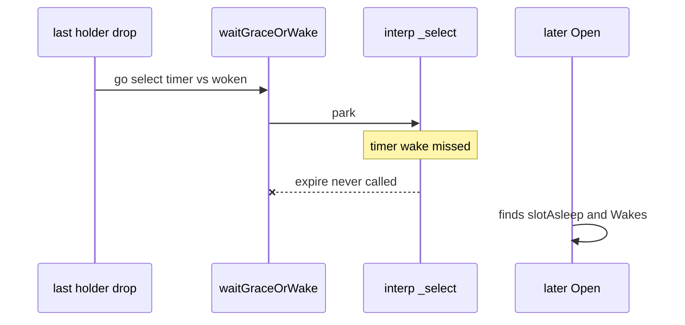

Developer review: in progress — 2026-09-13T16:41:46Z

[sgsi-dev-ticket-status:2026-09-13-reclaim-bug-yaegi-grace-select]

## What this changes
**Operators.** None.

**Admin users.** None.

**Developers.** None yet. Explore confirmed the Yaegi grace-select hang on Go 1.21.13. Product code is still DestBranch `waitGraceOrWake`.

**End users.** None.

## Motivation
Interpreted `reclaim` grace wait parks in Yaegi `_select`. On Go 1.21.13 a concurrent expire of 16 keys missed Close and left `interp._select.func4` at `run.go:3815` spawned from `go callf(in)` (`run.go:1322`). `expire`, `dispose`, and `endMappedClose` never run. A later `Open` can still reclaim. The Traefik plugin path arms `DefaultGrace` on every drop, so a missed timer leaks the stored value and its Close hook.

## Merge readiness
Explore reproduced the hang. Propose and AfterFunc apply next. 1 item remains.

Priority: P1 — production Traefik plugin path can strand a grace waiter and never Close the stored value
Reviewed head: 24ed9c8
Owner decision: None.

## Review scores
| Measure | Result | What it means |
| --- | --- | --- |
| Overall readiness | 1/6 | Hang confirmed; no apply yet |
| CI proof | 1/6 | Pushed; CI not seen this Set |
| Local tests proof | N/A | Before implement |
| Review resolution | 6/6 | No PR comments |

## Verification
| Check | Result | Evidence |
| --- | --- | --- |
| Branch | 2026-09-13-reclaim-bug-yaegi-grace-select pushed | origin |
| OpenSpec | none | openspec/ |
| Pull request | https://github.com/david-garcia-garcia/traefik-middleware-utilities/pull/80 | #80 |
| CI | not seen | not measured this Set |
| Local tests | none | handoff.yaml |
| PR comments | no comments | none |

## Specs
None.

## Deviations from the ask
None.

## Follow-up issues
None.

## How this fits together
Local spec → branch off `master` → stub PR #80. Explore hung concurrent expire on Go 1.21.13. Next is AfterFunc apply.

## Explore Decisions
None.

## Before merge
- [ ] Apply AfterFunc grace waiter, add Yaegi watchdog, prove `-count=10` on Go 1.21.13 and green CI.

## Findings
- [P1] Interpreted `waitGraceOrWake` misses the timer — CONFIRMED. Path: `reclaim/table.go:419`. 3/3 concurrent expire misses with `_select.func4`.

## Axis review
None.

## Agent review details

### Review metrics
| Metric | Value | Why it matters |
| --- | --- | --- |
| Specs in this PR | none | No apply yet |
| Open reviewer comments walked | 0 FIX / 0 ANSWER / 0 open | No comments |
| Reviewed head | 24ed9c86f9d5d4504179a25501d6c77a77bad14b | Last pushed bus commit |

### Stored data model
None.

### Technical review
Best possible solution: `time.AfterFunc` like PR #75, not opportunistic skip of grace.

Do we have a high-confidence way to reproduce? Yes — Go 1.21.13 `TestScratchYaegiGraceConcurrentExpire` `-count=3` missed Close with `interp._select.func4` `run.go:3815` / `run.go:1322`.

Is this the best way to solve the issue? Yes versus DestBranch `go`+`select`.

### Evidence
What I checked:
- `go version` `go1.21.13 windows/amd64`
- Existing `TestYaegi_OpenHooksRunSleepWakeClose` `-count=5` passed
- Isolated 5000-cycle WaitGroup probe passed
- Sequential expire 2000× passed
- Concurrent expire 3/3 FAIL, dump `interp._select.func4`
- `TestScratchYaegiWatchNilDone` 80× passed
- OPEN table.go conflict risk: #77, #78

### Rank-up moves
None.
