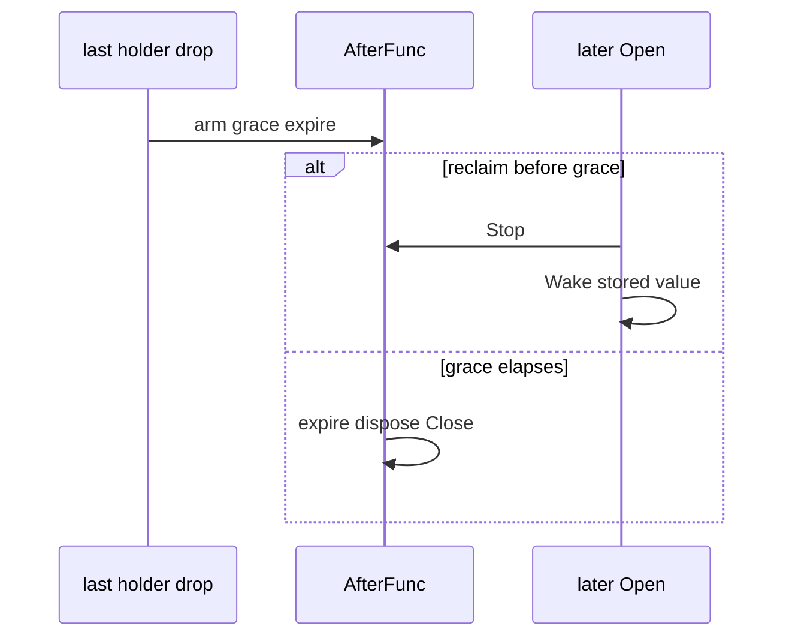

Developer review: ready for review — 2026-09-14T12:25:48Z

[sgsi-dev-ticket-status:2026-09-13-reclaim-bug-yaegi-grace-select]

## What this changes
**Operators.** None.

**Admin users.** None.

**Developers.** `reclaim` grace expire is a stdlib `time.AfterFunc` stored on the slot as `graceTimer`. `waitGraceOrWake` and the `woken` channel are gone. `reclaimLocked` and `Reset` stop that timer. `TestYaegi_GraceExpireDoesNotHang` is the DestBranch hang.

**End users.** None.

## Motivation
Interpreted `reclaim` parked a grace waiter in Yaegi `_select`. On Go 1.21.13 a concurrent last-holder drop missed Close: `expire`, `dispose`, and `endMappedClose` never ran. A later `Open` could still reclaim. The Traefik plugin path arms `DefaultGrace` on every drop, so a missed timer leaked the stored value and its Close hook. Dest `go`+`select` is replaced with `AfterFunc`, the same fix as windowcounter PR #75. This branch is rebased onto `master` after #77 (nil-Done `finished`) and #78 (`endBusyAfterPanic` honouring `EnforceCloseBeforeOpen`).

## Merge readiness
Rebased onto current `master` (`216b922`). CI run 34843100401 succeeded. 0 items remain.

Priority: P1 — production Traefik plugin path can strand a grace waiter and never Close the stored value
Reviewed head: a4b8d7d
Owner decision: None.

## Review scores
| Measure | Result | What it means |
| --- | --- | --- |
| Overall readiness | 6/6 | Ready |
| CI proof | 6/6 | All 8 checks succeeded — https://github.com/david-garcia-garcia/traefik-middleware-utilities/actions/runs/34843100401 |
| Local tests proof | N/A | Remote CI covers it |
| Review resolution | 6/6 | No PR comments |

## Verification
| Check | Result | Evidence |
| --- | --- | --- |
| Branch | 2026-09-13-reclaim-bug-yaegi-grace-select pushed | origin `a4b8d7d` |
| OpenSpec | reclaim-afterfunc-grace archived | openspec/changes/archive/2026-09-13-reclaim-afterfunc-grace/ |
| Pull request | https://github.com/david-garcia-garcia/traefik-middleware-utilities/pull/80 | #80 |
| CI | build 34843100401 success https://github.com/david-garcia-garcia/traefik-middleware-utilities/actions/runs/34843100401 | 8/8 success |
| Local tests | passed | `go test ./reclaim -count=1`; `go test ./... -short -count=1`; Yaegi `-count=10` on go1.25.6. Go 1.21.13 was not available. |
| PR comments | no comments | none |

## Specs
- [std_go_reclaim_value-lifecycle](https://github.com/david-garcia-garcia/traefik-middleware-utilities/blob/2026-09-13-reclaim-bug-yaegi-grace-select/openspec/changes/archive/2026-09-13-reclaim-afterfunc-grace/proposal.md) — modified

## Deviations from the ask
None.

## Follow-up issues
None.

## How this fits together
Local spec → branch off `master` → PR #80. Rebased onto `216b922` (#77 and #78). AfterFunc apply landed. CI 34843100401 green on `a4b8d7d`.

## Explore Decisions
None.

## Before merge
None.

## Findings
- [P1] Interpreted `waitGraceOrWake` missed the timer — fixed. Path: `reclaim/table.go` AfterFunc.

## Axis review
[Standards](https://github.com/david-garcia-garcia/traefik-middleware-utilities/blob/2026-09-13-reclaim-bug-yaegi-grace-select/devstate/2026/09/2026-09-13-reclaim-bug-yaegi-grace-select/codereview_standards.md) — 0 total, 0 pending, 0 completed
[Nitpicks](https://github.com/david-garcia-garcia/traefik-middleware-utilities/blob/2026-09-13-reclaim-bug-yaegi-grace-select/devstate/2026/09/2026-09-13-reclaim-bug-yaegi-grace-select/codereview_nitpicks.md) — 0 total, 0 pending, 0 completed
[Spec](https://github.com/david-garcia-garcia/traefik-middleware-utilities/blob/2026-09-13-reclaim-bug-yaegi-grace-select/devstate/2026/09/2026-09-13-reclaim-bug-yaegi-grace-select/codereview_spec.md) — 0 total, 0 pending, 0 completed
[Security](https://github.com/david-garcia-garcia/traefik-middleware-utilities/blob/2026-09-13-reclaim-bug-yaegi-grace-select/devstate/2026/09/2026-09-13-reclaim-bug-yaegi-grace-select/codereview_security.md) — 0 total, 0 pending, 0 completed
[Performance](https://github.com/david-garcia-garcia/traefik-middleware-utilities/blob/2026-09-13-reclaim-bug-yaegi-grace-select/devstate/2026/09/2026-09-13-reclaim-bug-yaegi-grace-select/codereview_performance.md) — 0 total, 0 pending, 0 completed
[Dead](https://github.com/david-garcia-garcia/traefik-middleware-utilities/blob/2026-09-13-reclaim-bug-yaegi-grace-select/devstate/2026/09/2026-09-13-reclaim-bug-yaegi-grace-select/codereview_dead.md) — 0 total, 0 pending, 0 completed
[Test coverage](https://github.com/david-garcia-garcia/traefik-middleware-utilities/blob/2026-09-13-reclaim-bug-yaegi-grace-select/devstate/2026/09/2026-09-13-reclaim-bug-yaegi-grace-select/codereview_coverage.md) — 0 total, 0 pending, 0 completed

## Agent review details

### Review metrics
| Metric | Value | Why it matters |
| --- | --- | --- |
| Specs in this PR | 0 added / 1 modified | value-lifecycle grace waiter |
| Open reviewer comments walked | 0 FIX / 0 ANSWER / 0 open | No comments |
| Reviewed head | a4b8d7d5d410f1f5d6684b54bf6134ab710a9192 | Rebased onto origin/master 216b922, CI 34843100401 |

### Stored data model
None.

### Technical review
Best possible solution: `time.AfterFunc` stored on the slot; wake/Reset `Stop()` it. Same as PR #75. `finished` and `endBusyAfterPanic` stay as on DestBranch.

Do we have a high-confidence way to reproduce? Yes — original Go 1.21.13 concurrent expire 3/3 missed Close with `interp._select.func4` `run.go:3815` / `run.go:1322`. This rebase re-ran `TestYaegi_GraceExpireDoesNotHang` `-count=10` on go1.25.6 (Go 1.21.13 was not on this runner).

Is this the best way to solve the issue? Yes versus DestBranch `go`+`select`.

### Evidence
What I checked:
- Rebase of `2026-09-13-reclaim-bug-yaegi-grace-select` onto `origin/master` `216b922` (conflicts in `reclaim/table.go` and `openspec/specs/std_go_reclaim_value-lifecycle/spec.md`)
- `go test ./reclaim -count=1` PASS (2.114s) on go1.25.6
- `go test ./... -short -count=1` PASS (backendbackoff, reclaim, simpleredis, tokenbucket, windowcounter)
- `TestRepro_SleepPanicUnmapsBeforeCloseWithEnforce` PASS (0.20s)
- `TestRepro_WakePanicUnmapsBeforeCloseWithEnforce` PASS (0.20s)
- `TestRepro_NilDoneHolderLeaksWatchGoroutine` PASS (0.02s)
- `TestTable_WakePanicWaiterReceivesErrorWithEnforce` PASS (0.05s)
- `TestYaegi_GraceExpireDoesNotHang` `-count=10` PASS on go1.25.6. Go 1.21.13 was not available, so that toolchain was not re-measured.
- CI 34843100401 on `a4b8d7d`: Lint, Unit, Unit race, Go E2E Redis, Go E2E Dragonfly, Integration Tests, Integration Tests Redis, Integration Tests Dragonfly — all success
- `reclaim/BUGS.md` not edited

### Rank-up moves
None.
