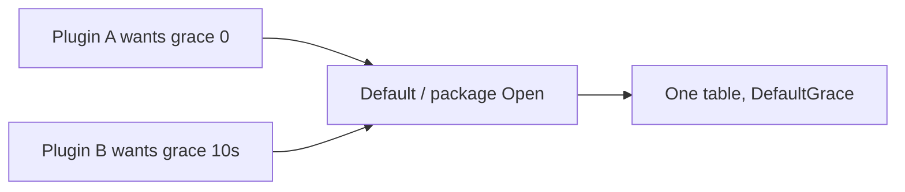

Developer review: in progress — 2026-09-13T08:10:33Z

## What this changes
**Operators.** None.

**Admin users.** None.

**Developers.** None.

**End users.** None.

## Motivation
On dest, reclaim still hands every caller the same process table (`Default` and package `Open`). Grace is already a constructor argument on `NewTable` and is never written after create, but the singleton is born at `DefaultGrace`. The only way to change it is `ResetWith`, which replaces that one table for the whole process.

Two plugins that want different grace, or that should not share keys, cannot both be right on that table. This ticket drops the singleton so each caller creates a table through `New()`, feeds constructor config there, and owns lifetime.

If this stays unmerged, production-shaped callers (`e2e/reclaimprobe`, README, usage) keep teaching a process-wide table that cannot take per-instance config.

## Merge readiness
Explore is written with assumed constructor and ownership decisions. Product apply has not started. Propose is next.

Priority: P3 — spec and internal API clarity, no current operator or end-user harm
Reviewed head: 11f6c1a
Owner decision: Required. See Explore Decisions.

## Review scores
| Measure | Result | What it means |
| --- | --- | --- |
| Overall readiness | 1/6 | Head pushed; CI on this SHA not seen |
| CI proof | 1/6 | `get_status` pending, 0 statuses on `11f6c1a` |
| Local tests proof | N/A | Before implement (`localTests: none`) |
| Review resolution | 6/6 | OPEN PR, no review comments |

## Verification
| Check | Result | Evidence |
| --- | --- | --- |
| Branch | 2026-09-13-reclaim-owned-table pushed | `git push` `11f6c1a` |
| OpenSpec | none | no change folder |
| Pull request | https://github.com/david-garcia-garcia/traefik-middleware-utilities/pull/65 | pr-host List |
| CI | not seen | pr-host get_status pending, 0 statuses on `11f6c1a` |
| Local tests | none | handoff.yaml localTests |
| PR comments | no comments | inventory empty |

## Specs
None.

## Deviations from the ask
None.

## Follow-up issues
None.

## How this fits together
Local ticket, branch `2026-09-13-reclaim-owned-table` from `origin/master`. Stub PR #65 is the durable card. Explore assumed `New(Config)` and caller-owned tables. Next is propose.

## Explore Decisions
| Question | Rank | Decision | By |
| --- | --- | --- | --- |
| Is `New` `New(grace time.Duration)` or `New(Config)` with `Grace` as a field? | bounded asked | assumed — `New(Config)` by value; `Grace` only; copy at `New`; no setter; negative → `DefaultGrace`; zero stays 0. Delete `NewTable`. | explore |
| Is `reclaim/default.go` deleted or left without the singleton? | bounded asked | assumed — delete `reclaim/default.go`. | explore |
| How does `e2e/reclaimprobe` hold the table so two Traefik `New`s still share an incarnation within grace? | bounded asked | assumed — package-level `var` table in `reclaimprobe`, `New(Config{Grace: DefaultGrace})` once; plugin `New` calls `table.Open`. | explore |
| Does `Config` live in `table.go` or a new `config.go`? | additive asked | assumed — `Config` next to `Table` in `reclaim/table.go`. No `reclaim/config.go`. | explore |

## Before merge
- [ ] Remove `Default`, package `Open`, `Reset`, and `ResetWith`; construct tables with `New(Config)` and caller-owned lifetime
- [ ] Fold spec, usage, README, and `reclaimprobe` off the process table

## Findings
None.

## Axis review
None.

## Agent review details

### Review metrics
| Metric | Value | Why it matters |
| --- | --- | --- |
| Specs in this PR | none | Same list as ## Specs; do not paste diff --stat |
| Open reviewer comments walked | 0 FIX / 0 ANSWER / 0 open | Unanswered review is merge risk |
| Reviewed head | 11f6c1ac675d237b8faf6ad9f704517896023704 | Card must match the branch you measured |

### Stored data model
None.

### Technical review
Best possible solution: not applied yet; dest still exposes the process table.

Do we have a high-confidence way to reproduce? Yes — `reclaim/default.go` plus `TestDefault_*` in `reclaim/table_test.go`.

Is this the best way to solve the issue? Yes versus dest — remove the singleton rather than add a second config path on `Default`.

### Evidence
What I checked:
- `origin/master...HEAD` product diff empty (`git diff` excluding `devstate/`)
- `devstate/explore.md` four assumed rows (`git`, `11f6c1a`)
- OPEN PR #65, empty comment inventory (GitHub MCP `get_comments`)
- CI on `11f6c1a`: `get_status` pending, 0 statuses (GitHub MCP)

### Rank-up moves
None.
