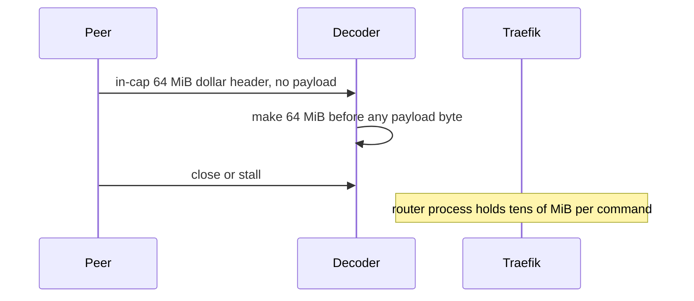

Developer review: in progress — 2026-09-13T17:06:40Z

## What this changes
**Operators.** None.

**Admin users.** None.

**Developers.** None yet versus DestBranch. Prepare only: this branch will stop the RESP decoder from sizing `make` off an in-cap `$` or `*` header before any payload byte arrives.

**End users.** None.

## Motivation
On DestBranch, SimpleRedis already rejects a `$` or `*` length above the package caps (`64 MiB` bulk, `1 Mi` array slots) as `redis:issue?` before `make`. A header *at* those caps is still treated as an allocation size. Eleven wire bytes `$67108864` plus CRLF allocate about 64 MiB; ten wire bytes `*1048576` allocate about 24 MiB of slice headers. The default pool of 8 concurrent commands multiplies that to about 512 MiB from 88 header bytes.

That allocation lives in the Traefik process. An OOM-killed router is an outage for every route, not only the rate-limited ones. The peer must be hostile or buggy (or a desynced socket feeding cache bytes as length headers), so this is below the availability bugs, but the amplification is millions to one.

## Merge readiness
Prepare is qualified. Product allocation change is not on this branch yet. Explore is next.

Priority: P2 — real operator pain (Traefik OOM from a handful of header bytes), limited blast until a hostile or buggy peer (or a desynced socket)
Reviewed head: 834c38a
Owner decision: None.

## Review scores
| Measure | Result | What it means |
| --- | --- | --- |
| Overall readiness | 2/6 | Stub PR is open; Unit already failed on the empty start commit; product fix not landed |
| CI proof | 2/6 | Unit failed on start commit `e15020f` ([Unit](https://github.com/david-garcia-garcia/traefik-middleware-utilities/actions/runs/34770502038/job/103759104644)); head `834c38a` not seen |
| Local tests proof | N/A | Before implement (`localTests: none`) |
| Review resolution | 6/6 | OPEN PR, no reviewer comments |

## Verification
| Check | Result | Evidence |
| --- | --- | --- |
| Branch | 2026-09-13-simpleredis-bounded-reply-allocation pushed | `git` |
| OpenSpec | none | `openspec/` |
| Pull request | https://github.com/david-garcia-garcia/traefik-middleware-utilities/pull/86 | pr-host List/Create |
| CI | build 34770502038 Unit failure (empty start commit) https://github.com/david-garcia-garcia/traefik-middleware-utilities/actions/runs/34770502038/job/103759104644 | pr-host CI |
| Local tests | none | handoff.yaml localTests |
| PR comments | no comments | no comments.md |

## Specs
None.

## Deviations from the ask
None.

## Follow-up issues
None.

## How this fits together
Local ticket → branch `2026-09-13-simpleredis-bounded-reply-allocation` → stub PR 86 against `master`. CI on the empty start commit already reported a Unit failure; the product decoder change is not in the diff yet.

## Explore Decisions
None.

## Before merge
- [ ] Keep SimpleRedis reply memory proportional to bytes the peer actually sent, not the declared in-cap `$` or `*` length
- [ ] Untagged `TotalAlloc` proof for a header-only oversized `$` and `*`
- [ ] Honour the simplicity gate: stop after propose if the correct fix is not small

## Findings
None.

## Axis review
None.

## Agent review details

### Review metrics
| Metric | Value | Why it matters |
| --- | --- | --- |
| Specs in this PR | none | Same list as ## Specs; do not paste diff --stat |
| Open reviewer comments walked | 0 FIX / 0 ANSWER / 0 open | Unanswered review is merge risk |
| Reviewed head | 834c38a7db5b7d0d945d42a1dbacf9787e2167cc | Card must match the branch you measured |

### Stored data model
None.

### Technical review
Best possible solution: not on DestBranch yet. Dest still `make`s from the declared in-cap length before reading payload.

Do we have a high-confidence way to reproduce? Yes, `readBulk` `make([]byte, length+2)` and `readReply` `make([][]byte, count)` on dest `simpleredis/resp.go`; caller-only tagged test `TestBugPeerControlledAllocationAmplification` measured the amplification.

Is this the best way to solve the issue? Not decided. Ticket asks grow-as-you-go; live spec requires make+ReadFull for accepted lengths. Explore/propose must weigh that against the common-path alloc ceilings.

### Evidence
What I checked:
- Dest `simpleredis/resp.go` `readBulk` / `readReply` `*` case (`origin/master` `a239a9e`, worktree `834c38a`)
- Decode spec SHALL make+ReadFull (`openspec/specs/std_go_simpleredis_resp-decode/spec.md`)
- tcp-session short-read still `io.ReadFull` (`openspec/specs/std_go_simpleredis_tcp-session/spec.md`)
- Research: `knowledge/research/ext_redis_resp_bulk-string/`, `ext_redis_proto_max-bulk-len/`, `ext_go-redis_proto_reader-limit/`
- OPEN PR 86, no comments (GitHub MCP)
- CI Unit failed on `e15020f` (run 34770502038)

### Rank-up moves
None.
