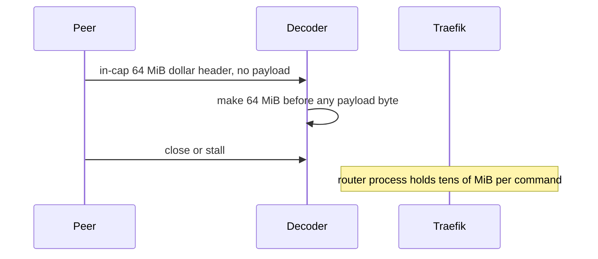

Developer review: in progress — 2026-09-13T17:16:15Z

## What this changes
**Operators.** None.

**Admin users.** None.

**Developers.** OpenSpec change `simpleredis-bounded-reply-allocation` records that an in-cap `$` or `*` header MUST NOT size `make` before payload or elements arrive. Product `readBulk` is still DestBranch.

**End users.** None.

## Motivation
On DestBranch, SimpleRedis already rejects a `$` or `*` length above the package caps (`64 MiB` bulk, `1 Mi` array slots) as `redis:issue?` before `make`. A header *at* those caps is still treated as an allocation size. Eleven wire bytes `$67108864` plus CRLF allocate about 64 MiB; ten wire bytes `*1048576` allocate about 24 MiB of slice headers. The default pool of 8 concurrent commands multiplies that to about 512 MiB from 88 header bytes.

That allocation lives in the Traefik process. An OOM-killed router is an outage for every route, not only the rate-limited ones. The peer must be hostile or buggy (or a desynced socket feeding cache bytes as length headers), so this is below the availability bugs, but the amplification is millions to one.

## Merge readiness
Propose is written and valid. Simplicity gate passed: chunked `ReadFull` with a 128 KiB first chunk and array append with start cap 16 is small enough to implement. Product decoder change is next.

Priority: P2 — real operator pain (Traefik OOM from a handful of header bytes), limited blast until a hostile or buggy peer (or a desynced socket)
Reviewed head: 0336427
Owner decision: None.

## Review scores
| Measure | Result | What it means |
| --- | --- | --- |
| Overall readiness | 3/6 | Propose landed; CI on this head is queued; product fix not landed |
| CI proof | 3/6 | build 34771076427 queued ([Unit](https://github.com/david-garcia-garcia/traefik-middleware-utilities/actions/runs/34771076427/job/103760662365)) |
| Local tests proof | N/A | Before implement (`localTests: none`) |
| Review resolution | 6/6 | OPEN PR, no reviewer comments |

## Verification
| Check | Result | Evidence |
| --- | --- | --- |
| Branch | 2026-09-13-simpleredis-bounded-reply-allocation pushed | `git` |
| OpenSpec | simpleredis-bounded-reply-allocation | `openspec/` |
| Pull request | https://github.com/david-garcia-garcia/traefik-middleware-utilities/pull/86 | pr-host List |
| CI | build 34771076427 queued https://github.com/david-garcia-garcia/traefik-middleware-utilities/actions/runs/34771076427 | pr-host CI |
| Local tests | none | handoff.yaml localTests |
| PR comments | no comments | no comments.md |

## Specs
- [std_go_simpleredis_resp-decode](https://github.com/david-garcia-garcia/traefik-middleware-utilities/blob/2026-09-13-simpleredis-bounded-reply-allocation/openspec/changes/simpleredis-bounded-reply-allocation/proposal.md) — modified

## Deviations from the ask
None.

## Follow-up issues
None.

## How this fits together
Local ticket → branch `2026-09-13-simpleredis-bounded-reply-allocation` → stub PR 86 against `master`. Propose is apply-ready; implement next.

## Explore Decisions
| Question | Rank | Decision | By |
| --- | --- | --- | --- |
| What first-chunk size keeps dest decode alloc ceilings while stopping header-only 64 MiB `make`? | bounded asked | assumed — `bulkReadChunk = 128 << 10` so 100 KB stays one-shot; a 64 MiB header with no payload allocates 128 KiB then short-reads | explore |
| What array start cap keeps `TestAllocDecodeArray10` while stopping a 1 Mi slot `make`? | bounded asked | assumed — `arrayGrowChunk = 16` so ten elements keep `cap == count`; `make([][]byte, 0, count)` is the same 24 MiB attack | explore |
| Does replacing the accepted-length make+ReadFull SHALL count as stopping at the simplicity gate? | bounded asked | assumed — no; updating the three contract files is the job. A common-path alloc/ns regression at implement is the remaining stop signal | explore |
| Who already owns client identity (address, user, tenant, Host, trust hop) for this change? | additive incidental | assumed — none. The decoder classifies a RESP header; it does not set or rebuild a host fact | explore |

## Before merge
- [ ] Keep SimpleRedis reply memory proportional to bytes the peer actually sent, not the declared in-cap `$` or `*` length
- [ ] Untagged `TotalAlloc` proof for a header-only oversized `$` and `*`
- [x] Honour the simplicity gate: the recorded shape is small enough to implement

## Findings
None.

## Axis review
None.

## Agent review details

### Review metrics
| Metric | Value | Why it matters |
| --- | --- | --- |
| Specs in this PR | 0 added / 1 modified | Same list as ## Specs |
| Open reviewer comments walked | 0 FIX / 0 ANSWER / 0 open | Unanswered review is merge risk |
| Reviewed head | 0336427711e927cd60873d683249bc58dab1daa3 | Card must match the branch you measured |

### Stored data model
None.

### Technical review
Best possible solution: not on DestBranch yet. Propose's shape is chunked `ReadFull` with first allocation `min(need, 128 KiB)` and array append with start cap 16.

Do we have a high-confidence way to reproduce? Yes. Tagged `TestBugPeerControlledAllocationAmplification` failed on dest: 11 bytes → 67,144,992 allocated; 10 bytes → 25,188,272.

Is this the best way to solve the issue? Yes versus DestBranch. `openspec validate simpleredis-bounded-reply-allocation --strict` is valid. Simplicity gate: implement.

### Evidence
What I checked:
- Change artifacts under `openspec/changes/simpleredis-bounded-reply-allocation/`
- `openspec validate simpleredis-bounded-reply-allocation --strict` valid
- FindSpecHost fold `std_go_simpleredis_resp-decode` (high)
- OPEN PR 86, no comments
- CI build 34771076427 queued on `0336427`

### Rank-up moves
None.
