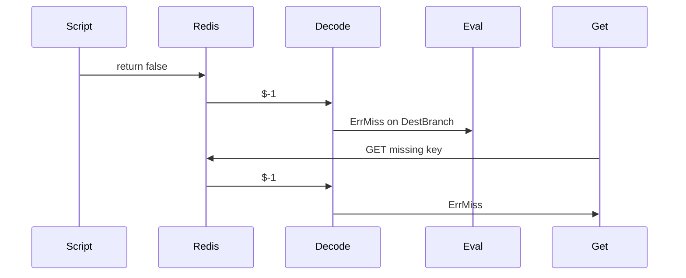

Developer review: in progress — 2026-09-13T05:46:56Z

## What this changes
**Operators.** None.

**Admin users.** None.

**Developers.** None.

**End users.** None.

## Motivation
On DestBranch, SimpleRedis Get treats a missing key as `redis:miss`, which is correct. Eval is supposed to return `[][]byte` slots (or a Lua/server `-` error). Redis maps Lua `return false` to the same RESP2 null bulk as a missing GET (`$-1`). The decoder turns every top-level `$-1` into `ErrMiss`, so a successful Eval false looks like a Get miss to any caller that uses `IsMiss` as “key absent”. `return {false}` is already a nil array slot with a nil error; only the top-level form is misclassified.

If we do not merge, Eval scripts that return false keep failing as key-absent, and tests never pin the split between Get miss and Eval null.

## Merge readiness
Prepare grounded the ticket and opened the stub PR. Product apply is not on this head. 3 items remain.

Priority: P1 — Eval false is classified as redis:miss on DestBranch today
Reviewed head: 2da5dad
Owner decision: None.

## Review scores
| Measure | Result | What it means |
| --- | --- | --- |
| Overall readiness | 1/6 | CI not seen; apply not landed |
| CI proof | 1/6 | Pushed; checks not seen |
| Local tests proof | N/A | Before implement; remote CI covers this host |
| Review resolution | 6/6 | OPEN PR; no reviewer comments |

## Verification
| Check | Result | Evidence |
| --- | --- | --- |
| Branch | 2026-09-13-simpleredis-bug-eval-null-bulk pushed | `git push` origin IssueKey |
| OpenSpec | none | `openspec/changes/` |
| Pull request | https://github.com/david-garcia-garcia/traefik-middleware-utilities/pull/46 | GitHub PR 46 |
| CI | not seen | GitHub checks not listed yet |
| Local tests | none | handoff.yaml localTests |
| PR comments | no comments | inventory empty |

## Specs
None.

## Deviations from the ask
None.

## Follow-up issues
None.

## How this fits together
Local ticket 2026-09-13-simpleredis-bug-eval-null-bulk is on branch `2026-09-13-simpleredis-bug-eval-null-bulk` into `master`, stub PR 46. CI is not seen yet.

## Explore Decisions
None.

## Before merge
- [ ] [P1] Land compiled tests that fail on dest: Eval `$-1` is not `ErrMiss`
- [ ] [P1] Decode top-level `$-1` as a nil slot; Get maps a 1-slot nil to `ErrMiss`; `$0` stays not miss
- [ ] Update decode spec so `$-1` is a nil slot, not miss for every verb

## Findings
None.

## Axis review
None.

## Agent review details

### Review metrics
| Metric | Value | Why it matters |
| --- | --- | --- |
| Specs in this PR | none | Same list as ## Specs |
| Open reviewer comments walked | 0 FIX / 0 ANSWER / 0 open | Unanswered review is merge risk |
| Reviewed head | 2da5dad67aa3cdc5d48668a9dca4e59fc2e673f3 | Card must match the branch you measured |

### Stored data model
None.

### Technical review
Best possible solution: decode top-level null bulk as a nil slot and let Get map a 1-slot nil to `ErrMiss`, instead of treating every `$-1` as miss at decode.

Do we have a high-confidence way to reproduce? Yes, `startStaticRedis` with `$-1` through Eval (adapt dest `Eval` digest argument).

Is this the best way to solve the issue? Yes — it fixes decode, which is the cause; remapping only inside Eval would paper over it.

### Evidence
What I checked:
- Top-level `$` forwards `errMiss`; array `$` leaves a nil slot (`simpleredis/resp.go`, origin/master `1aee4b8`)
- Get forwards exec’s error and does not inspect a nil slot (`simpleredis/commands.go`)
- Eval forwards exec with no extra mapping (`simpleredis/commands_eval.go`)
- Decode spec still says `$-1` remains `redis:miss` (`openspec/specs/std_go_simpleredis_resp-decode/spec.md`)
- Lua `false` → RESP2 null bulk (`knowledge/research/ext_redis_eval/notes.md`)
- Stub PR 46 is the one OPEN PR for this branch

### Rank-up moves
None.
