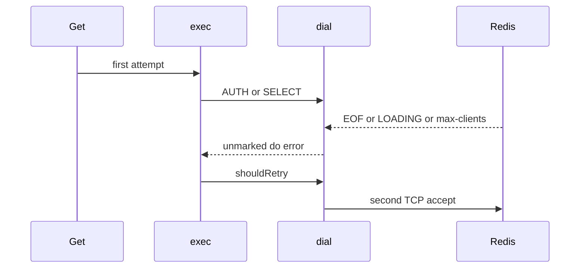

Developer review: in progress — 2026-09-13T05:50:09Z

## What this changes
**Operators.** None.

**Admin users.** None.

**Developers.** None.

**End users.** None.

## Motivation
A new SimpleRedis dial runs AUTH then SELECT before the command. On dest, those handshake errors come back from `dial` as the same `do` failures `exec` already retries: peer close (EOF → `redis:unreachable`), `LOADING …`, and `ERR max number of clients reached`. With `MaxRetries: 1` that is a second TCP accept for one `Get`. The tcp-session spec already says a handshake failure surfaces one error and MUST NOT open a second connection. WRONGPASS / SELECT 99 already stay at one accept because those replies are not retryable. AUTH that stalls with no reply is `redis:timeout` and is not retried.

Cost of not merging: a Redis that is loading, at client cap, or that closes during AUTH/SELECT is hit with another connection. Retrying max-clients while the engine is already at cap adds load on the path that should stop.

## Merge readiness
Prepare grounded the ticket and opened the stub PR. Product tests and the dial mark are not in this diff. 1 item remains.

Priority: P2 — handshake failure on dest opens a second TCP connection, including when Redis is at max clients
Reviewed head: 6739485
Owner decision: None.

## Review scores
| Measure | Result | What it means |
| --- | --- | --- |
| Overall readiness | 1/6 | CI not seen after push; prepare only |
| CI proof | 1/6 | pushed, checks not seen |
| Local tests proof | N/A | before implement; remote PR |
| Review resolution | 6/6 | OPEN PR, no review comments |

## Verification
| Check | Result | Evidence |
| --- | --- | --- |
| Branch | 2026-09-13-simpleredis-bug-handshake-redial pushed | git / origin |
| OpenSpec | none | `openspec/` |
| Pull request | https://github.com/david-garcia-garcia/traefik-middleware-utilities/pull/48 | pr-host List/Create |
| CI | not seen | pr-host CI |
| Local tests | none | handoff.yaml localTests |
| PR comments | no comments | none OPEN |

## Specs
None.

## Deviations from the ask
None.

## Follow-up issues
None.

## How this fits together
Local ticket `2026-09-13-simpleredis-bug-handshake-redial` is on that branch against `master`, stub PR #48. CI has not been seen yet.

## Explore Decisions
None.

## Before merge
- [ ] AUTH/SELECT failure must not open a second TCP connection (failing tests first, then the agreed dial mark)

## Findings
None.

## Axis review
None.

## Agent review details

### Review metrics
| Metric | Value | Why it matters |
| --- | --- | --- |
| Specs in this PR | none | Same list as ## Specs; do not paste diff --stat |
| Open reviewer comments walked | 0 FIX / 0 ANSWER / 0 open | Unanswered review is merge risk |
| Reviewed head | 6739485a5fd3422bd28555e1b8877bf561f52d92 | Card must match the branch you measured |

### Stored data model
None.

### Technical review
Best possible solution: not in this diff; dest still retries unmarked AUTH/SELECT `do` errors. The agreed how is a mark at `dial` after AUTH/SELECT, not an `ioError` unmask.

Do we have a high-confidence way to reproduce? Yes, four dest paths: AUTH close-no-reply, SELECT close-no-reply, AUTH LOADING, AUTH max-clients, against `startFakeRedis` / a close-after-AUTH listener.

Is this the best way to solve the issue? Yes — marking at `dial` keeps GET lost-reply and GET LOADING retry, and leaves TCP refuse retryable.

### Evidence
What I checked:
- `origin/master` `1aee4b8` has `simpleredis/` (`git ls-tree`)
- `simpleredis/pool.go` `dial` returns AUTH/SELECT `do` errors unchanged; TCP refuse is unmarked `errUnreachable`
- `simpleredis/commands_exec.go` `shouldRetry` retries `errUnreachable` and LOADING / max-clients
- `simpleredis/pool_test.go` WRONGPASS and SELECT 99 already 1 accept
- `simpleredis/commands_exec_test.go` `TestLoadingReplyIsRetried` is the GET path
- OPEN PR #48, comment inventory empty (GitHub MCP)

### Rank-up moves
None.
