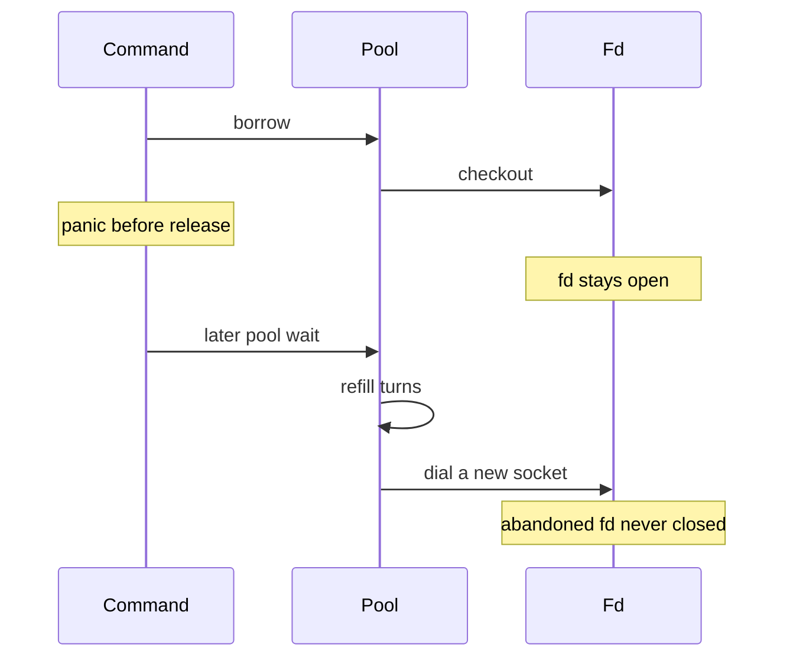

Developer review: in progress — 2026-09-13T14:09:39Z

**This PR stacks on #66.** #66 (`2026-09-13-simpleredis-lost-turn-recovery`) is green and under human review. It MUST merge first. Base is that branch, not `master`. `origin/HEAD` in this repo is stale `origin/initial` — ignore it.

## What this changes
**Operators.** None.

**Admin users.** None.

**Developers.** None yet versus DestBranch. Prepare only: this branch will close sockets abandoned by a panic between borrow and release, so recovery does not leave one dead fd per panic.

**End users.** None.

## Motivation
SimpleRedis already recovers a lost in-use turn after a panic between borrow and release (PR #66 on DestBranch). Recovery refills turns on pool-wait timeout and the next command dials a **new** socket. The abandoned socket's file descriptor stays open for the process lifetime.

On the scenario that motivated #66 — a plugin panicking once an hour — that is about 24 dead fds a day. The client looks healthy (concurrency is back) while fds accumulate until the process hits the fd cap. That is the same outage class as the turn brick, slower.

Closing a socket a live command still holds is worse than the leak: the command reads a closed fd, or the fd is reused. This change must reclaim only sockets that are genuinely abandoned, from the existing pool-wait path, not from a background sweeper.

## Merge readiness
Prepare is qualified. Product close of abandoned sockets is not on this branch yet. Explore is next.

Priority: P2 — real operator pain (unbounded dead fds after recovered panics), limited blast until many panics, restart as workaround
Reviewed head: 4fe65e3
Owner decision: None.

## Review scores
| Measure | Result | What it means |
| --- | --- | --- |
| Overall readiness | 6/6 | Stub CI succeeded; no open PR comments; product work not started |
| CI proof | 6/6 | All required checks succeeded on the start commit |
| Local tests proof | N/A | Before implement; remote CI covers the stub |
| Review resolution | 6/6 | No open PR comments |

## Verification
| Check | Result | Evidence |
| --- | --- | --- |
| Branch | 2026-09-13-simpleredis-close-abandoned-socket pushed | `git` origin |
| OpenSpec | none | `openspec/` |
| Pull request | https://github.com/david-garcia-garcia/traefik-middleware-utilities/pull/70 | stacked on #66 |
| CI | build 34761740921 succeeded https://github.com/david-garcia-garcia/traefik-middleware-utilities/actions/runs/34761740921 | GitHub check runs on PR 70 |
| Local tests | none | handoff.yaml localTests |
| PR comments | no comments | inventory on PR 70 |

## Specs
None.

## Deviations from the ask
None.

## Follow-up issues
None.

## How this fits together
Local ticket → branch `2026-09-13-simpleredis-close-abandoned-socket` from `origin/2026-09-13-simpleredis-lost-turn-recovery` → stacked PR #70. #66 must merge before this PR.

## Explore Decisions
None.

## Before merge
- [P1] Merge [#66](https://github.com/david-garcia-garcia/traefik-middleware-utilities/pull/66) first. This PR is stacked on it.
- [ ] Close abandoned sockets after recovered panics (checkout registry, reclaim only from pool-wait, age bound from the command budget). Not in this branch yet.
- [x] Stub PR opened against `2026-09-13-simpleredis-lost-turn-recovery`, not `master`.

## Findings
None.

## Axis review
None.

## Agent review details

### Review metrics
| Metric | Value | Why it matters |
| --- | --- | --- |
| Specs in this PR | none | Same list as Specs |
| Open reviewer comments walked | 0 FIX / 0 ANSWER / 0 open | Unanswered review is merge risk |
| Reviewed head | 4fe65e3a384606a716c2fe7d582676fd1ac8219c | Card must match the branch you measured |

### Stored data model
None.

### Technical review
Best possible solution: DestBranch recovers turns and dials a new socket; it cannot close the abandoned fd because `heldSockets` is a count with no `*pooledConn` pointer. A checkout registry with timestamps, reclaimed only from pool-wait and only past the command budget, is the ticket's conservative direction.

Do we have a high-confidence way to reproduce? Yes, `bugPanicAfterBorrow` in `simpleredis/pool_test.go` plus `fake.openSockets()` / `waitOpenSocketsEqual` in `simpleredis/fake_redis_test.go`. Dest `TestBugLostInUseTurnBricksPoolPermanently` proves turns recover, not that fds close.

Is this the best way to solve the issue? Yes versus DestBranch: you cannot close a socket you have no pointer to, and a sweeper goroutine is forbidden under Yaegi.

### Evidence
What I checked:
- Dest `recoverLostTurnsLocked` refills turns when idle is empty and `heldSockets` is 0; it does not close a conn (`simpleredis/pool.go`, `90cf4a8`)
- `heldSockets` is `atomic.Int64`; `LostTurns()` exists; no checkout registry (`simpleredis/simpleredis.go`)
- `doWithHeldSocket` covers only `do`; panic between borrow and that increment leaves the count at 0 (`simpleredis/commands_exec.go`)
- Debt notes on DestBranch: `knowledge/debt/2026-09-13-simpleredis-close-panic-leaked-fd.md`, `knowledge/debt/2026-09-13-simpleredis-held-socket-lease.md`
- PR 70 inventory: zero issue comments, zero review threads
- CI run 34761740921 succeeded on the start commit

### Rank-up moves
None.
