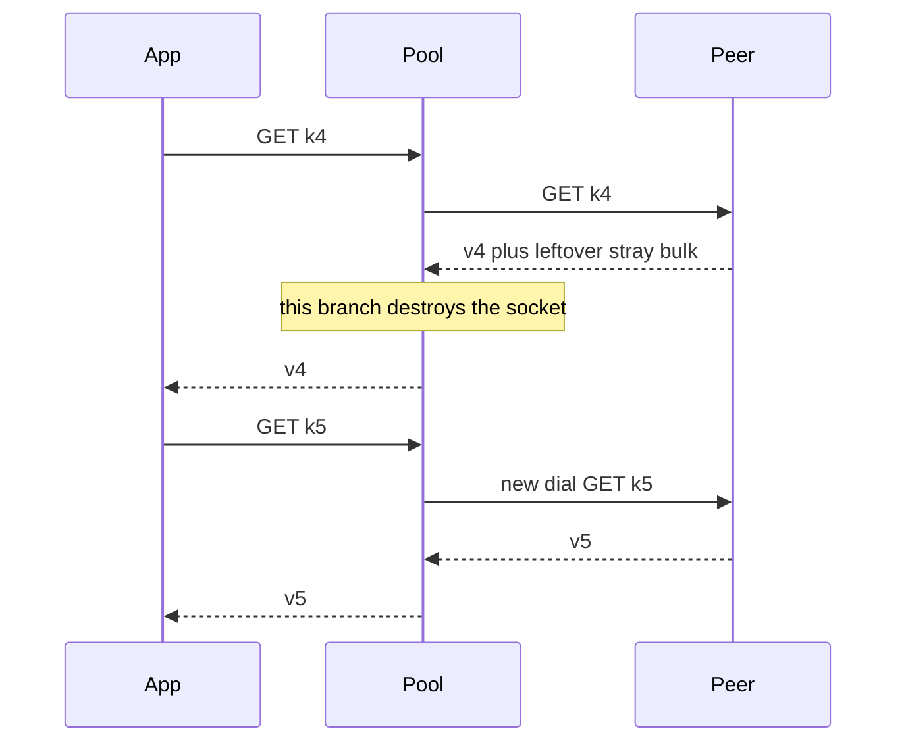

Developer review: ready for review — 2026-09-13T15:39:48Z

## What this changes
**Operators.** None.

**Admin users.** None.

**Developers.** `do` destroys a pooled socket when leftover RESP is already in the reader after a well-formed reply, and refuses the next write on that socket so AUTH leftover cannot be parsed as SELECT. Get after a stray extra already in the reader is own-key or error. Compliant 25 sequential Gets still open one TCP connection. Live specs scope that guarantee to leftover observable at the reply boundary. Idle arrival into the kernel buffer is a recorded follow-up.

**End users.** None.

## Motivation
Get on dest still returned whatever one well-formed RESP value the pooled socket next yielded. After a peer wrote an extra reply, that socket stayed one reply ahead and every later Get on it was another key's value, with no error.

Until merge that silent wrong-key path is live for leftover already in the reader: one tenant's cached bytes can be returned for another tenant's key until the process restarts. This branch gates reuse on an empty reader so that coalesced leftover is destroyed instead. A stray that arrives only into the kernel buffer while the socket is idle is still open.

## Merge readiness
Ready for review. 0 merge items remain. One recorded follow-up.

Priority: P1 — dest Get can serve another key's value with err nil
Reviewed head: 1f7326c
Owner decision: None.

## Review scores
| Measure | Result | What it means |
| --- | --- | --- |
| Overall readiness | 6/6 | CI green, no open PR comments |
| CI proof | 6/6 | all 8 checks succeeded https://github.com/david-garcia-garcia/traefik-middleware-utilities/actions/runs/34766080504 |
| Local tests proof | N/A | prHost remote; CI covers |
| Review resolution | 6/6 | OPEN PR, no comments |

## Verification
| Check | Result | Evidence |
| --- | --- | --- |
| Branch | 2026-09-13-simpleredis-desync-boundary-check pushed | git origin |
| OpenSpec | simpleredis-leftover-reply-destroy archived | openspec/changes/archive |
| Pull request | https://github.com/david-garcia-garcia/traefik-middleware-utilities/pull/69 | pr-host |
| CI | Lint, Unit, Unit race, Go E2E Redis, Go E2E Dragonfly, Integration Tests, Integration Tests Redis, Integration Tests Dragonfly all success | https://github.com/david-garcia-garcia/traefik-middleware-utilities/actions/runs/34766080504 |
| Local tests | passed | go vet ./simpleredis/ clean; go test -count=1 -timeout 8m ./simpleredis/ 13.730s; named leftover proofs and TestConnectionIsReused passed; pool and desync tests -count=5 passed |
| PR comments | no comments | no comments.md |

## Specs
- [std_go_simpleredis_tcp-session](https://github.com/david-garcia-garcia/traefik-middleware-utilities/blob/2026-09-13-simpleredis-desync-boundary-check/openspec/changes/archive/2026-09-13-simpleredis-leftover-reply-destroy/proposal.md) — modified
- [std_go_simpleredis_resp-commands](https://github.com/david-garcia-garcia/traefik-middleware-utilities/blob/2026-09-13-simpleredis-desync-boundary-check/openspec/changes/archive/2026-09-13-simpleredis-leftover-reply-destroy/proposal.md) — modified

## Deviations from the ask
- taken: post-read leftover returns the value and reusable false → also refuse the next write when Buffered() != 0 — `simpleredis/resp.go` — dial ignores reusable so AUTH leftover must not be parsed as SELECT. Requester: not asked.

## Follow-up issues
- [ ] [Idle-arrival desync still poisons a pooled SimpleRedis socket](https://github.com/david-garcia-garcia/traefik-middleware-utilities/blob/2026-09-13-simpleredis-desync-boundary-check/knowledge/debt/2026-09-13-simpleredis-idle-arrival-desync.md) — `Buffered()` cannot see a stray that arrives while the socket is idle.

## How this fits together
Local spec is the dump. Merged `origin/master` (including #71 `runOnConn` and #67 `handshakeFailed`) into this branch. Leftover destroy in `do` still returns `reusable == false` into `runOnConn`. PR 69 CI green on 1f7326c.

## Explore Decisions
| Question | Rank | Decision | By |
| --- | --- | --- | --- |
| Which spec leaves get leftover-bytes destroy | additive asked | assumed — both tcp-session leftover-unread and resp-commands Get; one change, no new leaf | explore |
| AUTH leftover when dial ignores reusable | additive asked | assumed — keep the gate in do; pre-write refuse if buffer not empty; do not edit pool.go | implement |

## Before merge
None.

## Findings
None.

## Axis review
[Standards](https://github.com/david-garcia-garcia/traefik-middleware-utilities/blob/2026-09-13-simpleredis-desync-boundary-check/devstate/2026/09/2026-09-13-simpleredis-desync-boundary-check/codereview_standards.md) — 3 total, 0 pending, 3 completed
[Nitpicks](https://github.com/david-garcia-garcia/traefik-middleware-utilities/blob/2026-09-13-simpleredis-desync-boundary-check/devstate/2026/09/2026-09-13-simpleredis-desync-boundary-check/codereview_nitpicks.md) — 3 total, 0 pending, 3 completed
[Spec](https://github.com/david-garcia-garcia/traefik-middleware-utilities/blob/2026-09-13-simpleredis-desync-boundary-check/devstate/2026/09/2026-09-13-simpleredis-desync-boundary-check/codereview_spec.md) — 0 total, 0 pending, 0 completed
[Security](https://github.com/david-garcia-garcia/traefik-middleware-utilities/blob/2026-09-13-simpleredis-desync-boundary-check/devstate/2026/09/2026-09-13-simpleredis-desync-boundary-check/codereview_security.md) — 0 total, 0 pending, 0 completed
[Performance](https://github.com/david-garcia-garcia/traefik-middleware-utilities/blob/2026-09-13-simpleredis-desync-boundary-check/devstate/2026/09/2026-09-13-simpleredis-desync-boundary-check/codereview_performance.md) — 0 total, 0 pending, 0 completed
[Dead](https://github.com/david-garcia-garcia/traefik-middleware-utilities/blob/2026-09-13-simpleredis-desync-boundary-check/devstate/2026/09/2026-09-13-simpleredis-desync-boundary-check/codereview_dead.md) — 0 total, 0 pending, 0 completed
[Test coverage](https://github.com/david-garcia-garcia/traefik-middleware-utilities/blob/2026-09-13-simpleredis-desync-boundary-check/devstate/2026/09/2026-09-13-simpleredis-desync-boundary-check/codereview_coverage.md) — 1 total, 0 pending, 1 completed

## Agent review details

### Review metrics
| Metric | Value | Why it matters |
| --- | --- | --- |
| Specs in this PR | 0 added / 2 modified | Same list as ## Specs |
| Open reviewer comments walked | 0 FIX / 0 ANSWER / 0 open | Unanswered review is merge risk |
| Reviewed head | 1f7326c3d0711750a09d80f34f7a6b85dbf10a72 | Card must match the branch you measured |

### Stored data model
None.

### Technical review
Best possible solution: dest reused a socket after any well-formed parse. This branch returns the current command's value and destroys the socket when leftover bytes remain in the reader, without draining. Dest's `runOnConn` already defers `release`; leftover sets `reusable == false` so that defer closes the socket and returns the turn once. Idle arrival still needs a borrow-time probe.

Do we have a high-confidence way to reproduce? Yes. Explore throwaway failed Get(k5)=STRAY on dest. After the fix, TestDesyncedSocketDoesNotServePreviousReplies, TestStrayExtraReplyIsNotPooled, and TestAuthLeftoverIsNotParsedAsSelect pass. TestConnectionIsReused still measures 1 TCP connection for 25 Gets. OverFrees stayed 0 after leftover destroy. The fake writes value and stray in one Write so the stray is in the reader at the boundary.

Is this the best way to solve the issue? Yes for leftover already in the reader. Idle arrival is a later ticket.

### Evidence
What I checked:
- merged origin/master c14cbec (PR #71 and #67 landed; golangci-lint-harden and idle-mutex-defer had not)
- conflict only in simpleredis/resp.go `do` comment: kept post-#71 runOnConn wording and leftover-gate meaning; did not restore "release never runs"
- go vet ./simpleredis/ clean; go test -count=1 -timeout 8m ./simpleredis/ 13.730s
- TestDesyncedSocketDoesNotServePreviousReplies, TestStrayExtraReplyIsNotPooled, TestAuthLeftoverIsNotParsedAsSelect, TestConnectionIsReused passed; pool and desync tests -count=5 passed; OverFrees() == 0 on leftover destroy
- CI run 34766080504: all 8 checks success including Unit race
- recorded knowledge/debt/2026-09-13-simpleredis-idle-arrival-desync.md

### Rank-up moves
None.
