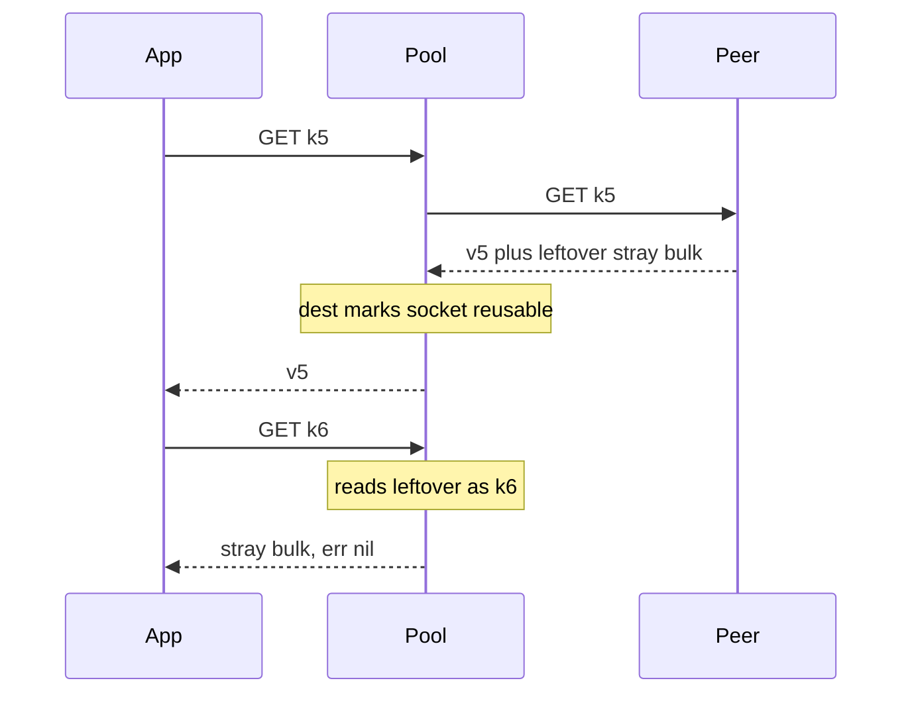

Developer review: in progress — 2026-09-13T08:52:24Z

## What this changes
**Operators.** None.

**Admin users.** None.

**Developers.** None.

**End users.** None.

## Motivation
Get on dest still returns whatever one well-formed RESP value the pooled socket next yields. After a peer writes an extra reply, that socket is one reply ahead and every later Get on it is another key's value, with no error.

On dest, `do` marks the socket reusable whenever `readReply` parsed one complete value. It does not look at leftover bytes in the `bufio.Reader`. `release` then refreshes `lastUsed`, so traffic keeps the poisoned socket under `IdleTimeout`. A fake that answers `GET kN` with `vN` and appends one extra bulk every 5th command yields `Get(k5)` as that stray bulk, then `Get(k6)` as `v5`, and so on — 35 of 40 answers wrong, zero errors, never healed. A compliant Redis 7 that stays RESP2 does not do this on its own. A duplicating proxy, a RESP3 push on a connection the client treats as RESP2, or a non-Redis engine can. Until merge, one tenant's cached bytes can be returned for another tenant's key until the process restarts.

## Merge readiness
Prepare grounded. Product fix has not landed. 2 items remain.

Priority: P1 — dest Get can serve another key's value with err nil
Reviewed head: edfb204
Owner decision: None.

## Review scores
| Measure | Result | What it means |
| --- | --- | --- |
| Overall readiness | 1/6 | Pushed stub, CI not seen |
| CI proof | 1/6 | pushed, not seen |
| Local tests proof | N/A | localTests none, before implement |
| Review resolution | 6/6 | OPEN PR, no comments |

## Verification
| Check | Result | Evidence |
| --- | --- | --- |
| Branch | 2026-09-13-simpleredis-desync-boundary-check pushed | `git` origin |
| OpenSpec | none | `openspec/` |
| Pull request | https://github.com/david-garcia-garcia/traefik-middleware-utilities/pull/69 | pr-host Create |
| CI | not seen | pr-host CI |
| Local tests | none | handoff.yaml localTests |
| PR comments | no comments | no comments.md |

## Specs
None.

## Deviations from the ask
None.

## Follow-up issues
None.

## How this fits together
Local spec is the dump. Branch `2026-09-13-simpleredis-desync-boundary-check` from `origin/master` opened PR 69. CI has not been measured.

## Explore Decisions
None.

## Before merge
- [ ] [P1] Destroy a pooled socket when leftover RESP remains after a well-formed reply
- [ ] Permanent untagged tests: own-key Get after stray extra, idle pool empty then redial, compliant peer still one connection

## Findings
None.

## Axis review
None.

## Agent review details

### Review metrics
| Metric | Value | Why it matters |
| --- | --- | --- |
| Specs in this PR | none | Same list as ## Specs |
| Open reviewer comments walked | 0 FIX / 0 ANSWER / 0 open | Unanswered review is merge risk |
| Reviewed head | edfb204076f90714e6c0cdcf4ecf6bf769747216 | Card must match the branch you measured |

### Stored data model
None.

### Technical review
Best possible solution: dest still reuses a socket after any well-formed parse. The agreed `Buffered() == 0` gate in `do` is not on this branch yet.

Do we have a high-confidence way to reproduce? Yes, `origin/bugfixes20260913:simpleredis/bugs_repro_test.go` `TestBugDesyncedSocketKeepsServingPreviousReplies` fails on dest for leftover replies.

Is this the best way to solve the issue? Yes — destroy on leftover, do not drain. A compliant peer already leaves `Buffered() == 0`, so pooling tests stay the guard against churn.

### Evidence
What I checked:
- dest `do` returns `reusable = true` after a clean `readReply` (`simpleredis/resp.go`, `origin/master` `c5118f1`)
- dest `release` refreshes `lastUsed` when reusable (`simpleredis/pool.go`)
- dest has no stray-extra repro (`simpleredis/`, `origin/master`)
- reference repro on `origin/bugfixes20260913`
- PR 69 open, comments empty (GitHub MCP)

### Rank-up moves
None.
