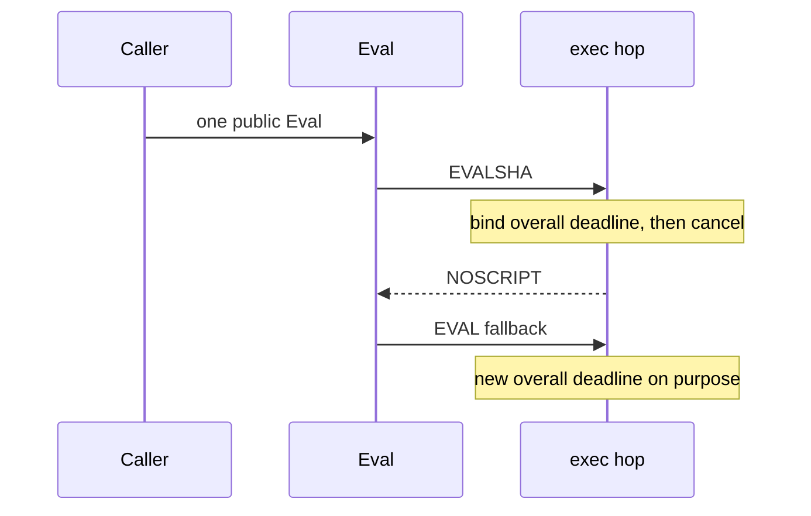

Developer review: in progress — 2026-09-13T05:47:34Z

## What this changes
**Operators.** None.

**Admin users.** None.

**Developers.** None.

**End users.** None.

## Motivation
Eval and MSetEX are public SimpleRedis commands whose fallbacks each call `exec` again (EVALSHA then EVAL on NOSCRIPT; native MSETEX then Eval on unknown-command). On master each `exec` binds `(maxRetries+1)*(DialTimeout+IOTimeout)` and cancels that child when the hop returns, so the next hop starts a full command budget.

The live tcp-session spec still says one overall deadline per public command. Measured with MaxRetries -1, DialTimeout 20ms, IOTimeout 100ms (120ms one-command budget) and an 85ms first-hop delay, Eval NOSCRIPT then a stalled EVAL is ~186ms; MSetEX unknown-command then stalled Eval is ~186ms. Immediate NOSCRIPT still fits in 120ms — stacking only shows when the first hop spends time.

This ticket is comments (and tests that pass on dest), not a behavior change. Sharing remaining time across hops can starve EVAL. Not merging leaves the next reader treating intended per-hop budgets as a bug to “fix” by stacking one deadline, and leaves no comment that the second bind is on purpose.

## Merge readiness
Prepare grounded the local spec and opened stub PR 47. Product delta vs master is still empty. 2 items remain.

Priority: P3 — comments and tests that document intended per-hop budgets; dest already behaves this way, no current user or operator harm
Reviewed head: 3060002
Owner decision: None.

## Review scores
| Measure | Result | What it means |
| --- | --- | --- |
| Overall readiness | 3/6 | CI in progress; no product apply yet |
| CI proof | 3/6 | Lint, Unit, Unit race, Go E2E Redis, Go E2E Dragonfly, Integration Tests in progress on run 34741166823 |
| Local tests proof | N/A | `localTests: none` (before implement; remote CI covers) |
| Review resolution | 6/6 | OPEN PR 47; no review comments |

## Verification
| Check | Result | Evidence |
| --- | --- | --- |
| Branch | 2026-09-13-simpleredis-eval-fallback-comments pushed | `git` origin 3060002 |
| OpenSpec | none | `openspec/` unchanged vs master |
| Pull request | https://github.com/david-garcia-garcia/traefik-middleware-utilities/pull/47 | GitHub PR 47 |
| CI | build 34741166823 in progress https://github.com/david-garcia-garcia/traefik-middleware-utilities/actions/runs/34741166823 | GitHub check runs |
| Local tests | none | handoff.yaml localTests |
| PR comments | no comments | no comments.md |

## Specs
None.

## Deviations from the ask
None.

## Follow-up issues
None.

## How this fits together
Local spec → branch `2026-09-13-simpleredis-eval-fallback-comments` from `master` → stub PR 47 → prepare qualified-with-gaps (spec one-budget vs dest per-hop vs comments-only); CI run 34741166823 in progress.

## Explore Decisions
None.

## Before merge
- [ ] Tests that document per-hop budget (must pass on dest), then comments on Eval, MSetEX, MSetEXAt, and msetex
- [x] Prepare: stub PR 47, requirement, qualify

## Findings
None.

## Axis review
None.

## Agent review details

### Review metrics
| Metric | Value | Why it matters |
| --- | --- | --- |
| Specs in this PR | none | Same list as ## Specs; do not paste diff --stat |
| Open reviewer comments walked | 0 FIX / 0 ANSWER / 0 open | Unanswered review is merge risk |
| Reviewed head | 3060002e06e6aa5817296de26b3f6f06ef349c22 | Card must match the branch you measured |

### Stored data model
None.

### Technical review
Best possible solution: not applied yet vs master; the agreed how is comments that keep per-hop `exec` deadlines, not sharing remaining time.

Do we have a high-confidence way to reproduce? Yes — characterization already measured stacking with DialTimeout 20ms, IOTimeout 100ms, first-hop delay 85ms; this ticket must not land that as a failing CI test.

Is this the best way to solve the issue? Yes for the human decision: comments-only, tests that pass on dest.

### Evidence
What I checked:
- `simpleredis/commands_eval.go` Eval two `exec` hops; `simpleredis/commands_msetex.go` MSETEX then Eval; `simpleredis/commands_exec.go` bindCommandDeadline + defer cancel (HEAD 3060002e06e6aa5817296de26b3f6f06ef349c22, dest 1aee4b8)
- Live spec `openspec/specs/std_go_simpleredis_tcp-session/spec.md` “Whole command has an overall deadline”
- `execBound` not found
- GitHub PR 47 check runs on workflow 34741166823 in progress

### Rank-up moves
None.
