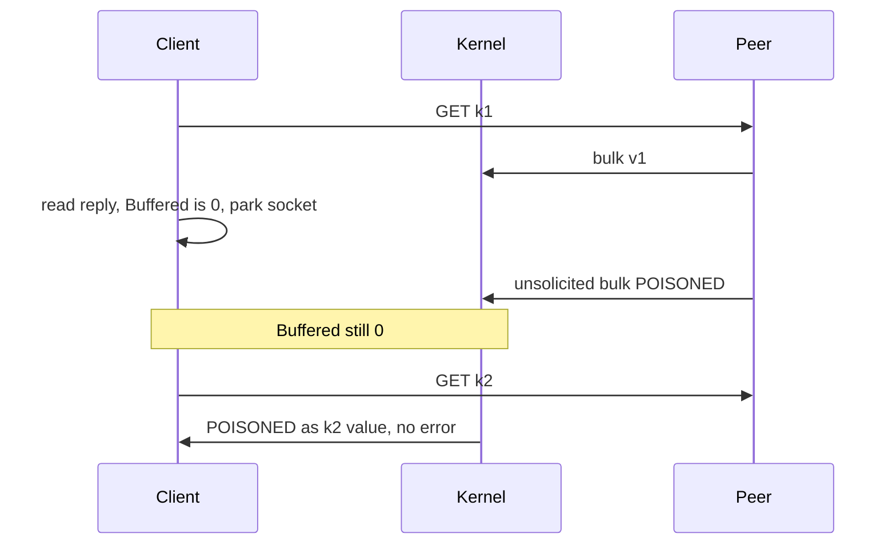

Developer review: in progress — 2026-09-13T17:19:41Z

## What this changes
**Operators.** None.

**Admin users.** None.

**Developers.** OpenSpec change `simpleredis-idle-arrival-desync` recommends no `simpleredis` code change; research packets `ext_go-redis_pool_conn-check` and `ext_go_net_setreaddeadline` record why.

**End users.** None.

## Motivation
A parked SimpleRedis socket can sit one reply ahead when a stray bulk arrives only in the kernel receive buffer. Dest already destroys leftover that is already in the `bufio` reader. It does not see bytes that land while the socket is idle, so the next Get can return another key's payload with no error.

On dest that looks like `Get(k2)` returning `POISONED` while `err == nil`. This run's tagged reproduction: 19 wrong, 40 correct, 0 errors over 59 later commands. A rate limiter then admits or denies on another window key's count.

Not merging this PR leaves that hole as dest already has it, plus a written no-fix recommendation. The cost of not taking a probe is the silent wrong-data path. The cost of taking option 1 as specified is an incorrect Windows probe, or about 525 microseconds per clean reuse versus 18.6 microseconds Get. This proposal chooses neither code change.

## Merge readiness
Propose recommends no product fix. The simplicity gate stops the run here. 5 later phases are not started.

Priority: P1 — Production is serving a wrong public contract today
Reviewed head: 4d67e78
Owner decision: Required. See Explore Decisions.

## Review scores
| Measure | Result | What it means |
| --- | --- | --- |
| Overall readiness | 1/6 | Propose head just pushed; CI not seen on 4d67e78 |
| CI proof | 1/6 | not seen on 4d67e78. Prior explore-card head 8/8 succeeded ([run 34771106331](https://github.com/david-garcia-garcia/traefik-middleware-utilities/actions/runs/34771106331)) |
| Local tests proof | N/A | `prHost` is github |
| Review resolution | 6/6 | OPEN PR, no comments |

## Verification
| Check | Result | Evidence |
| --- | --- | --- |
| Branch | 2026-09-13-simpleredis-idle-arrival-desync pushed | `git` / GitHub |
| OpenSpec | simpleredis-idle-arrival-desync | `openspec/changes/simpleredis-idle-arrival-desync/` |
| Pull request | https://github.com/david-garcia-garcia/traefik-middleware-utilities/pull/83 | pr-host List |
| CI | not seen on 4d67e78 | pr-host CI |
| Local tests | none | handoff.yaml localTests |
| PR comments | no comments | no comments.md |

## Specs
None.

## Deviations from the ask
None.

## Follow-up issues
- [ ] [Idle-arrival desync still poisons a pooled SimpleRedis socket](https://github.com/david-garcia-garcia/traefik-middleware-utilities/blob/2026-09-13-simpleredis-idle-arrival-desync/knowledge/debt/2026-09-13-simpleredis-idle-arrival-desync.md) — idle-arrival kernel probe has no portable Yaegi-safe cheap fix; dest still returns another key's Get with err == nil.

## How this fits together
Propose recorded none of the three directions. Branch `2026-09-13-simpleredis-idle-arrival-desync`, PR 83. Implement is not started (simplicity gate).

## Explore Decisions
| Question | Rank | Decision | By |
| --- | --- | --- | --- |
| Is there an elegant fix, or does the run stop after propose with none? | additive asked | assumed — none. Propose writes the three options and their costs and recommends no code change. Do not implement. Debt file stays. | explore |
| Probe placement (`takeIdleConn`/`borrow` vs `do` before `writeCommand`) if a later human overrides the gate? | additive incidental | assumed — moot this run. If a human later commissions a probe, put it in `borrow` after `takeIdleConn` (parked sockets only, not fresh dials; does not touch `resp.go`). | explore |
| Permanent test file name and fake prefix on dest? | additive asked | assumed — moot this run (no fix, no failing default-suite test). If a later change ships a probe: `simpleredis/resp_test.go` plus `startIdleArrivalStrayFake` in `fake_redis_test.go`. | explore |

## Before merge
- [ ] [P1] Human accepts no product fix, or overrides and commissions a probe despite the measured cost
- [x] Propose wrote options, costs, and `skip_specs`

## Findings
None.

## Axis review
None.

## Agent review details

### Review metrics
| Metric | Value | Why it matters |
| --- | --- | --- |
| Specs in this PR | none | Same list as ## Specs |
| Open reviewer comments walked | 0 FIX / 0 ANSWER / 0 open | Unanswered review is merge risk |
| Reviewed head | 4d67e784e3e78e800567b2b63882f9dcb2ac25d9 | Card must match the branch you measured |

### Stored data model
None.

### Technical review
Best possible solution: dest leftover-in-reader destroy plus a written no-probe recommendation. There is no portable Yaegi-safe probe that is both correct and cheap.

Do we have a high-confidence way to reproduce? Yes, tagged `TestBugIdleArrivalDesyncReturnsAnotherKeysValue` (19 wrong this run).

Is this the best way to solve the issue? Yes versus DestBranch for this gate: do not ship option 1 (Windows expired deadline misses kernel data; 1ns wait is ~28x Get) or option 2 (GET/GET same shape).

### Evidence
What I checked:
- Tagged reproduction FAIL: Get(k2)="POISONED"; 19 wrong, 40 correct, 0 errors
- `BenchmarkGet` 18303–18796 ns/op
- Throwaway: `SetReadDeadline(time.Now())` dirty timeout; `+1ns` sees data; empty `+1ns` ~525 microseconds/op
- `knowledge/research/ext_go-redis_pool_conn-check/` Unix MSG_PEEK vs Windows no-op
- `knowledge/research/ext_go_net_setreaddeadline/` zero Time is not a poll
- openspec validate: change complete, specs skipped
- Prior CI run 34771106331 succeeded; 4d67e78 not seen

### Rank-up moves
None.
