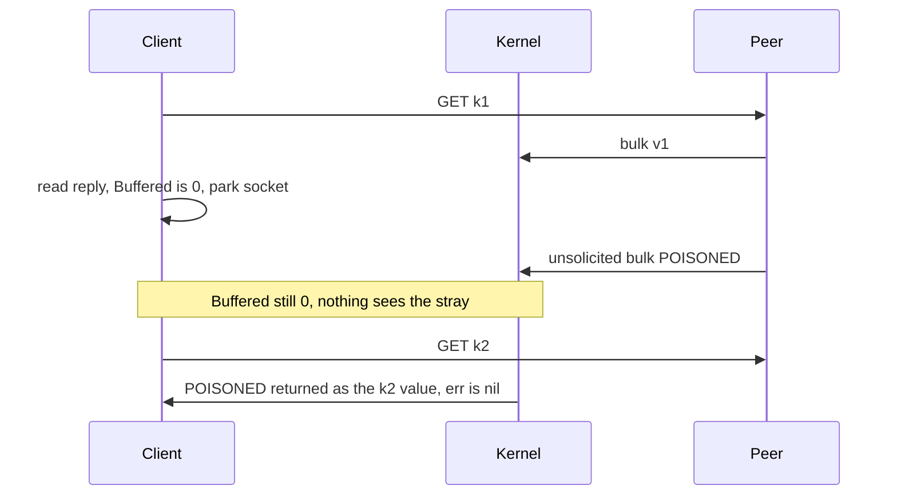

Developer review: ready for review — 2026-09-14T09:34:50Z

This PR deliberately ships **no product change**. It is research plus a decision record. Nothing in `simpleredis/` or any other package moves.

## What this changes
**Operators.** None.

**Admin users.** None.

**Developers.** Two research packets land — `knowledge/research/ext_go-redis_pool_conn-check/` (how go-redis peeks a parked socket, and why it is a no-op on Windows) and `knowledge/research/ext_go_net_setreaddeadline/` (the stdlib zero-`Time` vs expired-deadline contract) — and `knowledge/debt/2026-09-13-simpleredis-idle-arrival-desync.md` gains the measured decision record that closes the open question it was carrying. The gotcha bullet in `knowledge/devdocs/std_go_simpleredis.md` now cites that research folder and is corrected: `connCheck` peeks with `syscall.Recvfrom` and `MSG_PEEK|MSG_DONTWAIT`, it does not do a consuming `syscall.Read`.

**End users.** None.

## Motivation
`simpleredis` parks TCP sockets in an unused pool so a burst of commands on one client pays one dial and one AUTH/SELECT instead of one per command. `do` refuses to reuse a socket whose `bufio.Reader` already has bytes in it, which covers a peer that writes a reply plus an extra in the same write. It cannot cover bytes that are only in the kernel receive queue: `Buffered()` reports userspace, so a stray reply that lands while the socket is parked is invisible at borrow, and the next `Get` decodes it as its own reply with `err == nil`. A rate limiter then admits or denies on another window key's count.

That hole is on master today and this PR does not close it. What is missing on master is the reason. `knowledge/debt/2026-09-13-simpleredis-idle-arrival-desync.md` already names the two candidate probes, but it ends on an unanswered question: whether an already-expired read deadline reports the timeout *before* it hands back bytes that are already pending. If it does, the cheap probe silently misses the exact desync it exists to catch, which is worse than not probing at all. That question was measured during this run and the answer is yes — so the free form of the probe is the wrong one, and the cheapest correct form costs about 525 microseconds per idle reuse against an 18.6 microsecond `Get`. Without this PR that measurement lives nowhere, and the next person to pick the debt note up re-runs the same day of work before reaching the same "do nothing" answer. Master's devdocs bullet also describes the go-redis probe as a consuming `syscall.Read` when it is a non-consuming peek, which would mislead anyone reasoning from it.

## Merge readiness
Documentation and research only, CI green on the merged head, and the recommendation is to accept the hole rather than probe for it. 1 item remains, and it is a human call, not work.

Priority: P3 — docs and internal clarity; no product behaviour moves, so no user or operator harm changes either way
Reviewed head: ab07587
Owner decision: Required. See Explore Decisions.

## Review scores
| Measure | Result | What it means |
| --- | --- | --- |
| Overall readiness | 6/6 | Docs-only diff, CI 8/8 succeeded on ab07587, no open comments |
| CI proof | 6/6 | 8/8 succeeded ([run 34828870756](https://github.com/david-garcia-garcia/traefik-middleware-utilities/actions/runs/34828870756)) |
| Local tests proof | N/A | `prHost` is github, CI proof covers it. `go build`, `go vet`, `go test ./... -count=1 -short` were still run locally and passed |
| Review resolution | 6/6 | OPEN PR, no comments |

## Verification
| Check | Result | Evidence |
| --- | --- | --- |
| Branch | 2026-09-13-simpleredis-idle-arrival-desync pushed | `git` / GitHub |
| OpenSpec | none | `openspec/` — the live change folder was withdrawn |
| Pull request | https://github.com/david-garcia-garcia/traefik-middleware-utilities/pull/83 | pr-host List |
| CI | run 34828870756 8/8 success https://github.com/david-garcia-garcia/traefik-middleware-utilities/actions/runs/34828870756 | pr-host CI |
| Local tests | passed | handoff.yaml localTests |
| PR comments | no comments | devstate has no comments.md |

## Specs
None.

## Deviations from the ask
- taken: propose left the written recommendation in a live OpenSpec change → withdrew that folder and folded its decision record into the debt note — `knowledge/debt/2026-09-13-simpleredis-idle-arrival-desync.md` — no product code ships, so a live change on master would advertise in-flight work that is never implemented. Requester: confirmed.
- taken: the ticket asked to close the hole and land a permanent default-suite test that fails before the fix → shipped neither — `knowledge/debt/2026-09-13-simpleredis-idle-arrival-desync.md` — the ticket makes a written recommendation an accepted outcome, and a default-suite test for a hole that stays open would be red forever. Requester: confirmed.

## Follow-up issues
- [ ] [Idle-arrival desync still poisons a pooled SimpleRedis socket](https://github.com/david-garcia-garcia/traefik-middleware-utilities/blob/2026-09-13-simpleredis-idle-arrival-desync/knowledge/debt/2026-09-13-simpleredis-idle-arrival-desync.md) — idle-arrival kernel probe has no portable Yaegi-safe cheap fix; dest still returns another key's Get with err == nil.

## How this fits together
Ticket `2026-09-13-simpleredis-idle-arrival-desync` explored three directions, rejected all three, and stopped at the simplicity gate. Branch `2026-09-13-simpleredis-idle-arrival-desync`, PR 83, merged up to master at da1d245, CI run 34828870756 green. Implement and the later phases never ran because there is nothing to implement.

## Explore Decisions
| Question | Rank | Decision | By |
| --- | --- | --- | --- |
| Is there an elegant fix, or does the run stop with none? | additive asked | assumed — none. The three directions and their costs are recorded in the debt note; no code change. Debt file stays open. | explore |
| Probe placement (`takeIdleConn`/`borrow` vs `do` before `writeCommand`) if a later human overrides the gate? | additive incidental | assumed — moot this run. If a human later commissions a probe, put it in `borrow` after `takeIdleConn` (parked sockets only, not fresh dials; does not touch `resp.go`). | explore |
| Permanent test file name and fake prefix on dest? | additive asked | assumed — moot this run (no fix, no failing default-suite test). If a later change ships a probe: `simpleredis/resp_test.go` plus `startIdleArrivalStrayFake` in `fake_redis_test.go`. | explore |

## Before merge
- [ ] [P3] Owner accepts "do nothing" as the answer, or overrides and commissions a probe at the measured cost
- [x] Decision record folded into the debt note, with the measured probe costs and both rejection reasons
- [x] Live OpenSpec change folder withdrawn; `validate_artifact_names` and `validate_spec_map` still OK
- [x] Merged origin/master; the one index conflict resolved keeping both entries
- [x] devdocs gotcha bullet verified against the research note, corrected, and pointed at it

## Findings
- [[P3] devdocs bullet named the wrong syscall](knowledge/devdocs/std_go_simpleredis.md) — FIX — master described go-redis `connCheck` as a non-blocking `syscall.Read`; at the pinned commit it is `syscall.Recvfrom` with `MSG_PEEK|MSG_DONTWAIT`, which does not consume the byte. Found while verifying the bullet before citing the research note. Path: `knowledge/devdocs/std_go_simpleredis.md` (pool gotcha bullet). Reply N/A (self-found, no PR comment).

## Axis review
None.

## Agent review details

### Review metrics
| Metric | Value | Why it matters |
| --- | --- | --- |
| Specs in this PR | none | Same list as ## Specs |
| Open reviewer comments walked | 0 FIX / 0 ANSWER / 0 open | Unanswered review is merge risk |
| Reviewed head | ab075876bad62085a08e902f2046ebdde3a30231 | Card must match the branch you measured |

### Stored data model
None.

### Technical review
Best possible solution: versus master, the best available outcome is a recorded decision and no probe. Master keeps its leftover-in-reader destroy, which is correct for everything it can see, and gains the measurement showing that every variant of the borrow-time probe is either wrong or too expensive.

Do we have a high-confidence way to reproduce? Yes for the underlying bug — the tagged `TestBugIdleArrivalDesyncReturnsAnotherKeysValue` reproduction from the explore phase (19 wrong of 59 later commands). Not landed here on purpose: an untagged version would be red forever while the hole stays open.

Is this the best way to solve the issue? Yes for this PR's job, which is to record rather than to fix. The expired-deadline probe misses kernel data that is already queued; the 1ns-deadline probe that does see it costs about 28x a whole `Get` on every idle reuse; reply-shape correlation cannot separate a real GET bulk from a stray GET bulk; and "make it loud" has no error to promote when the decode succeeds.

### Evidence
What I checked:
- `go build ./...`, `go vet ./...`, `go test ./... -count=1 -short` all pass on the merged head (local)
- CI run 34828870756, 8/8 jobs succeeded on ab07587 (pr-host CI)
- `validate_artifact_names` OK and `validate_spec_map` OK after removing the live change folder (opd-mcp, this worktree)
- Merge of origin/master (da1d245) produced exactly one conflict, `knowledge/research/index_ext_go-redis.md`; both `ext_go-redis_yaegi-compatibility` and `ext_go-redis_pool_conn-check` entries kept (`git`)
- `knowledge/research/ext_go-redis_pool_conn-check/.sources/conn_check.go.md` records `syscall.Recvfrom(fd, buf[:1], MSG_PEEK|MSG_DONTWAIT)`, contradicting master's devdocs bullet (`go-redis@7f3b3dff:internal/pool/conn_check.go`)
- `knowledge/research/ext_go_net_setreaddeadline/` makes no claim about this repo's own deadline handling, so PR #84 replacing `IOTimeout` with `CommandTimeout` left it accurate; no edit needed
- Probe costs carried into the debt note were measured during explore on this Windows host on 2026-09-13, not re-measured in this pass

### Rank-up moves
None.
