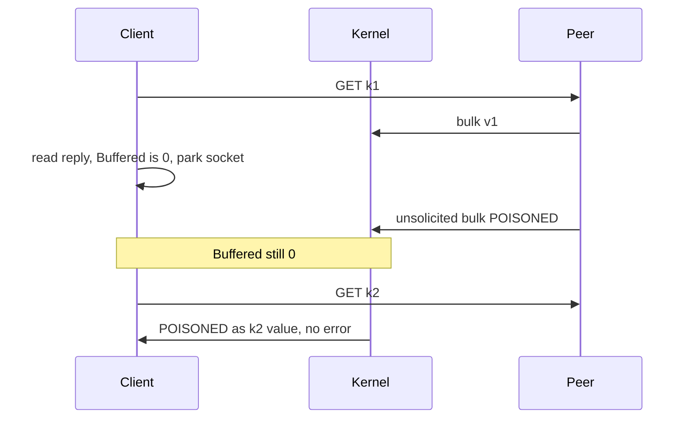

Developer review: in progress — 2026-09-13T17:07:14Z

## What this changes
**Operators.** None.

**Admin users.** None.

**Developers.** None.

**End users.** None.

## Motivation
A parked SimpleRedis socket can sit one reply ahead when a stray bulk arrives only in the kernel receive buffer. Dest already destroys leftover that is already in the `bufio` reader. It does not see bytes that land while the socket is idle, so the next Get can return another key's payload with no error.

On dest that looks like `Get(k2)` returning `POISONED` while `err == nil`. Measured off dest: 3, 4, 6, or 17 wrong values over 59 later commands, and once 4 of 4 consecutive Gets wrong with no eviction. A rate limiter then admits or denies on another window key's count.

Not merging leaves that silent wrong-data path open. Live specs currently exclude it. This ticket asks to close it, or to stop after propose if there is no small, coherent, elegant fix.

## Merge readiness
Prepare is grounded (`qualified-with-gaps`). Explore has not started. 7 items remain.

Priority: P1 — Production is serving a wrong public contract today
Reviewed head: 818aaba
Owner decision: None.

## Review scores
| Measure | Result | What it means |
| --- | --- | --- |
| Overall readiness | 6/6 | Stub CI succeeded and there are no open PR comments. Product fix is not in this phase. |
| CI proof | 6/6 | 8/8 succeeded on the stub head ([run 34770424110](https://github.com/david-garcia-garcia/traefik-middleware-utilities/actions/runs/34770424110)) |
| Local tests proof | N/A | `prHost` is github |
| Review resolution | 6/6 | OPEN PR, no comments |

## Verification
| Check | Result | Evidence |
| --- | --- | --- |
| Branch | 2026-09-13-simpleredis-idle-arrival-desync pushed | `git` / GitHub |
| OpenSpec | none | `openspec/` |
| Pull request | https://github.com/david-garcia-garcia/traefik-middleware-utilities/pull/83 | pr-host Create |
| CI | build 34770424110 succeeded https://github.com/david-garcia-garcia/traefik-middleware-utilities/actions/runs/34770424110 | pr-host CI |
| Local tests | none | handoff.yaml localTests |
| PR comments | no comments | no comments.md |

## Specs
None.

## Deviations from the ask
None.

## Follow-up issues
None.

## How this fits together
Local caller spec grounded on dest `master`, branch `2026-09-13-simpleredis-idle-arrival-desync`, stub PR 83. Stub CI is green. Explore is next.

## Explore Decisions
None.

## Before merge
- [ ] [P1] Close the silent cross-key Get, or stop after propose if no elegant fix
- [x] Stub PR 83 opened

## Findings
None.

## Axis review
None.

## Agent review details

### Review metrics
| Metric | Value | Why it matters |
| --- | --- | --- |
| Specs in this PR | none | Same list as ## Specs |
| Open reviewer comments walked | 0 FIX / 0 ANSWER / 0 open | Unanswered review is merge risk |
| Reviewed head | 818aaba1f67b4b77d111e55432cac72f04f152dc | Card must match the branch you measured |

### Stored data model
None.

### Technical review
Best possible solution: dest already refuses leftover in the reader. The remaining hole is a stray that never enters that reader while the socket is parked.

Do we have a high-confidence way to reproduce? Yes, untracked tagged `TestBugIdleArrivalDesyncReturnsAnotherKeysValue` (caller workspace). Dest default suite does not cover idle arrival.

Is this the best way to solve the issue? Not chosen. Prepare records three options (zero-deadline one-byte read, reply-shape correlation, loud failure) and a simplicity gate that may stop after propose.

### Evidence
What I checked:
- `simpleredis/resp.go` `do` Buffered() gates and kernel-buffer comments (origin/master a239a9e)
- `simpleredis/pool.go` `takeIdleConn` pop with no read
- Live specs exclude kernel-buffer idle arrival (`std_go_simpleredis_tcp-session`, `std_go_simpleredis_resp-commands`)
- Dest `knowledge/debt/2026-09-13-simpleredis-idle-arrival-desync.md` exists (ticket said it did not)
- Traefik `useUnsafe` dual gate (`knowledge/research/ext_traefik_plugins_useunsafe/`); Yaegi tests load `stdlib.Symbols` only
- PR 83 check runs 8/8 success on stub head (run 34770424110)

### Rank-up moves
None.
