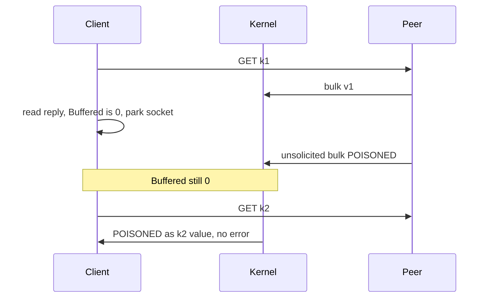

Developer review: in progress — 2026-09-13T17:15:38Z

## What this changes
**Operators.** None.

**Admin users.** None.

**Developers.** None.

**End users.** None.

## Motivation
A parked SimpleRedis socket can sit one reply ahead when a stray bulk arrives only in the kernel receive buffer. Dest already destroys leftover that is already in the `bufio` reader. It does not see bytes that land while the socket is idle, so the next Get can return another key's payload with no error.

On dest that looks like `Get(k2)` returning `POISONED` while `err == nil`. This run's tagged reproduction: 19 wrong, 40 correct, 0 errors over 59 later commands. A rate limiter then admits or denies on another window key's count.

Not merging leaves that silent wrong-data path open. Explore measured option 1 on Windows: an expired read deadline misses kernel data, and the smallest deadline that sees it costs about 525 microseconds per clean reuse versus 18.6 microseconds Get. The simplicity gate says stop after propose if there is no small, coherent, elegant fix.

## Merge readiness
Explore is written. Propose will recommend no product fix. 6 items remain.

Priority: P1 — Production is serving a wrong public contract today
Reviewed head: 88cd4e5
Owner decision: Required. See Explore Decisions.

## Review scores
| Measure | Result | What it means |
| --- | --- | --- |
| Overall readiness | 3/6 | Explore CI is still in progress |
| CI proof | 3/6 | 8 checks in progress on explore head ([run 34771041171](https://github.com/david-garcia-garcia/traefik-middleware-utilities/actions/runs/34771041171)) |
| Local tests proof | N/A | `prHost` is github |
| Review resolution | 6/6 | OPEN PR, no comments |

## Verification
| Check | Result | Evidence |
| --- | --- | --- |
| Branch | 2026-09-13-simpleredis-idle-arrival-desync pushed | `git` / GitHub |
| OpenSpec | none | `openspec/` |
| Pull request | https://github.com/david-garcia-garcia/traefik-middleware-utilities/pull/83 | pr-host List |
| CI | build 34771041171 in progress https://github.com/david-garcia-garcia/traefik-middleware-utilities/actions/runs/34771041171 | pr-host CI |
| Local tests | none | handoff.yaml localTests |
| PR comments | no comments | no comments.md |

## Specs
None.

## Deviations from the ask
None.

## Follow-up issues
None.

## How this fits together
Explore recorded that option 1 is not a correct cheap probe on Windows, option 2 cannot catch GET/GET, and the run should stop after propose. Branch `2026-09-13-simpleredis-idle-arrival-desync`, PR 83.

## Explore Decisions
| Question | Rank | Decision | By |
| --- | --- | --- | --- |
| Is there an elegant fix, or does the run stop after propose with none? | additive asked | assumed — none. Propose writes the three options and their costs and recommends no code change. Do not implement. Debt file stays. | explore |
| Probe placement (`takeIdleConn`/`borrow` vs `do` before `writeCommand`) if a later human overrides the gate? | additive incidental | assumed — moot this run. If a human later commissions a probe, put it in `borrow` after `takeIdleConn` (parked sockets only, not fresh dials; does not touch `resp.go`). | explore |
| Permanent test file name and fake prefix on dest? | additive asked | assumed — moot this run (no fix, no failing default-suite test). If a later change ships a probe: `simpleredis/resp_test.go` plus `startIdleArrivalStrayFake` in `fake_redis_test.go`. | explore |

## Before merge
- [ ] [P1] Propose writes options and costs, then stop (no product fix unless a human overrides)
- [x] Explore reproduced idle-arrival (19/59 wrong, no errors) and measured option 1

## Findings
None.

## Axis review
None.

## Agent review details

### Review metrics
| Metric | Value | Why it matters |
| --- | --- | --- |
| Specs in this PR | none | Same list as ## Specs |
| Open reviewer comments walked | 0 FIX / 0 ANSWER / 0 open | Unanswered review is merge risk |
| Reviewed head | 88cd4e5600aff21f67181a5739cd3f43a7bc87de | Card must match the branch you measured |

### Stored data model
None.

### Technical review
Best possible solution: dest already refuses leftover in the reader. The remaining hole has no portable Yaegi-safe probe that is both correct and cheap.

Do we have a high-confidence way to reproduce? Yes, tagged `TestBugIdleArrivalDesyncReturnsAnotherKeysValue` (19 wrong this run). Dest default suite does not cover idle arrival.

Is this the best way to solve the issue? No product fix this run. Option 1 expired deadline misses kernel data on Windows; a 1ns deadline that sees data costs ~525 µs vs 18.6 µs Get. Option 2 cannot tell two GET bulks apart. Stopping after propose is the gate.

### Evidence
What I checked:
- Tagged reproduction FAIL: Get(k2)="POISONED"; 19 wrong, 40 correct, 0 errors (caller workspace)
- `BenchmarkGet` 18303–18796 ns/op (worktree, Windows amd64)
- Throwaway loopback: `SetReadDeadline(time.Now())` dirty timeout then blocking Read got the stray byte; `+1ns` sees data; empty `+1ns` ~525 µs/op
- go-redis `connCheck` Unix MSG_PEEK vs Windows dummy no-op (pin 7f3b3dff)
- Traefik `useUnsafe` dual gate (`knowledge/research/ext_traefik_plugins_useunsafe/`)
- CI run 34771041171 in progress on 88cd4e5

### Rank-up moves
None.
