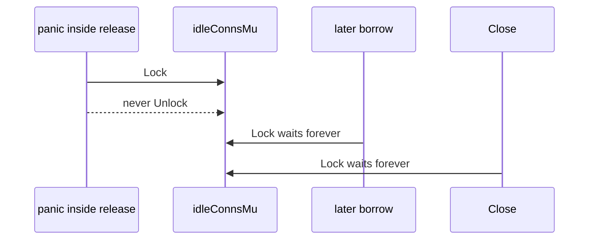

Developer review: in progress — 2026-09-13T15:43:03Z

## What this changes
**Operators.** None.

**Admin users.** None.

**Developers.** `release` extracts `parkIdleConn` so `idleConnsMu` unlocks via `defer` without holding the lock across `conn.close()` or `freeInUseTurn`. `cachedGroupWrite` / `storeGroupWrite` defer `groupWriteMu`. `BUGS.md` section 2 records that interpreted `defer` runs on panic under Yaegi v0.16.1 and points at `simpleredis/yaegi_defer_test.go`.

**End users.** None.

## Motivation
On dest, `release` still unlocks `idleConnsMu` by hand on two paths after the keep-or-close decision. A panic in that section leaves the mutex locked for the process lifetime. Traefik recovers the panicking plugin request, so the process stays up. Every later `borrow` waits in `takeIdleConn`, every later `release` waits, and `Close` waits. Stuck goroutines accumulate. That is worse than the in-use-turn leak #71 already defers around.

#71 already defers `release` in `runOnConn` and `freeInUseTurn` in `borrow`. Dest still hand-unwinds this one mutex. A naive `defer Unlock()` at the top of `release` would hold the lock across `conn.close()` and the `freeInUseTurn` channel send — a different production stall. The extract-and-defer shape (`parkIdleConn`) is the remaining apply.

If this PR does not land, dest keeps a permanent deadlock on a recovered panic inside `release`, and `BUGS.md` section 2 still tells the next reader that `exec` releases without `defer`.

## Merge readiness
Product is on the branch. CI on the product commit succeeded. Code review has not run. 3 items remain.

Priority: P1 — a recovered panic inside `release` deadlocks the idle mutex for the process lifetime
Reviewed head: 6bf96ce
Owner decision: None.

## Review scores
| Measure | Result | What it means |
| --- | --- | --- |
| Overall readiness | 6/6 | Product applied, CI succeeded, no open comments |
| CI proof | 6/6 | succeeded [CI run 34766304374](https://github.com/david-garcia-garcia/traefik-middleware-utilities/actions/runs/34766304374) |
| Local tests proof | N/A | remote PR; localTests passed |
| Review resolution | 6/6 | OPEN PR #73, no reviewer comments |

## Verification
| Check | Result | Evidence |
| --- | --- | --- |
| Branch | 2026-09-13-simpleredis-idle-mutex-defer pushed | `git` HEAD 6bf96ce |
| OpenSpec | simpleredis-idle-mutex-defer | `openspec/changes/simpleredis-idle-mutex-defer/` |
| Pull request | https://github.com/david-garcia-garcia/traefik-middleware-utilities/pull/73 | GitHub |
| CI | build 34766304374 succeeded https://github.com/david-garcia-garcia/traefik-middleware-utilities/actions/runs/34766304374 | GitHub: Lint, Unit, Unit race, Integration Tests, Integration Tests Redis, Integration Tests Dragonfly, Go E2E Redis, Go E2E Dragonfly all success |
| Local tests | passed | `go vet ./simpleredis/` clean; `go test -count=1 -timeout 300s ./simpleredis/` 13.591s; `-count=5 -run "Pool|Panic|Release|Borrow|Turn"` 7.912s |
| PR comments | no comments | comments: none |

## Specs
- [std_go_simpleredis_tcp-session](https://github.com/david-garcia-garcia/traefik-middleware-utilities/blob/2026-09-13-simpleredis-idle-mutex-defer/openspec/changes/simpleredis-idle-mutex-defer/proposal.md) — modified

## Deviations from the ask
None.

## Follow-up issues
None.

## How this fits together
Local spec → branch `2026-09-13-simpleredis-idle-mutex-defer` from `origin/2026-09-13-simpleredis-panic-safe-release` → GitHub PR #73 (stacked on #71, must merge after it) → OpenSpec `simpleredis-idle-mutex-defer` → product HEAD 6bf96ce → CI 34766304374 success.

**Stacked:** this PR is stacked on #71 and MUST merge after it. Base is `2026-09-13-simpleredis-panic-safe-release`, not master.

## Explore Decisions
| Question | Rank | Decision | By |
| --- | --- | --- | --- |
| Can a panic-inside-`parkIdleConn` test be written with no production API change? | additive asked | assumed — no. Existing pool reuse, live-under-cap, OverFrees, cancel-close, and panic-in-`do` tests cover the four semantics. A panic inside the locked section would need a production hook, which the requirement forbids. | explore |

## Before merge
- [x] [P1] Extract `parkIdleConn` so `release` unlocks `idleConnsMu` via defer without holding the lock across close or `freeInUseTurn`
- [x] Defer the two `groupWriteMu` unlocks in `cachedGroupWrite` / `storeGroupWrite`
- [x] Replace `simpleredis/BUGS.md` section 2 with the Yaegi-defer finding and point at `simpleredis/yaegi_defer_test.go`
- [x] Full local suite including Yaegi tests, `go vet`, pool/release tests `-count=5`, measured CI green
- [ ] Merge after #71 (`2026-09-13-simpleredis-panic-safe-release`)
- [x] Stub PR #73 opened with base `2026-09-13-simpleredis-panic-safe-release`
- [x] Explore: extract `parkIdleConn`; no panic-inside-lock test; fold tcp-session delta
- [x] Propose: OpenSpec `simpleredis-idle-mutex-defer` apply-ready
- [ ] Seven-axis code review
- [ ] Archive the OpenSpec change into the live catalog
- [ ] Drop WIP from the PR title

## Findings
None.

## Axis review
None.

## Agent review details

### Review metrics
| Metric | Value | Why it matters |
| --- | --- | --- |
| Specs in this PR | 0 added / 1 modified | Same list as ## Specs |
| Open reviewer comments walked | 0 FIX / 0 ANSWER / 0 open | Unanswered review is merge risk |
| Reviewed head | 6bf96ce758f2ec22cde3674ceac1b7e41ec3a8aa | Card must match the branch you measured |

### Stored data model
None.

### Technical review
Best possible solution: dest now extracts `parkIdleConn` so `defer` owns `idleConnsMu` unlock; `release` closes and `freeInUseTurn`s after that method returns. One `conn.close` site, one `freeInUseTurn` site.

Do we have a high-confidence way to reproduce? Not as a live panic (no seam without a production hook). Dest `release` had two manual unlocks. After apply, a panic in `parkIdleConn` still unlocks.

Is this the best way to solve the issue? Yes versus dest: extract so defer owns the unlock. A top-of-`release` `defer Unlock()` is a regression.

### Evidence
What I checked:
- `go vet ./simpleredis/` clean
- `go test -count=1 -timeout 300s ./simpleredis/` passed in 13.591s
- `go test -count=5 -timeout 600s -run "Pool|Panic|Release|Borrow|Turn" ./simpleredis/` passed in 7.912s
- `openspec validate simpleredis-idle-mutex-defer --strict` valid
- CI run 34766304374: all 8 checks success
- Close / takeIdleConn / resp.go / math/rand / OverFrees unchanged vs dest
- In-flight `2026-09-13-simpleredis-close-abandoned-socket` `release` still adds `deregisterCheckout` then dest's body — mechanical conflict remains

### Rank-up moves
None.
