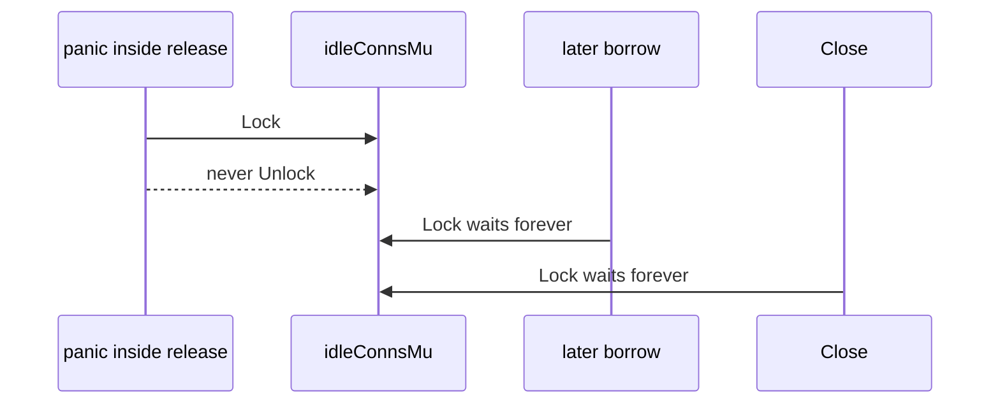

Developer review: in progress — 2026-09-13T15:28:18Z

## What this changes
**Operators.** None.

**Admin users.** None.

**Developers.** None.

**End users.** None.

## Motivation
On dest, `release` still unlocks `idleConnsMu` by hand on two paths after the keep-or-close decision. A panic in that section leaves the mutex locked for the process lifetime. Traefik recovers the panicking plugin request, so the process stays up. Every later `borrow` waits in `takeIdleConn`, every later `release` waits, and `Close` waits. Stuck goroutines accumulate. That is worse than the in-use-turn leak #71 already defers around.

#71 already defers `release` in `runOnConn` and `freeInUseTurn` in `borrow`. Dest still hand-unwinds this one mutex. A naive `defer Unlock()` at the top of `release` would hold the lock across `conn.close()` and the `freeInUseTurn` channel send — a different production stall. The extract-and-defer shape (`parkIdleConn`) is the remaining apply.

If this PR does not land, dest keeps a permanent deadlock on a recovered panic inside `release`, and `BUGS.md` section 2 still tells the next reader that `exec` releases without `defer`.

## Merge readiness
Prepare grounded the ticket and opened stacked stub PR #73. Product apply is not on this branch yet. 5 items remain.

Priority: P1 — a recovered panic inside `release` deadlocks the idle mutex for the process lifetime
Reviewed head: 23bfdaf
Owner decision: None.

## Review scores
| Measure | Result | What it means |
| --- | --- | --- |
| Overall readiness | 3/6 | CI in progress; product apply not started |
| CI proof | 3/6 | in progress [CI run 34765685325](https://github.com/david-garcia-garcia/traefik-middleware-utilities/actions/runs/34765685325) |
| Local tests proof | N/A | `localTests: none` (before implement) |
| Review resolution | 6/6 | OPEN PR #73, no reviewer comments |

## Verification
| Check | Result | Evidence |
| --- | --- | --- |
| Branch | 2026-09-13-simpleredis-idle-mutex-defer pushed | `git` / GitHub |
| OpenSpec | none | `openspec/` |
| Pull request | https://github.com/david-garcia-garcia/traefik-middleware-utilities/pull/73 | pr-host Create |
| CI | build 34765685325 in progress https://github.com/david-garcia-garcia/traefik-middleware-utilities/actions/runs/34765685325 | GitHub check runs |
| Local tests | none | handoff.yaml localTests |
| PR comments | no comments | inventory empty |

## Specs
None.

## Deviations from the ask
None.

## Follow-up issues
None.

## How this fits together
Local spec → branch `2026-09-13-simpleredis-idle-mutex-defer` from `origin/2026-09-13-simpleredis-panic-safe-release` → GitHub PR #73 (base that dest, stacked on #71, must merge after it) → CI run 34765685325 in progress.

## Explore Decisions
None.

## Before merge
- [ ] [P1] Extract `parkIdleConn` so `release` unlocks `idleConnsMu` via defer without holding the lock across close or `freeInUseTurn`
- [ ] Defer the two `groupWriteMu` unlocks in `cachedGroupWrite` / `storeGroupWrite`
- [ ] Replace `simpleredis/BUGS.md` section 2 with the Yaegi-defer finding and point at `simpleredis/yaegi_defer_test.go`
- [ ] Full local suite including Yaegi tests, `go vet`, pool/release tests `-count=5`, measured CI green
- [ ] Merge after #71 (`2026-09-13-simpleredis-panic-safe-release`)
- [x] Stub PR #73 opened with base `2026-09-13-simpleredis-panic-safe-release`

## Findings
None.

## Axis review
None.

## Agent review details

### Review metrics
| Metric | Value | Why it matters |
| --- | --- | --- |
| Specs in this PR | none | Same list as ## Specs; do not paste diff --stat |
| Open reviewer comments walked | 0 FIX / 0 ANSWER / 0 open | Unanswered review is merge risk |
| Reviewed head | 23bfdafedb60598149531e0a0fdfc31146f58710 | Card must match the branch you measured |

### Stored data model
None.

### Technical review
Best possible solution: not applied versus dest yet; dest still hand-unlocks `idleConnsMu` in `release`.

Do we have a high-confidence way to reproduce? Yes, dest `release` has two manual unlocks after `idleConnsMu.Lock()` with close and `freeInUseTurn` after unlock (`simpleredis/pool.go`).

Is this the best way to solve the issue? Yes — extract the locked decision so defer owns the unlock, then close and free the turn after return. A top-of-`release` `defer Unlock()` is a regression.

### Evidence
What I checked:
- Dest HEAD `b5d241cb12b8b28afe43cb92f42ebf50b38eda36` (`origin/2026-09-13-simpleredis-panic-safe-release`)
- `simpleredis/pool.go` `release` two manual unlocks (path, SHA `b5d241c`)
- `simpleredis/commands_msetex.go` two manual `groupWriteMu` unlocks (path, SHA `b5d241c`)
- `simpleredis/BUGS.md` section 2 still says exec releases without defer; ticket quote not found (path, SHA `b5d241c`)
- `simpleredis/yaegi_defer_test.go` and `knowledge/devdocs/std_go_simpleredis.md` already record defer-on-panic (SHA `b5d241c`)
- `simpleredis/resp.go` / `commands_exec.go` stale #29 comments gone (SHA `b5d241c`)
- PR #73 comments empty (GitHub MCP)
- CI run 34765685325 in progress (GitHub check runs)

### Rank-up moves
None.
