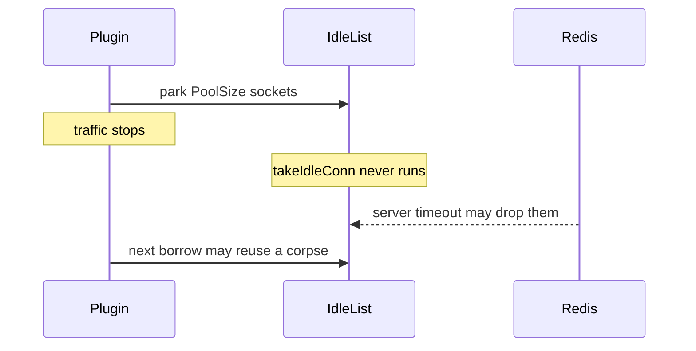

Developer review: in progress — 2026-09-13T17:14:25Z

## What this changes
**Operators.** None.

**Admin users.** None.

**Developers.** None.

**End users.** None.

## Motivation
IdleTimeout on SimpleRedis is the reuse gate for parked TCP sockets. Dest already sweeps the whole idle list when a command borrows (closed PR 33). This ticket asks whether those sockets must also be closed while traffic is stopped.

On DestBranch the sweep lives only in takeIdleConn, and takeIdleConn runs only from borrow. The tagged hunt TestBugIdleSocketsAreNeverReapedWithoutTraffic failed as claimed: IdleTimeout 50 milliseconds, 500 milliseconds of silence, idle list 4 and server-side open sockets 4. Dest spec currently allows that: New must not start a goroutine to close idle sockets, and a client that never borrows again MAY keep them until Close. Dest compose Redis ships timeout 0, so CI Redis will not drop them. In a deployment with a positive Redis timeout, or after a restart, those pinned sockets are the corpses the sibling stale-pool defect then fails on.

A background ticker is the only way to release fds during silence, and it is not a small fix in this tree. Dest product New paths never Close (Traefik probe, windowcounter Close leaves the injected client open), so a New goroutine would leak on the production path. Yaegi v0.16.1 races on interpreted select from a goroutine. Stamping an absolute expiry at park is the same reuse-gate math as lastUsed and does not close sockets while traffic is stopped. Explore therefore takes direction 3 (leave dest; the request-path fix is BUG-1) and the simplicity gate stops this run after propose.

## Merge readiness
Explore reproduced the hunt and chose direction 3 under the simplicity gate. Propose still owes the written recommendation. 1 item remains.

Priority: P2 — real operator, admin-user, or end-user pain, with a workaround or limited blast radius
Reviewed head: 8077e33
Owner decision: Required. See Explore Decisions.

## Review scores
| Measure | Result | What it means |
| --- | --- | --- |
| Overall readiness | 3/6 | CI for this head is still queued; no product delta |
| CI proof | 3/6 | in progress, [CI run 34770975287](https://github.com/david-garcia-garcia/traefik-middleware-utilities/actions/runs/34770975287) |
| Local tests proof | N/A | before implement (`localTests: none`) |
| Review resolution | 6/6 | OPEN PR, no reviewer comments |

## Verification
| Check | Result | Evidence |
| --- | --- | --- |
| Branch | 2026-09-13-simpleredis-idle-socket-reaper pushed | git / GitHub |
| OpenSpec | none | `openspec/` |
| Pull request | https://github.com/david-garcia-garcia/traefik-middleware-utilities/pull/88 | pr-host List/Create |
| CI | build 34770975287 in progress https://github.com/david-garcia-garcia/traefik-middleware-utilities/actions/runs/34770975287 | pr-host CI |
| Local tests | none | handoff.yaml localTests |
| PR comments | no comments | no comments.md |

## Specs
None.

## Deviations from the ask
None.

## Follow-up issues
None.

## How this fits together
Explore wrote `devstate/explore.md` on branch `2026-09-13-simpleredis-idle-socket-reaper`, stub PR 88. Propose will record the direction-3 stop.

## Explore Decisions
| Question | Rank | Decision | By |
| --- | --- | --- | --- |
| Which of the three fix directions should this run take? | additive asked | assumed — direction 3. Direction 1 is the only true fd-release and is not small (spec reversal of New MUST NOT start a goroutine, dest product New paths never Close, Yaegi select, Close/reaper race). Direction 2 does not release fds during silence. Simplicity gate: stop after propose with this written recommendation; that stop is success. | explore |
| Does production Redis close idle clients (timeout > 0), so quiet-time pinning becomes corpses without a restart? | additive asked | assumed — dest compose/CI is timeout 0. Treat the amplifier as restart / CLIENT KILL / BUG-1, which does not need a server timeout. Do not bake a server-timeout assumption into a product change this run is not making. | explore |
| If direction 3, should this run still rewrite the spec or usage gotcha to document it? | additive asked | assumed — do not rewrite. Spec and std_go_simpleredis.md already state New starts no reaper and a quiet client MAY keep sockets until Close. Restating is noise. Propose writes the recommendation on the card; no product delta. | explore |

## Before merge
- [ ] Propose writes the direction-3 recommendation and this run stops (simplicity gate success)

## Findings
None.

## Axis review
None.

## Agent review details

### Review metrics
| Metric | Value | Why it matters |
| --- | --- | --- |
| Specs in this PR | none | Same list as ## Specs; do not paste diff --stat |
| Open reviewer comments walked | 0 FIX / 0 ANSWER / 0 open | Unanswered review is merge risk |
| Reviewed head | 8077e332345ad1b8644d685eb9776f0515eb274b | Card must match the branch you measured |

### Stored data model
None.

### Technical review
Best possible solution: leave DestBranch as specified (sweep on borrow, New starts no reaper). A ticker would reverse a landed spec and leak on dest callers that never Close.

Do we have a high-confidence way to reproduce? Yes, the tagged hunt failed with idle 4 and server open 4 after 500 milliseconds at IdleTimeout 50 milliseconds.

Is this the best way to solve the issue? Yes versus DestBranch: do not implement a reaper in this ticket. The request-path corpses belong to BUG-1.

### Evidence
What I checked:
- tagged hunt FAIL idle=4 open=4 after 500ms (caller workspace `go test -tags simpleredis_bugs`)
- dest `simpleredis/pool.go` takeIdleConn only from borrow
- spec Idle connections are pooled: New MUST NOT start a goroutine; quiet client MAY keep until Close
- `windowcounter/limiter.go` Close does not close SimpleRedis; `e2e/simpleredisprobe/plugin.go` never Closes
- research `ext_go-redis_connection-pool` lazy ConnMaxIdleTime; `ext_redis_clients_idle-close` dest timeout 0
- prior debt `knowledge/debt/2026-09-12-simpleredis-idle-reaper-reclaim.md`
- Yaegi select comment in `simpleredis/resp.go` watchConnClose
- PR 88 CI run 34770975287 queued after explore push

### Rank-up moves
None.
