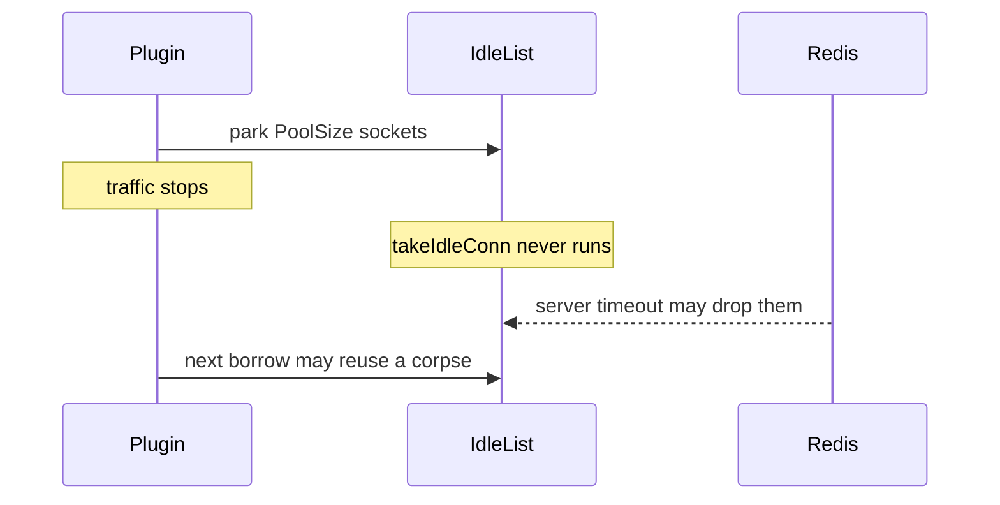

Developer review: in progress — 2026-09-13T17:09:07Z

## What this changes
**Operators.** None.

**Admin users.** None.

**Developers.** None.

**End users.** None.

## Motivation
IdleTimeout on SimpleRedis is the reuse gate for parked TCP sockets. Dest already sweeps the whole idle list when a command borrows (closed PR 33). This ticket asks whether those sockets must also be closed while traffic is stopped.

On DestBranch the sweep lives only in takeIdleConn, and takeIdleConn runs only from borrow. With IdleTimeout at 50 milliseconds and traffic stopped, a hunt against dest-shaped code still saw 4 sockets on the idle list and 4 sockets still open on the fake server after 500 milliseconds. Dest spec currently allows that: New must not start a goroutine to close idle sockets, and a client that never borrows again MAY keep them until Close. Dest compose Redis ships timeout 0, so CI Redis will not drop them. In a deployment with a positive Redis timeout, or after a restart, those pinned sockets are the corpses the sibling stale-pool defect then fails on.

Leaving dest as specified keeps quiet Traefik workers holding up to PoolSize Redis clients until process death. Adding a New ticker without Close wiring would still leak in this tree: the Traefik probe never Closes, and windowcounter Close does not close the injected client. The simplicity gate on this ticket says a written stop after propose is success if the only fd-releasing fix is not small.

## Merge readiness
Prepare grounded the ticket and opened the stub PR. 1 item remains.

Priority: P2 — real operator, admin-user, or end-user pain, with a workaround or limited blast radius
Reviewed head: c42499c
Owner decision: None.

## Review scores
| Measure | Result | What it means |
| --- | --- | --- |
| Overall readiness | 3/6 | CI is still running; no product fix has landed |
| CI proof | 3/6 | in progress, [CI run 34770681567](https://github.com/david-garcia-garcia/traefik-middleware-utilities/actions/runs/34770681567) |
| Local tests proof | N/A | before implement (`localTests: none`) |
| Review resolution | 6/6 | OPEN PR, no reviewer comments |

## Verification
| Check | Result | Evidence |
| --- | --- | --- |
| Branch | 2026-09-13-simpleredis-idle-socket-reaper pushed | git / GitHub |
| OpenSpec | none | `openspec/` |
| Pull request | https://github.com/david-garcia-garcia/traefik-middleware-utilities/pull/88 | pr-host List/Create |
| CI | build 34770681567 in progress https://github.com/david-garcia-garcia/traefik-middleware-utilities/actions/runs/34770681567 | pr-host CI |
| Local tests | none | handoff.yaml localTests |
| PR comments | no comments | no comments.md |

## Specs
None.

## Deviations from the ask
None.

## Follow-up issues
None.

## How this fits together
Local caller spec dumped to the run bus, branch `2026-09-13-simpleredis-idle-socket-reaper` from `origin/master`, stub PR 88, CI still running.

## Explore Decisions
None.

## Before merge
- [ ] Pick at most one of background reaper, park-expiry, or document-only under the simplicity gate (stop after propose if the fd-releasing fix is not small)

## Findings
None.

## Axis review
None.

## Agent review details

### Review metrics
| Metric | Value | Why it matters |
| --- | --- | --- |
| Specs in this PR | none | Same list as ## Specs; do not paste diff --stat |
| Open reviewer comments walked | 0 FIX / 0 ANSWER / 0 open | Unanswered review is merge risk |
| Reviewed head | c42499cd90bcca0823b6cbe0d2aaac5c93ff3eca | Card must match the branch you measured |

### Stored data model
None.

### Technical review
Best possible solution: DestBranch already matches go-redis (idle age checked on the next borrow) and forbids a New goroutine; later phases must weigh a reaper against that spec and against dest callers that never Close.

Do we have a high-confidence way to reproduce? Yes, the untracked tagged hunt `TestBugIdleSocketsAreNeverReapedWithoutTraffic` plus dest `TestStaleIdleHeadIsClosedWhileTailStaysHot` (New starts no goroutine).

Is this the best way to solve the issue? Not decided in prepare. Direction 1 is the only true fd release during silence and is the costly one; dest spec currently encodes directions 2/3.

### Evidence
What I checked:
- dest `simpleredis/pool.go` takeIdleConn only from borrow (origin/master a239a9e, reviewed head c42499c)
- dest spec idle-pool requirement and `TestStaleIdleHeadIsClosedWhileTailStaysHot`
- `windowcounter/limiter.go` Close does not close SimpleRedis; `e2e/simpleredisprobe/plugin.go` never Closes
- research `ext_go-redis_connection-pool` lazy ConnMaxIdleTime; `ext_redis_clients_idle-close` dest timeout 0
- prior debt `knowledge/debt/2026-09-12-simpleredis-idle-reaper-reclaim.md`
- PR 88 CI run 34770681567 in progress

### Rank-up moves
None.
