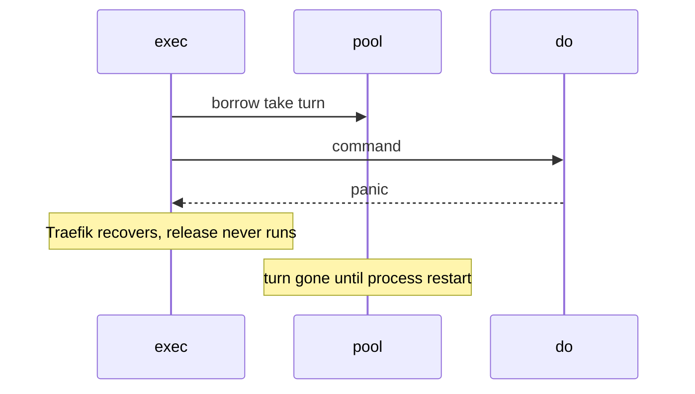

Developer review: in progress — 2026-09-13T09:28:36Z

## What this changes
**Operators.** None.

**Admin users.** None.

**Developers.** SimpleRedis restores missing in-use turns at pool-wait when idle is empty and no still-running command holds a socket, exposes read-only `LostTurns()`, and does not defer `release`. Spec `std_go_simpleredis_tcp-session` now treats wait-not-dial as backpressure only when sockets are actually owned.

**End users.** None.

## Motivation
SimpleRedis returns an in-use-turn only from `release` after `do`. On DestBranch that call is not deferred (PR 29 discarded defer-release). A panic between `borrow` and `release` drops one turn forever. There is no reaper, and `OverFrees()` only counts extra returns, so it cannot restore a missing one.

Measured on DestBranch with `PoolSize` 2: one warm socket, then two recovered panics after `borrow`. `inUseTurns` ended 0/2, idle 0, TCP accepts 2, next `Get` returned `redis:unreachable` while Redis was healthy. Traefik recovers a panicking middleware per request, so the process stays up and quietly loses a turn each time. After `PoolSize` recovered panics the client is dead for the process lifetime.

If this does not merge, `PoolSize` recovered panics convert a live client into a permanent outage that looks like a Redis failure. No reachable panic was found in compiled Go (`readReply` fuzz 7.04M execs / 91s), so this is a latent hazard with unbounded blast radius, not a live crash. Yaegi panics are already documented in this package.

## Merge readiness
Apply, seven-axis review, usage packet, and spec archive are on the branch. CI on the archived head is not seen yet. 2 items remain.

Priority: P2 — latent operator outage with a restart workaround, not a live compiled crash today
Reviewed head: b343180
Owner decision: Required. See Explore Decisions.

## Review scores
| Measure | Result | What it means |
| --- | --- | --- |
| Overall readiness | 1/6 | Product is on the branch; remote CI on this head is not seen |
| CI proof | 1/6 | not seen on reviewed head b343180 |
| Local tests proof | N/A | `localTests: passed`; remote CI is the proof axis |
| Review resolution | 6/6 | OPEN PR 66, no review comments |

## Verification
| Check | Result | Evidence |
| --- | --- | --- |
| Branch | 2026-09-13-simpleredis-lost-turn-recovery not pushed | `git` HEAD b343180 ahead of origin dba2c67 |
| OpenSpec | simpleredis-lost-turn-recovery | archived |
| Pull request | https://github.com/david-garcia-garcia/traefik-middleware-utilities/pull/66 | GitHub |
| CI | not seen | GitHub check runs not measured on this head |
| Local tests | passed | handoff.yaml localTests |
| PR comments | no comments | comments: none |

## Specs
- [std_go_simpleredis_tcp-session](https://github.com/david-garcia-garcia/traefik-middleware-utilities/blob/2026-09-13-simpleredis-lost-turn-recovery/openspec/changes/archive/2026-09-13-simpleredis-lost-turn-recovery/proposal.md) — modified

## Deviations from the ask
None.

## Follow-up issues
None.

## How this fits together
Local ticket → branch `2026-09-13-simpleredis-lost-turn-recovery` → PR 66 → wait for CI on the archived head.

## Explore Decisions
| Question | Rank | Decision | By |
| --- | --- | --- | --- |
| Refill missing turns at errPoolWait when owned live sockets are zero, or make the turn a leased resource with a reaper? | additive asked | assumed — refill at errPoolWait when idle is empty and heldSockets is 0; no lease object and no goroutine reaper | explore |
| Where is the dialed-but-not-yet-released counter incremented so a recovered panic looks like zero owned sockets and a busy Get does not? | additive asked | assumed — heldSockets atomic, increment in exec after borrow with defer decrement, and around dial inside borrow. Do not increment at turn-take (leaks like the turn). Direct borrow then panic never enters exec so refill is correct | explore |
| Does the nanosecond window after taking a turn and before heldSockets increments let recovery fire and dial past PoolSize? | additive incidental | assumed — do not add a mutex or reaper for that window; hung TCP is covered by the dial increment | explore |
| Should this change also close TCP fds left behind when borrow returns a conn that is never released? | additive incidental | assumed — do not track or close those fds; refill lets the next command dial | explore |

## Before merge
- [ ] [P2] Wait for CI on PR 66 at b343180
- [ ] Drop the WIP title on PR 66
- [x] [P2] Refill leaked in-use turns at pool-wait when owned live sockets are zero, without breaching PoolSize while commands are busy
- [x] [P2] Port TestBugLostInUseTurnBricksPoolPermanently into the default suite so it passes; add busy-pool and LostTurns() tests
- [x] Expose read-only LostTurns() next to OverFrees()
- [x] Spec: wait-not-dial is backpressure only when sockets are actually live at PoolSize

## Findings
None.

## Axis review
[Standards](https://github.com/david-garcia-garcia/traefik-middleware-utilities/blob/2026-09-13-simpleredis-lost-turn-recovery/devstate/2026/09/2026-09-13-simpleredis-lost-turn-recovery/codereview_standards.md) — 2 total, 0 pending, 2 completed
[Nitpicks](https://github.com/david-garcia-garcia/traefik-middleware-utilities/blob/2026-09-13-simpleredis-lost-turn-recovery/devstate/2026/09/2026-09-13-simpleredis-lost-turn-recovery/codereview_nitpicks.md) — 1 total, 0 pending, 1 completed
[Spec](https://github.com/david-garcia-garcia/traefik-middleware-utilities/blob/2026-09-13-simpleredis-lost-turn-recovery/devstate/2026/09/2026-09-13-simpleredis-lost-turn-recovery/codereview_spec.md) — 0 total, 0 pending, 0 completed
[Security](https://github.com/david-garcia-garcia/traefik-middleware-utilities/blob/2026-09-13-simpleredis-lost-turn-recovery/devstate/2026/09/2026-09-13-simpleredis-lost-turn-recovery/codereview_security.md) — 0 total, 0 pending, 0 completed
[Performance](https://github.com/david-garcia-garcia/traefik-middleware-utilities/blob/2026-09-13-simpleredis-lost-turn-recovery/devstate/2026/09/2026-09-13-simpleredis-lost-turn-recovery/codereview_performance.md) — 1 total, 0 pending, 1 completed
[Dead](https://github.com/david-garcia-garcia/traefik-middleware-utilities/blob/2026-09-13-simpleredis-lost-turn-recovery/devstate/2026/09/2026-09-13-simpleredis-lost-turn-recovery/codereview_dead.md) — 0 total, 0 pending, 0 completed
[Test coverage](https://github.com/david-garcia-garcia/traefik-middleware-utilities/blob/2026-09-13-simpleredis-lost-turn-recovery/devstate/2026/09/2026-09-13-simpleredis-lost-turn-recovery/codereview_coverage.md) — 3 total, 0 pending, 2 completed, 1 skipped

## Agent review details

### Review metrics
| Metric | Value | Why it matters |
| --- | --- | --- |
| Specs in this PR | 0 added / 1 modified | Same list as ## Specs |
| Open reviewer comments walked | 0 FIX / 0 ANSWER / 0 open | Unanswered review is merge risk |
| Reviewed head | b34318042ae3ff411d1adacc3e68ec67f003f854 | Card must match the branch you measured |

### Stored data model
None.

### Technical review
Best possible solution: Restore leaked turns at pool-wait when the client owns zero sockets, instead of defer-release (PR 29 discarded that).

Do we have a high-confidence way to reproduce? Yes, TestBugLostInUseTurnBricksPoolPermanently failed on DestBranch (turns=0/2, redis:unreachable) and passes after the refill.

Is this the best way to solve the issue? Yes versus DestBranch: it fixes permanence without reversing PR 29, and recovery does not fire while sockets are genuinely busy.

### Evidence
What I checked:
- Default suite `go test -count=1 -timeout 300s ./simpleredis/` passed (~12-14s)
- Pool tests `-count=5` passed
- `go vet ./simpleredis/` clean
- Local `-race` not run (no C toolchain); CI race job is the proof
- PR 29 owner: discarded defer-release as too much complexity for Yaegi recovering the request while the turn stays lost

### Rank-up moves
- TCP fds left behind when borrow returns a conn that is never released stay leaked, as on DestBranch. Refill dials a new socket.
