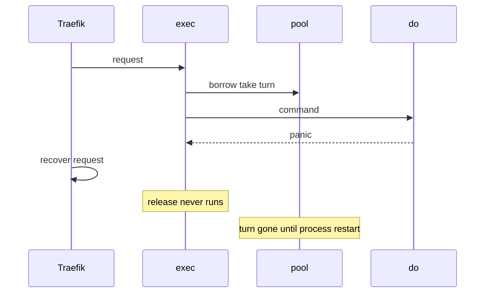

Developer review: in progress — 2026-09-13T08:50:29Z

## What this changes
**Operators.** None.

**Admin users.** None.

**Developers.** None.

**End users.** None.

## Motivation
SimpleRedis gates concurrent sockets with a `PoolSize` turn channel filled once at `New`. `exec` returns a turn only by calling `release` after `do`. DestBranch does not defer that call (PR 29 discarded defer-release as too much complexity under Yaegi). A panic between `borrow` and `release` drops the token for the life of the process.

Traefik recovers a panicking middleware per request and keeps serving. After `PoolSize` recovered panics the channel is empty, idle is empty, and every later command waits one `PoolTimeout` then returns `redis:unreachable` even when Redis is healthy and no sockets are open. Restarting Redis does not recover it. The lookalike is a backend outage.

No reachable panic was found in compiled Go (`readReply` fuzzed 7.04M execs / 91s; `parseLen` is capped by `maxBulkLength` before `length+2`). This is a latent hazard with unbounded blast radius, not a live compiled crash. Yaegi panics are already documented in this package (`errors.As` on a package-local struct, a `net.Error` type assert, `interp._select` on a context channel). If this does not merge, each recovered panic permanently shrinks concurrency until the Traefik process is restarted.

## Merge readiness
Prepare is qualified. Product delta versus `master` is the empty start commit. Explore has not run. 3 items remain.

Priority: P2 — latent (no compiled panic), but a recovered panic permanently bricks the client until process restart
Reviewed head: 6549b58
Owner decision: None.

## Review scores
| Measure | Result | What it means |
| --- | --- | --- |
| Overall readiness | 3/6 | CI still in progress on the stub PR |
| CI proof | 3/6 | in progress https://github.com/david-garcia-garcia/traefik-middleware-utilities/actions/runs/34748485042 (Lint success; Unit, Unit race, Go E2E, Integration still running) |
| Local tests proof | N/A | before implement; remote CI is the proof axis |
| Review resolution | 6/6 | OPEN PR 66, no review comments |

## Verification
| Check | Result | Evidence |
| --- | --- | --- |
| Branch | 2026-09-13-simpleredis-lost-turn-recovery pushed | `git` / GitHub |
| OpenSpec | none | `openspec/` |
| Pull request | https://github.com/david-garcia-garcia/traefik-middleware-utilities/pull/66 | GitHub Create |
| CI | build 34748485042 in progress https://github.com/david-garcia-garcia/traefik-middleware-utilities/actions/runs/34748485042 | GitHub check runs |
| Local tests | none | handoff.yaml localTests |
| PR comments | no comments | Comment-List empty |

## Specs
None.

## Deviations from the ask
None.

## Follow-up issues
None.

## How this fits together
Local spec → branch `2026-09-13-simpleredis-lost-turn-recovery` → stub PR 66 → CI run 34748485042 in progress.

## Explore Decisions
None.

## Before merge
- [ ] Explore recovery (refill at pool-wait vs leased turn) without firing while sockets are genuinely busy [P2]
- [ ] Land permanence fix plus the three default-suite tests; do not `defer sr.release` unless arguing PR 29's discard comment [P2]
- [x] Stub PR 66 opened against `master`

## Findings
None.

## Axis review
None.

## Agent review details

### Review metrics
| Metric | Value | Why it matters |
| --- | --- | --- |
| Specs in this PR | none | Same list as ## Specs |
| Open reviewer comments walked | 0 FIX / 0 ANSWER / 0 open | Unanswered review is merge risk |
| Reviewed head | 6549b58f6006e7d57fe046f9ecf2a7ddce8f5bbc | Card must match the branch you measured |

### Stored data model
None.

### Technical review
Best possible solution: not yet applied. Ticket: fix permanence (refill when zero live sockets, or a recoverable lease) and expose `LostTurns()`. Do not `defer sr.release` unless later work argues against PR 29's discard.

Do we have a high-confidence way to reproduce? Yes. `origin/bugfixes20260913:simpleredis/bugs_repro_test.go` `TestBugLostInUseTurnBricksPoolPermanently` (`borrow` then panic, caller `recover()`).

Is this the best way to solve the issue? Yes versus DestBranch for permanence: DestBranch never restores a missing turn. Defer was tried on PR 29 and discarded.

### Evidence
What I checked:
- `git ls-tree origin/master` contains `simpleredis`
- PR 29 closed unmerged; owner discard comment 5646712668
- GitHub check runs on 34748485042: Lint success; others in progress
- One OPEN PR 66; Comment-List empty

### Rank-up moves
None.
