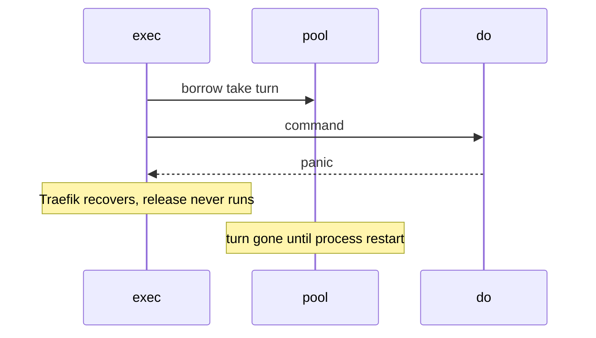

Developer review: in progress — 2026-09-13T09:02:12Z

## What this changes
**Operators.** None.

**Admin users.** None.

**Developers.** None.

**End users.** None.

## Motivation
SimpleRedis returns an in-use-turn only by calling `release` after `do`. On DestBranch that call is not deferred (PR 29 discarded defer-release). A panic between `borrow` and `release` drops one turn forever. There is no reaper and `OverFrees()` only counts extra returns, so it cannot restore a missing one.

Measured on this DestBranch with `PoolSize` 2: one warm socket, then two recovered panics after `borrow` (`TestBugLostInUseTurnBricksPoolPermanently` from `origin/bugfixes20260913`). `inUseTurns` ended 0/2, idle 0, TCP accepts 2, next `Get` returned `redis:unreachable` while Redis was healthy.

If this does not merge, `PoolSize` recovered panics convert a live client into a permanent outage that looks like a Redis failure. No reachable panic was found in compiled Go (`readReply` fuzz 7.04M execs / 91s), so this is a latent hazard with unbounded blast radius, not a live crash. Yaegi panics are already documented in this package, and Traefik recovers the request so the process stays up.

## Merge readiness
Explore is recorded. Product apply has not started. 5 items remain.

Priority: P2 — latent operator outage with a restart workaround, not a live compiled crash today
Reviewed head: 5579d5c
Owner decision: Required. See Explore Decisions.

## Review scores
| Measure | Result | What it means |
| --- | --- | --- |
| Overall readiness | 3/6 | Explore done; apply not started; CI on the explore push is still running |
| CI proof | 3/6 | build 34748819631 in progress https://github.com/david-garcia-garcia/traefik-middleware-utilities/actions/runs/34748819631 |
| Local tests proof | N/A | before implement (`localTests: none`); remote CI is the proof axis |
| Review resolution | 6/6 | OPEN PR 66, no review comments |

## Verification
| Check | Result | Evidence |
| --- | --- | --- |
| Branch | 2026-09-13-simpleredis-lost-turn-recovery pushed | `git` |
| OpenSpec | none | `openspec/` |
| Pull request | https://github.com/david-garcia-garcia/traefik-middleware-utilities/pull/66 | GitHub |
| CI | build 34748819631 in progress https://github.com/david-garcia-garcia/traefik-middleware-utilities/actions/runs/34748819631 | GitHub check runs |
| Local tests | none | handoff.yaml localTests |
| PR comments | no comments | comments: none |

## Specs
None.

## Deviations from the ask
None.

## Follow-up issues
None.

## How this fits together
Local ticket → branch `2026-09-13-simpleredis-lost-turn-recovery` → PR 66 → explore recorded; apply next.

## Explore Decisions
| Question | Rank | Decision | By |
| --- | --- | --- | --- |
| Refill missing turns at errPoolWait when owned live sockets are zero, or make the turn a leased resource with a reaper? | additive asked | assumed — refill at errPoolWait when idle is empty and heldSockets is 0; no lease object and no goroutine reaper | explore |
| Where is the dialed-but-not-yet-released counter incremented so a recovered panic looks like zero owned sockets and a busy Get does not? | additive asked | assumed — heldSockets atomic, increment in exec after borrow with defer decrement, and around dial inside borrow. Do not increment at turn-take (leaks like the turn). Direct borrow then panic never enters exec so refill is correct | explore |
| Does the nanosecond window after taking a turn and before heldSockets increments let recovery fire and dial past PoolSize? | additive incidental | assumed — do not add a mutex or reaper for that window; hung TCP is covered by the dial increment | explore |
| Should this change also close TCP fds left behind when borrow returns a conn that is never released? | additive incidental | assumed — do not track or close those fds; refill lets the next command dial | explore |

## Before merge
- [ ] [P2] Refill leaked in-use turns at pool-wait when owned live sockets are zero, without breaching PoolSize while commands are busy
- [ ] [P2] Port TestBugLostInUseTurnBricksPoolPermanently into the default suite so it passes; add busy-pool and LostTurns() tests
- [ ] Expose read-only LostTurns() next to OverFrees()
- [ ] Spec: wait-not-dial is backpressure only when sockets are actually live at PoolSize
- [ ] Do not defer sr.release (PR 29 discarded that)

## Findings
- [P2] DestBranch bricks after PoolSize recovered panics — reproduced `TestBugLostInUseTurnBricksPoolPermanently` (turns=0/2, idle=0, accepts=2, next Get redis:unreachable). Path: `simpleredis/pool.go` `borrow` / `simpleredis/commands_exec.go` `exec`. Reply none.

## Axis review
None.

## Agent review details

### Review metrics
| Metric | Value | Why it matters |
| --- | --- | --- |
| Specs in this PR | none | Same list as ## Specs |
| Open reviewer comments walked | 0 FIX / 0 ANSWER / 0 open | Unanswered review is merge risk |
| Reviewed head | 5579d5c06d85f06444c4c803fb55535171d76571 | Card must match the branch you measured |

### Stored data model
None.

### Technical review
Best possible solution: not applied yet. Explore chose refill-on-empty-owned-sockets over defer-release (PR 29) and over a leased-turn reaper.

Do we have a high-confidence way to reproduce? Yes. `TestBugLostInUseTurnBricksPoolPermanently` failed on this DestBranch for the stated reason.

Is this the best way to solve the issue? Not applied yet. Refill at pool-wait when idle and heldSockets are zero preserves PR 29 and the live cap.

### Evidence
What I checked:
- `go test -tags bugrepro -count=1 -timeout 120s -run TestBugLostInUseTurnBricksPoolPermanently ./simpleredis/` failed: turns=0/2, idle=0, accepts=2, Get redis:unreachable
- PR 29 owner comment: discarded defer-release as too much complexity for Yaegi recovering the request while the in-use-turn stays lost
- Check runs on 34748819631: queued / in progress after the explore push

### Rank-up moves
None.
