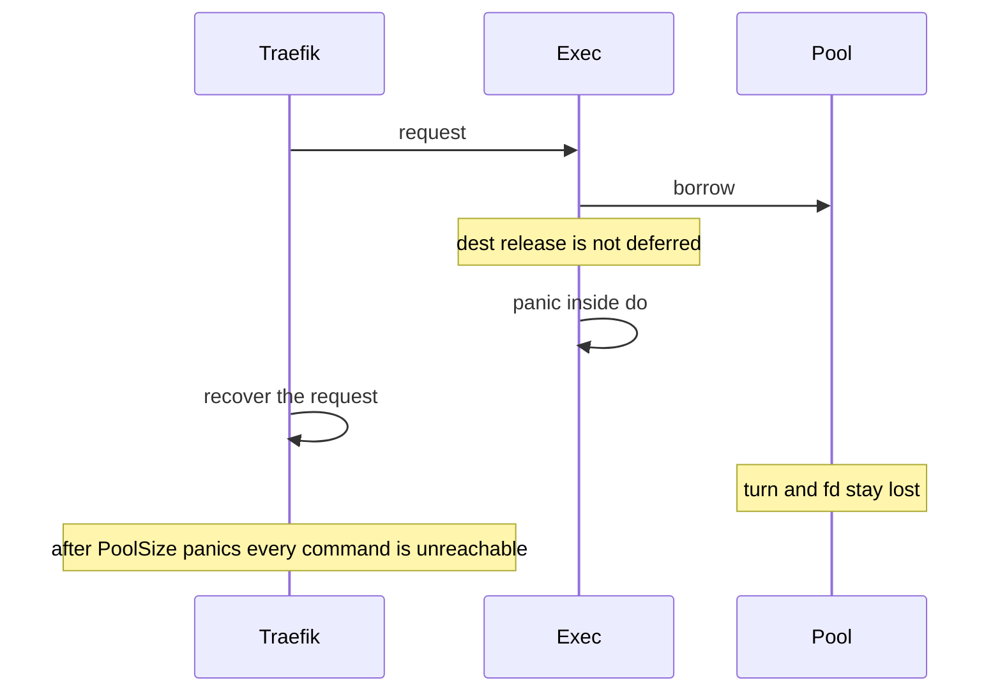

Developer review: ready for review — 2026-09-13T15:26:09Z

## What this changes
**Operators.** None.

**Admin users.** None.

**Developers.** `exec` defers `release` via `runOnConn`. `borrow` defers `freeInUseTurn` unless the socket is handed off, and still returns dest's `handshakeFailed` bool. A recovered panic returns the in-use turn and closes the socket. Permanent proofs: `simpleredis/panic_safety_test.go`, `simpleredis/yaegi_defer_test.go`.

**End users.** None.

## Motivation
SimpleRedis spends one in-use turn for every borrowed socket. Dest fills that turn channel once in `New` and never puts a lost turn back. `exec` calls `release` only after `do` returns. A panic between those two calls keeps the turn and the socket fd.

On dest, Traefik recovers a panicking middleware per request, so the process stays up. After `PoolSize` recovered panics the channel is empty, idle is empty, and every later command is `redis:unreachable` against a healthy Redis with zero open sockets. Operators see an outage. PR 29 closed on the belief that a deferred `release` would not run under Yaegi. A probe on Yaegi v0.16.1 ran the deferred restore for an explicit interpreted panic, the interpreter `errors.As` panic, and a nil-map write. Until this lands, one panicking plugin request per live slot permanently bricks the client.

## Merge readiness
CI succeeded on the merge head. 0 items remain.

Priority: P1 — dest is permanently unreachable after PoolSize recovered panics
Reviewed head: b5d241c
Owner decision: None.

## Review scores
| Measure | Result | What it means |
| --- | --- | --- |
| Overall readiness | 6/6 | Open PR, CI green, no open comments |
| CI proof | 6/6 | succeeded, https://github.com/david-garcia-garcia/traefik-middleware-utilities/actions/runs/34765449702 |
| Local tests proof | N/A | remote PR; localTests passed |
| Review resolution | 6/6 | OPEN PR, no comments |

## Verification
| Check | Result | Evidence |
| --- | --- | --- |
| Branch | 2026-09-13-simpleredis-panic-safe-release pushed | `git` HEAD b5d241c |
| OpenSpec | simpleredis-panic-safe-release | `openspec/changes/archive/2026-09-13-simpleredis-panic-safe-release/` |
| Pull request | https://github.com/david-garcia-garcia/traefik-middleware-utilities/pull/71 | GitHub |
| CI | build 1243 success https://github.com/david-garcia-garcia/traefik-middleware-utilities/actions/runs/34765449702 | Lint, Unit, Unit race, Go E2E Redis, Go E2E Dragonfly, Integration Tests, Integration Tests Redis, Integration Tests Dragonfly |
| Local tests | passed | `go vet ./simpleredis/` clean; after merge `go test -count=1 -timeout 300s ./simpleredis/` 14.141s; `-count=5 -run "Pool|Panic|Release|Borrow|Turn"` 7.867s; no dest test files modified vs origin/master |
| PR comments | no comments | comments: none |

## Specs
- [std_go_simpleredis_tcp-session](https://github.com/david-garcia-garcia/traefik-middleware-utilities/blob/2026-09-13-simpleredis-panic-safe-release/openspec/changes/archive/2026-09-13-simpleredis-panic-safe-release/proposal.md) — modified

## Deviations from the ask
None.

## Follow-up issues
None.

## How this fits together
Local ticket → branch `2026-09-13-simpleredis-panic-safe-release` → PR 71 → CI 1243 green on b5d241c → OpenSpec archive `2026-09-13-simpleredis-panic-safe-release`.

## Explore Decisions
None.

## Before merge
None.

## Findings
None.

## Axis review
[Standards](https://github.com/david-garcia-garcia/traefik-middleware-utilities/blob/2026-09-13-simpleredis-panic-safe-release/devstate/2026/09/2026-09-13-simpleredis-panic-safe-release/codereview_standards.md) — 0 total, 0 pending, 0 completed
[Nitpicks](https://github.com/david-garcia-garcia/traefik-middleware-utilities/blob/2026-09-13-simpleredis-panic-safe-release/devstate/2026/09/2026-09-13-simpleredis-panic-safe-release/codereview_nitpicks.md) — 0 total, 0 pending, 0 completed
[Spec](https://github.com/david-garcia-garcia/traefik-middleware-utilities/blob/2026-09-13-simpleredis-panic-safe-release/devstate/2026/09/2026-09-13-simpleredis-panic-safe-release/codereview_spec.md) — 0 total, 0 pending, 0 completed
[Security](https://github.com/david-garcia-garcia/traefik-middleware-utilities/blob/2026-09-13-simpleredis-panic-safe-release/devstate/2026/09/2026-09-13-simpleredis-panic-safe-release/codereview_security.md) — 0 total, 0 pending, 0 completed
[Performance](https://github.com/david-garcia-garcia/traefik-middleware-utilities/blob/2026-09-13-simpleredis-panic-safe-release/devstate/2026/09/2026-09-13-simpleredis-panic-safe-release/codereview_performance.md) — 0 total, 0 pending, 0 completed
[Dead](https://github.com/david-garcia-garcia/traefik-middleware-utilities/blob/2026-09-13-simpleredis-panic-safe-release/devstate/2026/09/2026-09-13-simpleredis-panic-safe-release/codereview_dead.md) — 0 total, 0 pending, 0 completed
[Test coverage](https://github.com/david-garcia-garcia/traefik-middleware-utilities/blob/2026-09-13-simpleredis-panic-safe-release/devstate/2026/09/2026-09-13-simpleredis-panic-safe-release/codereview_coverage.md) — 1 total, 0 pending, 0 completed, 1 skipped

## Agent review details

### Review metrics
| Metric | Value | Why it matters |
| --- | --- | --- |
| Specs in this PR | 0 added / 1 modified | Same list as ## Specs |
| Open reviewer comments walked | 0 FIX / 0 ANSWER / 0 open | Unanswered review is merge risk |
| Reviewed head | b5d241cb12b8b28afe43cb92f42ebf50b38eda36 | Card must match the branch you measured |

### Stored data model
None.

### Technical review
Best possible solution: dest now defers `release` in `runOnConn` and `freeInUseTurn` in `borrow` unless handed off. Same design as `origin/proto-defer-net`, applied onto current dest (no merge of that branch). Sync with dest #67 kept `handshakeFailed` and dropped the explicit error-path `freeInUseTurn` calls so the defer does not double-free.

Do we have a high-confidence way to reproduce? Yes. Dest throwaway: `turns=0/2` then `redis:unreachable`. After apply: `TestPanicInDoReturnsTurnAndClosesSocket` `turns=2/2 idle=0 accepts=3 OverFrees=0`.

Is this the best way to solve the issue? Yes versus dest: prevent the leak. Closed 66 / 70 refilled turns without closing the panicked fd.

### Evidence
What I checked:
- `go vet ./simpleredis/` clean after the dest merge
- `go test -count=1 -timeout 300s ./simpleredis/` passed in 14.141s on b5d241c
- `go test -count=5 -timeout 600s -run "Pool|Panic|Release|Borrow|Turn" ./simpleredis/` passed in 7.867s on b5d241c
- `git diff origin/master -- simpleredis/*_test.go` is only the two new files (no dest test edited)
- `TestYaegi_DeferRunsOnPanic`: Eval errors `boom`, `errors: *target must be interface or implement error`, `assignment to entry in nil map`; turns=0 each
- Yaegi pin resolved: this module `go.mod` and Traefik v3.7.11 both require v0.16.1
- CI 1243 on b5d241c: Lint, Unit, Unit race, Go E2E Redis, Go E2E Dragonfly, Integration Tests, Integration Tests Redis, Integration Tests Dragonfly all success

### Rank-up moves
None.
