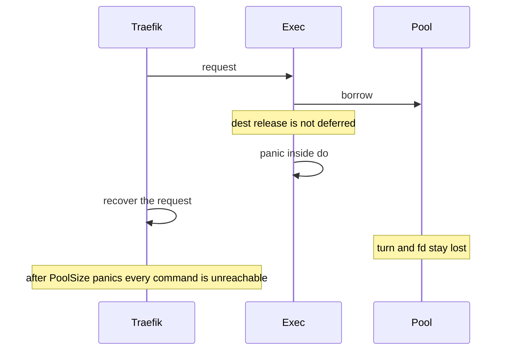

Developer review: in progress — 2026-09-13T14:59:09Z

## What this changes
**Operators.** None.

**Admin users.** None.

**Developers.** OpenSpec change `simpleredis-panic-safe-release` folds a panic-returns-turn requirement into `std_go_simpleredis_tcp-session`. Product code is not on this branch yet.

**End users.** None.

## Motivation
SimpleRedis spends one in-use turn for every borrowed socket. Dest fills that turn channel once in `New` and never puts a lost turn back. `exec` calls `release` only after `do` returns. A panic between those two calls keeps the turn and the socket fd.

On dest, Traefik recovers a panicking middleware per request, so the process stays up. After `PoolSize` recovered panics the channel is empty, idle is empty, and every later command is `redis:unreachable` against a healthy Redis with zero open sockets. Operators see an outage. PR #29 closed on the belief that a deferred `release` would not run under Yaegi. A probe on Yaegi v0.16.1 ran the deferred restore for an explicit interpreted panic, the interpreter `errors.As` panic, and a nil-map write. Until this lands, one panicking plugin request per live slot permanently bricks the client.

## Merge readiness
Propose is apply-ready. Product fix is not on this branch yet. 4 items remain.

Priority: P1 — dest is permanently unreachable after PoolSize recovered panics
Reviewed head: bf04c39
Owner decision: None.

## Review scores
| Measure | Result | What it means |
| --- | --- | --- |
| Overall readiness | 3/6 | Propose pushed, CI in progress |
| CI proof | 3/6 | in progress, [build 34764213110](https://github.com/david-garcia-garcia/traefik-middleware-utilities/actions/runs/34764213110) |
| Local tests proof | N/A | localTests none, before implement |
| Review resolution | 6/6 | OPEN PR, no comments |

## Verification
| Check | Result | Evidence |
| --- | --- | --- |
| Branch | 2026-09-13-simpleredis-panic-safe-release pushed | `git` HEAD bf04c39 |
| OpenSpec | simpleredis-panic-safe-release | `openspec/changes/simpleredis-panic-safe-release/` |
| Pull request | https://github.com/david-garcia-garcia/traefik-middleware-utilities/pull/71 | GitHub |
| CI | build 34764213110 in progress https://github.com/david-garcia-garcia/traefik-middleware-utilities/actions/runs/34764213110 | GitHub check runs |
| Local tests | none | handoff.yaml localTests |
| PR comments | no comments | comments: none |

## Specs
- [std_go_simpleredis_tcp-session](https://github.com/david-garcia-garcia/traefik-middleware-utilities/blob/2026-09-13-simpleredis-panic-safe-release/openspec/changes/simpleredis-panic-safe-release/proposal.md) — modified

## Deviations from the ask
None.

## Follow-up issues
None.

## How this fits together
Local spec → branch `2026-09-13-simpleredis-panic-safe-release` → PR 71 → OpenSpec change `simpleredis-panic-safe-release` → CI 34764213110 in progress.

## Explore Decisions
None.

## Before merge
- [ ] [P1] Land `runOnConn` deferred release from `origin/proto-defer-net` without redesign
- [ ] [P1] Land `borrow` `handedOff` and drop the explicit error-path `freeInUseTurn` calls
- [ ] Permanent panic-in-`do` test and Yaegi defer-on-panic probe (no `zz_` / proto / scratch names)
- [ ] Update `resp.go` `do` comment, tcp-session spec, and `std_go_simpleredis.md` gotcha

## Findings
None.

## Axis review
None.

## Agent review details

### Review metrics
| Metric | Value | Why it matters |
| --- | --- | --- |
| Specs in this PR | 0 added / 1 modified | Same list as ## Specs |
| Open reviewer comments walked | 0 FIX / 0 ANSWER / 0 open | Unanswered review is merge risk |
| Reviewed head | bf04c3958bace1d5a2bfb22c197ee19ae243d4ae | Card must match the branch you measured |

### Stored data model
None.

### Technical review
Best possible solution: apply `runOnConn` plus `borrow` `handedOff` from `origin/proto-defer-net` onto dest; do not merge that branch.

Do we have a high-confidence way to reproduce? Yes. Explore throwaway: PoolSize 2, two recovered panics → `turns=0/2`, next Get `redis:unreachable`.

Is this the best way to solve the issue? Yes versus dest: prevent the leak. Closed #66 / #70 refilled turns without closing the panicked fd.

### Evidence
What I checked:
- `openspec validate simpleredis-panic-safe-release --strict` valid
- FindSpecHost fold `std_go_simpleredis_tcp-session` (high)
- dest Yaegi pin v0.16.1 resolved on explore.md
- CI 34764213110 in progress after propose push

### Rank-up moves
None.
