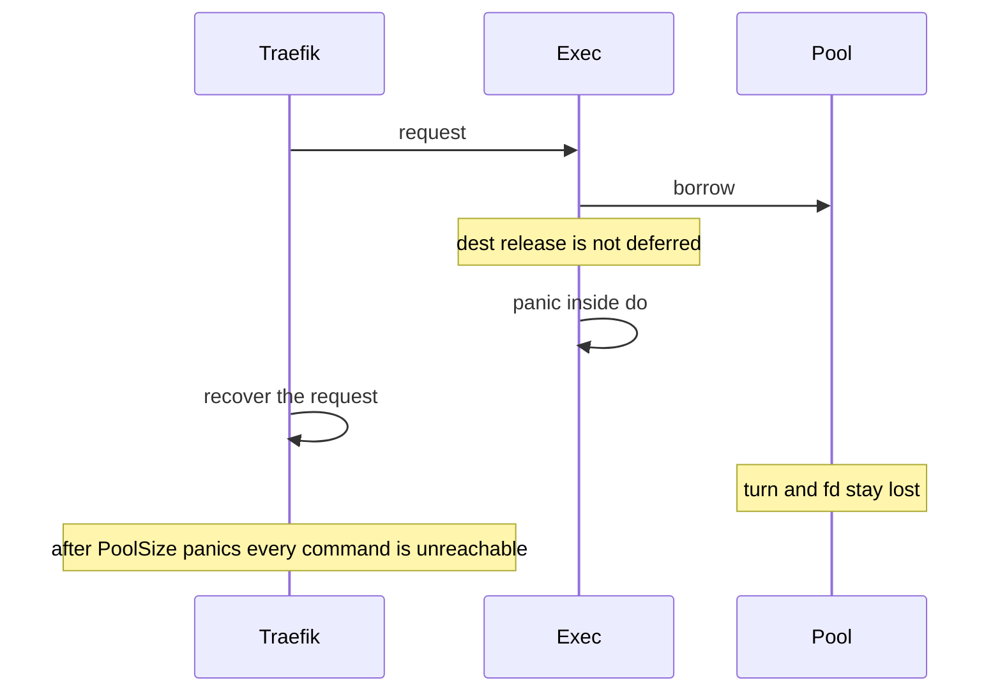

Developer review: in progress — 2026-09-13T14:49:05Z

## What this changes
**Operators.** None.

**Admin users.** None.

**Developers.** None.

**End users.** None.

## Motivation
SimpleRedis spends one in-use turn for every borrowed socket. Dest fills that turn channel once in `New` and never puts a lost turn back. `exec` calls `release` only after `do` returns. A panic between those two calls keeps the turn and the socket fd.

On dest, Traefik recovers a panicking middleware per request, so the process stays up. After `PoolSize` recovered panics the channel is empty, idle is empty, and every later command is `redis:unreachable` against a healthy Redis with zero open sockets. Operators see an outage. PR #29 closed on the belief that a deferred `release` would not run under Yaegi. A probe on Yaegi v0.16.1 ran the deferred restore for an explicit interpreted panic, the interpreter `errors.As` panic, and a nil-map write. Until this lands, one panicking plugin request per live slot permanently bricks the client.

## Merge readiness
Prepare grounded the ticket. Product fix is not on this branch yet. 4 items remain.

Priority: P1 — dest is permanently unreachable after PoolSize recovered panics
Reviewed head: 5794f04
Owner decision: None.

## Review scores
| Measure | Result | What it means |
| --- | --- | --- |
| Overall readiness | 3/6 | Stub PR open, CI in progress |
| CI proof | 3/6 | in progress, [build 34763734136](https://github.com/david-garcia-garcia/traefik-middleware-utilities/actions/runs/34763734136) |
| Local tests proof | N/A | localTests none, before implement |
| Review resolution | 6/6 | OPEN PR, no comments |

## Verification
| Check | Result | Evidence |
| --- | --- | --- |
| Branch | 2026-09-13-simpleredis-panic-safe-release pushed | `git` origin |
| OpenSpec | none | `openspec/` |
| Pull request | https://github.com/david-garcia-garcia/traefik-middleware-utilities/pull/71 | pr-host Create |
| CI | build 34763734136 in progress https://github.com/david-garcia-garcia/traefik-middleware-utilities/actions/runs/34763734136 | pr-host CI |
| Local tests | none | handoff.yaml localTests |
| PR comments | no comments | no comments.md |

## Specs
None.

## Deviations from the ask
None.

## Follow-up issues
None.

## How this fits together
Local spec is the dump. Branch `2026-09-13-simpleredis-panic-safe-release` from `origin/master` opened PR 71. CI is in progress on the prepare commits.

## Explore Decisions
None.

## Before merge
- [ ] [P1] Land `runOnConn` deferred release from `origin/proto-defer-net` without redesign
- [ ] [P1] Land `borrow` `handedOff` and drop the explicit error-path `freeInUseTurn` calls
- [ ] Permanent panic-in-`do` test and Yaegi defer-on-panic probe (no `zz_` / proto / scratch names)
- [ ] Update `resp.go` `do` comment, tcp-session spec, and `std_go_simpleredis.md` gotcha

## Findings
None.

## Axis review
None.

## Agent review details

### Review metrics
| Metric | Value | Why it matters |
| --- | --- | --- |
| Specs in this PR | none | Same list as ## Specs |
| Open reviewer comments walked | 0 FIX / 0 ANSWER / 0 open | Unanswered review is merge risk |
| Reviewed head | 5794f04318d32e030e2f6089993a0c4c9726b4d5 | Card must match the branch you measured |

### Stored data model
None.

### Technical review
Best possible solution: dest still loses the turn and fd on a recovered panic. The prototype deferred `release` plus `handedOff` is the smallest durable delta versus dest.

Do we have a high-confidence way to reproduce? Yes — dest `exec` has no deferred `release` (`simpleredis/commands_exec.go`), dest hunt file records PoolSize 2 then `redis:unreachable` (`simpleredis/BUGS.md` section 2), and `origin/proto-defer-net` already has a passing panic test.

Is this the best way to solve the issue? Yes — keep the prototype. Closed PRs #66 and #70 refilled turns without closing the panicked fd; this ticket forbids that machinery.

### Evidence
What I checked:
- dest `exec` comments PR #29 and calls `release` only after `do` (`simpleredis/commands_exec.go`, `origin/master` `c960bfe`)
- dest `borrow` explicit `freeInUseTurn` on closed-idle and dial-error only (`simpleredis/pool.go`)
- dest `do` comment still says a panic loses the turn (`simpleredis/resp.go`)
- dest pins `github.com/traefik/yaegi v0.16.1` (`go.mod`, `go.sum`); compose image `traefik:v3.7.11`
- prototype `runOnConn` / `handedOff` on `origin/proto-defer-net`
- PR 71 open, comments empty (GitHub MCP)

### Rank-up moves
None.
