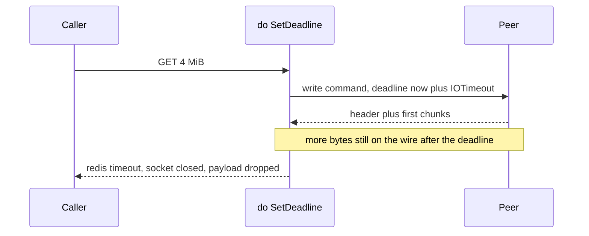

Developer review: in progress — 2026-09-13T17:10:01Z

## What this changes
**Operators.** None.

**Admin users.** None.

**Developers.** None yet versus DestBranch. Explore reproduced BUG-3 and chose a stall-timeout wrapper under `bufio` at dial. Product code has not landed.

**End users.** None.

## Motivation
A GET of a large Redis value on DestBranch can fail forever even when the peer is healthy and sending bytes the whole time. `do` stamps one `SetDeadline(now+IOTimeout)` for the whole command. Default `IOTimeout` is 100 milliseconds; the decoder still accepts bulks up to 64 MiB.

Measured on this run: tagged `TestBugValueLargerThanIOTimeoutIsPermanentlyUnfetchable` failed 5/5 with `redis:timeout`, 5 dials, 20.5 MiB allocated, 0.30s. If we do not merge a stall-timeout, those keys stay unreadable and every retry looks like a generic timeout.

## Merge readiness
Explore is written. Simplicity gate: the stall wrapper is small enough to implement. Product code has not landed. 7 items remain.

Priority: P1 — Production is serving a wrong public contract today: compliant large values are permanently unreadable.
Reviewed head: 945ca37
Owner decision: None.

## Review scores
| Measure | Result | What it means |
| --- | --- | --- |
| Overall readiness | 1/6 | No apply yet; CI not seen |
| CI proof | 1/6 | Branch pushed; checks not seen |
| Local tests proof | N/A | Before implement; remote PR uses CI proof |
| Review resolution | 6/6 | OPEN PR; no review comments |

## Verification
| Check | Result | Evidence |
| --- | --- | --- |
| Branch | 2026-09-13-simpleredis-per-read-deadline pushed | origin (bus commits local 945ca37 unpushed) |
| OpenSpec | none | no change folder |
| Pull request | https://github.com/david-garcia-garcia/traefik-middleware-utilities/pull/84 | GitHub |
| CI | not seen | not measured this card |
| Local tests | none | handoff.yaml localTests |
| PR comments | no comments | comments: none |

## Specs
None.

## Deviations from the ask
- taken: reconcile `maxBulkLength` with what `IOTimeout` can carry → keep `64 << 20`; stall bound plus overall command budget is the wall-time cap — `simpleredis/resp.go` `maxBulkLength` — a shrink or bandwidth model re-breaks large values the stall fix makes readable. Requester: not asked.

## Follow-up issues
None.

## How this fits together
Local ticket on branch `2026-09-13-simpleredis-per-read-deadline`, stub PR #84. Explore reproduced the tagged failure and recorded proceed policies on `explore.md`.

## Explore Decisions
| Question | Rank | Decision | By |
| --- | --- | --- | --- |
| Should `maxBulkLength` shrink to what `IOTimeout` can carry? | bounded incidental | assumed — leave `64 << 20`; overall budget plus `watchConnClose` is the wall-time cap | explore |
| How does per-Read refresh keep the caller deadline vs `redis:timeout` split? | additive asked | assumed — each Read/Write uses `clampTimeout(ctx, IOTimeout)`; `do` still passes start-of-command `ioBound` to `ioOrContext`; `watchConnClose` is the hard stop | explore |

## Before merge
- [ ] Propose the tcp-session stall-timeout delta
- [ ] Implement the dial-time `net.Conn` wrapper
- [ ] Default-suite stall-progress and stall-silence tests
- [ ] Keep caller-deadline vs `redis:timeout` tests green
- [ ] Prove a drip peer cannot pin a turn past the command budget
- [ ] Measured CI on this PR

## Findings
None.

## Axis review
None.

## Agent review details

### Review metrics
| Metric | Value | Why it matters |
| --- | --- | --- |
| Specs in this PR | none | No apply yet |
| Open reviewer comments walked | 0 FIX / 0 ANSWER / 0 open | Unanswered review is merge risk |
| Reviewed head | 945ca3743580ab3adad218271ffcdf4bd54a6e2d | Card must match the branch you measured |

### Stored data model
None.

### Technical review
Best possible solution: wrap the TCP conn at dial so every `bufio` `Read`/`Write` refreshes `SetReadDeadline`/`SetWriteDeadline` with `clampTimeout(ctx, IOTimeout)`, and keep `watchConnClose` as the overall cap.

Do we have a high-confidence way to reproduce? Yes — tagged test failed 5/5 with `redis:timeout`, 5 dials, 20.5 MiB allocated.

Is this the best way to solve the issue? Yes versus DestBranch one-shot `SetDeadline`. A bandwidth-derived `maxBulkLength` is the worse alternative (deviation taken).

### Evidence
What I checked:
- Tagged repro FAIL (caller checkout, 5/5, 20.5 MiB, 5 dials)
- `simpleredis/resp.go` `do` / `watchConnClose` / `ioOrContext`
- `simpleredis/pool.go` `dial` creates `bufio` on `netConn`
- `openspec/specs/std_go_simpleredis_tcp-session/spec.md` overall-deadline requirement

### Rank-up moves
None.
