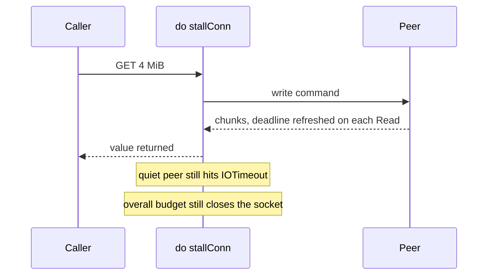

Developer review: ready for review — 2026-09-13T17:24:36Z

## What this changes
**Operators.** None.

**Admin users.** None.

**Developers.** `IOTimeout` is a stall bound: each kernel `Read`/`Write` refreshes `SetReadDeadline`/`SetWriteDeadline`. A steadily streaming multi-megabyte bulk that outlasts one `IOTimeout` returns intact. A silent mid-reply still times out promptly. A drip peer cannot pin an in-use turn past `(MaxRetries+1)*(DialTimeout+IOTimeout)`. `maxBulkLength` stays 64 MiB.

**End users.** None.

## Motivation
A GET of a large Redis value on DestBranch can fail forever even when the peer is healthy and sending bytes the whole time. `do` stamped one `SetDeadline(now+IOTimeout)` for the whole command. Default `IOTimeout` is 100 milliseconds; the decoder still accepts bulks up to 64 MiB.

Measured before the fix: tagged `TestBugValueLargerThanIOTimeoutIsPermanentlyUnfetchable` failed 5/5 with `redis:timeout`, 5 dials, 20.5 MiB allocated. After the fix: 0/5 failed, 1 dial reused, same allocation size. If we do not merge, those keys stay unreadable and every retry looks like a generic timeout.

## Merge readiness
Ready for review. 0 items remain.

Priority: P1 — Production is serving a wrong public contract today: compliant large values are permanently unreadable.
Reviewed head: a447151
Owner decision: None.

## Review scores
| Measure | Result | What it means |
| --- | --- | --- |
| Overall readiness | 6/6 | CI green, no open comments, local suite passed |
| CI proof | 6/6 | All 8 checks succeeded https://github.com/david-garcia-garcia/traefik-middleware-utilities/actions/runs/34771324910 |
| Local tests proof | N/A | Remote PR; CI proof covers |
| Review resolution | 6/6 | OPEN PR; no review comments |

## Verification
| Check | Result | Evidence |
| --- | --- | --- |
| Branch | 2026-09-13-simpleredis-per-read-deadline pushed | origin a447151 |
| OpenSpec | simpleredis-iotimeout-stall archived | `openspec/changes/archive/2026-09-13-simpleredis-iotimeout-stall/` |
| Pull request | https://github.com/david-garcia-garcia/traefik-middleware-utilities/pull/84 | GitHub |
| CI | build 34771324910 success https://github.com/david-garcia-garcia/traefik-middleware-utilities/actions/runs/34771324910 | GitHub checks |
| Local tests | passed | `go vet ./simpleredis/`, `go test ./simpleredis/ -count=1`, `go test ./... -count=1 -short`; tagged BUG-3 0/5 fail |
| PR comments | no comments | comments: none |

## Specs
- [std_go_simpleredis_tcp-session](https://github.com/david-garcia-garcia/traefik-middleware-utilities/blob/2026-09-13-simpleredis-per-read-deadline/openspec/changes/archive/2026-09-13-simpleredis-iotimeout-stall/proposal.md) — modified

## Deviations from the ask
- taken: reconcile `maxBulkLength` with what `IOTimeout` can carry → keep `64 << 20`; stall bound plus overall command budget is the wall-time cap — `simpleredis/resp.go` `maxBulkLength` — a shrink or bandwidth model re-breaks large values the stall fix makes readable. Requester: not asked.

## Follow-up issues
None.

## How this fits together
Local ticket on branch `2026-09-13-simpleredis-per-read-deadline`, PR #84. Change `simpleredis-iotimeout-stall` is archived. CI run 34771324910 is green.

## Explore Decisions
| Question | Rank | Decision | By |
| --- | --- | --- | --- |
| Should `maxBulkLength` shrink to what `IOTimeout` can carry? | bounded incidental | assumed — leave `64 << 20`; overall budget plus `watchConnClose` is the wall-time cap | explore |
| How does per-Read refresh keep the caller deadline vs `redis:timeout` split? | additive asked | assumed — each Read/Write uses `clampTimeout(ctx, IOTimeout)`; `do` still passes start-of-command `ioBound` to `ioOrContext`; `watchConnClose` is the hard stop | explore |

## Before merge
None.

## Findings
None.

## Axis review
[Standards](https://github.com/david-garcia-garcia/traefik-middleware-utilities/blob/2026-09-13-simpleredis-per-read-deadline/devstate/2026/09/2026-09-13-simpleredis-per-read-deadline/codereview_standards.md) — 0 total, 0 pending, 0 completed
[Nitpicks](https://github.com/david-garcia-garcia/traefik-middleware-utilities/blob/2026-09-13-simpleredis-per-read-deadline/devstate/2026/09/2026-09-13-simpleredis-per-read-deadline/codereview_nitpicks.md) — 0 total, 0 pending, 0 completed
[Spec](https://github.com/david-garcia-garcia/traefik-middleware-utilities/blob/2026-09-13-simpleredis-per-read-deadline/devstate/2026/09/2026-09-13-simpleredis-per-read-deadline/codereview_spec.md) — 0 total, 0 pending, 0 completed
[Security](https://github.com/david-garcia-garcia/traefik-middleware-utilities/blob/2026-09-13-simpleredis-per-read-deadline/devstate/2026/09/2026-09-13-simpleredis-per-read-deadline/codereview_security.md) — 0 total, 0 pending, 0 completed
[Performance](https://github.com/david-garcia-garcia/traefik-middleware-utilities/blob/2026-09-13-simpleredis-per-read-deadline/devstate/2026/09/2026-09-13-simpleredis-per-read-deadline/codereview_performance.md) — 0 total, 0 pending, 0 completed
[Dead](https://github.com/david-garcia-garcia/traefik-middleware-utilities/blob/2026-09-13-simpleredis-per-read-deadline/devstate/2026/09/2026-09-13-simpleredis-per-read-deadline/codereview_dead.md) — 0 total, 0 pending, 0 completed
[Test coverage](https://github.com/david-garcia-garcia/traefik-middleware-utilities/blob/2026-09-13-simpleredis-per-read-deadline/devstate/2026/09/2026-09-13-simpleredis-per-read-deadline/codereview_coverage.md) — 0 total, 0 pending, 0 completed

## Agent review details

### Review metrics
| Metric | Value | Why it matters |
| --- | --- | --- |
| Specs in this PR | 0 added / 1 modified | Same list as ## Specs |
| Open reviewer comments walked | 0 FIX / 0 ANSWER / 0 open | Unanswered review is merge risk |
| Reviewed head | a44715182062b578035d213c309a451c14fbb514 | Card must match the branch you measured |

### Stored data model
None.

### Technical review
Best possible solution: wrap the TCP conn at dial so every `bufio` `Read`/`Write` refreshes the stall deadline with `clampTimeout(ctx, IOTimeout)`, keep `watchConnClose` as the overall cap, leave `maxBulkLength` as a parse cap. Yaegi required every `net.Conn` method to be declared (no embed promotion).

Do we have a high-confidence way to reproduce? Yes — tagged test failed 5/5 before, passed 0/5 after; default-suite `TestBug3StreamingBulkBeyondIOTimeoutReturnsIntact`, `TestBug3SilentMidReplyTimesOutOnStall`, `TestBug3DripPeerCannotPinTurnPastOverallBudget`.

Is this the best way to solve the issue? Yes versus DestBranch one-shot `SetDeadline`. A bandwidth-derived `maxBulkLength` is the worse alternative (deviation taken).

### Evidence
What I checked:
- Tagged repro FAIL then PASS (5/5 fail → 0/5 fail, 5 dials → 1 dial)
- `go vet ./simpleredis/`, `go test ./simpleredis/ -count=1`, `go test ./... -count=1 -short`
- CI run 34771324910 all success
- Caller-deadline tests still green (`TestGetCallerDeadlineIsDeadlineExceededNotRedisTimeout`)

### Rank-up moves
None.
