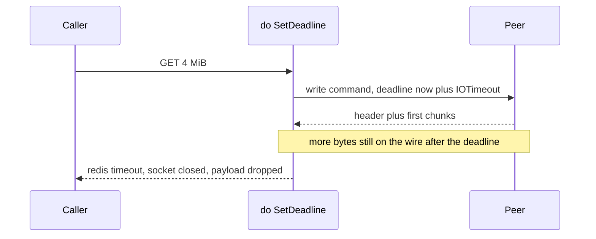

Developer review: in progress — 2026-09-13T17:04:38Z

## What this changes
**Operators.** None.

**Admin users.** None.

**Developers.** None yet. This branch only opens the review PR. The ticket is to stop treating `IOTimeout` as a total-transfer cap so a steadily streaming Redis bulk that outlasts one `IOTimeout` can still be read.

**End users.** None.

## Motivation
A GET of a large Redis value on DestBranch can fail forever even when the peer is healthy and sending bytes the whole time. `do` stamps one `SetDeadline(now+IOTimeout)` for the whole command. Default `IOTimeout` is 100 milliseconds; the decoder still accepts bulks up to 64 MiB. Those two numbers need about 5.4 Gbit/s sustained. A 4 MiB value at 60 ms failed 5/5 with `redis:timeout`, allocated ~20 MiB, and burned a fresh dial each time.

If we do not merge a stall-timeout (or an equally small correct alternative), any key whose payload cannot cross the wire inside one `IOTimeout` stays unreadable, and every retry looks like a generic timeout. Raising `IOTimeout` is not a workaround: that same knob bounds every small command.

## Merge readiness
Ticket is grounded and a stub PR exists. Product code has not landed. 8 items remain.

Priority: P1 — Production is serving a wrong public contract today: compliant large values are permanently unreadable.
Reviewed head: ff821e8
Owner decision: None.

## Review scores
| Measure | Result | What it means |
| --- | --- | --- |
| Overall readiness | 1/6 | Stub PR only; CI not seen; no apply yet |
| CI proof | 1/6 | Pushed; checks not seen |
| Local tests proof | N/A | Before implement; remote PR uses CI proof |
| Review resolution | 6/6 | OPEN PR; no review comments |

## Verification
| Check | Result | Evidence |
| --- | --- | --- |
| Branch | 2026-09-13-simpleredis-per-read-deadline pushed | `git push` origin |
| OpenSpec | none | no change folder |
| Pull request | https://github.com/david-garcia-garcia/traefik-middleware-utilities/pull/84 | GitHub Create |
| CI | not seen | just pushed |
| Local tests | none | handoff.yaml localTests |
| PR comments | no comments | comments: none |

## Specs
None.

## Deviations from the ask
None.

## Follow-up issues
None.

## How this fits together
Local ticket `2026-09-13-simpleredis-per-read-deadline` runs on this branch from `origin/master`. Stub PR #84 is the durable card host. First prepare worker returned paths that were not on disk; this prepare re-ran in `wt-modsec-2026-09-13-simpleredis-per-read-deadline` and is the record.

## Explore Decisions
None.

## Before merge
- [ ] Explore the stall-timeout shape and the `maxBulkLength` tension
- [ ] Propose (or stop at the simplicity gate)
- [ ] Implement only if the simplest correct fix is small
- [ ] Default-suite stall-progress and stall-silence tests
- [ ] Keep caller-deadline vs `redis:timeout` tests green
- [ ] Measured CI on this PR

## Findings
None.

## Axis review
None.

## Agent review details

### Review metrics
| Metric | Value | Why it matters |
| --- | --- | --- |
| Specs in this PR | none | No apply yet |
| Open reviewer comments walked | 0 FIX / 0 ANSWER / 0 open | Unanswered review is merge risk |
| Reviewed head | ff821e87bae195ceb235d8356aef4c8183441af6 | Card must match the branch you measured |

### Stored data model
None.

### Technical review
Best possible solution: not chosen yet; DestBranch still uses one absolute `SetDeadline` per command.

Do we have a high-confidence way to reproduce? Yes, tagged `TestBugValueLargerThanIOTimeoutIsPermanentlyUnfetchable` against a trickle bulk peer (explore will run it).

Is this the best way to solve the issue? Not decided. Prepare does not pick the wrapper vs other shapes.

### Evidence
What I checked:
- `simpleredis/resp.go` `do` one-shot `SetDeadline` (origin/master a239a9e)
- `simpleredis/commands_exec.go` `bindCommandDeadline` / `clampTimeout` / `ioOrContext` (same SHA)
- `openspec/specs/std_go_simpleredis_tcp-session/spec.md` overall-deadline requirement (same SHA)
- Stub PR https://github.com/david-garcia-garcia/traefik-middleware-utilities/pull/84

### Rank-up moves
None.
