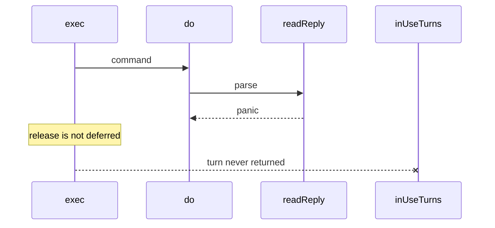

Developer review: in progress — 2026-09-13T09:05:40Z

## What this changes
**Operators.** None.

**Admin users.** None.

**Developers.** OpenSpec change `simpleredis-resilience-test-coverage` adds coverage requirements on `std_go_simpleredis_tcp-session`, `std_go_simpleredis_resp-decode`, and `std_go_simpleredis_resp-commands`. Tests and `BUGS.md` are not in this diff yet.

**End users.** None.

## Motivation
Dest `simpleredis` already survived a hunt for production killers (races, leaked pool turns, silent cross-key replies). Three real defects are owned by other PRs. The probes that came back healthy are not locked in on dest: there is no chaos fake, no `FuzzReadReply`, no 200-cycle lifecycle lock, no interpreted error-path Yaegi coverage, no concurrent MSetEX fallback race lock, and no RESP injection test for CRLF plus an inline PING payload. `simpleredis/BUGS.md` is also missing on dest.

Cost of not merging: the next edit can reintroduce a turn leak or a cross-key reply and CI will still look green. A decoder panic in `readReply` is a permanent pool-turn leak because `exec` releases without `defer`.

## Merge readiness
Propose folded coverage onto three existing spec leaves. Product tests are not in this diff. 1 item remains.

Priority: P3 — spec, docs, tests, or internal clarity, no current user or operator harm
Reviewed head: dba1ba2
Owner decision: None.

## Review scores
| Measure | Result | What it means |
| --- | --- | --- |
| Overall readiness | 1/6 | CI not seen after propose push |
| CI proof | 1/6 | named checks not seen |
| Local tests proof | N/A | before implement; remote PR |
| Review resolution | 6/6 | OPEN PR, no review comments |

## Verification
| Check | Result | Evidence |
| --- | --- | --- |
| Branch | 2026-09-13-simpleredis-resilience-test-coverage pushed | git / origin |
| OpenSpec | simpleredis-resilience-test-coverage | `openspec/changes/simpleredis-resilience-test-coverage/` |
| Pull request | https://github.com/david-garcia-garcia/traefik-middleware-utilities/pull/68 | pr-host |
| CI | not seen | GitHub MCP get_check_runs empty on last measure |
| Local tests | none | handoff.yaml localTests |
| PR comments | no comments | no comments.md |

## Specs
- [std_go_simpleredis_tcp-session](https://github.com/david-garcia-garcia/traefik-middleware-utilities/blob/2026-09-13-simpleredis-resilience-test-coverage/openspec/changes/simpleredis-resilience-test-coverage/proposal.md) — modified
- [std_go_simpleredis_resp-decode](https://github.com/david-garcia-garcia/traefik-middleware-utilities/blob/2026-09-13-simpleredis-resilience-test-coverage/openspec/changes/simpleredis-resilience-test-coverage/proposal.md) — modified
- [std_go_simpleredis_resp-commands](https://github.com/david-garcia-garcia/traefik-middleware-utilities/blob/2026-09-13-simpleredis-resilience-test-coverage/openspec/changes/simpleredis-resilience-test-coverage/proposal.md) — modified

## Deviations from the ask
None.

## Follow-up issues
None.

## How this fits together
Propose is on PR 68 off `origin/master`. Implement has not started.

## Explore Decisions
| Question | Rank | Decision | By |
| --- | --- | --- | --- |
| What are the new test file and function names? | additive asked | assumed — chaos_pool_test.go, resp_fuzz_test.go, lifecycle_test.go, yaegi_errorpath_test.go, commands_msetex_concurrent_test.go, resp_injection_test.go | explore |
| Is BUGS.md a tracked package record or a local-only artifact? | additive asked | assumed — commit simpleredis/BUGS.md; leave reclaim/tokenbucket/windowcounter BUGS.md untracked | explore |
| Does propose add an OpenSpec coverage requirement, or are tests-only enough? | additive asked | assumed — add coverage requirements on the three existing SimpleRedis spec leaves, no new family | explore |
| What chaos duration and lifecycle iteration counts keep the default suite in the low seconds and keep go test -race from timing out? | additive asked | assumed — Short skips chaos/lifecycle; default 24 goroutines x 1s and 200 cycles; raceDetectorOn lowers those plus concurrent MSetEX | explore |
| Who already owns client identity (address, user, tenant, Host, trust hop)? | additive asked | assumed — none; this PR does not set or reconstruct identity | explore |

## Before merge
- [ ] Land the six healthy-probe tests and reframed `simpleredis/BUGS.md` (tests and docs only)
- [ ] Human: `reclaim/BUGS.md`, `tokenbucket/BUGS.md`, and `windowcounter/BUGS.md` are untracked in the caller workspace — decide whether `BUGS.md` stays local rather than silently dropping `simpleredis/BUGS.md`
- [x] Propose folded coverage onto three existing spec leaves
- [x] Explore recorded assumed proceed policies
- [x] Stub PR opened

## Findings
None.

## Axis review
None.

## Agent review details

### Review metrics
| Metric | Value | Why it matters |
| --- | --- | --- |
| Specs in this PR | 0 added / 3 modified | Same list as ## Specs |
| Open reviewer comments walked | 0 FIX / 0 ANSWER / 0 open | Unanswered review is merge risk |
| Reviewed head | dba1ba26f6d60390c8cc1212f16607703efaba38 | Card must match the branch you measured |

### Stored data model
None.

### Technical review
Best possible solution: dest already behaves as the healthy probes measured; this ticket adds the missing locks and the written record, not a product patch.

Do we have a high-confidence way to reproduce? Yes, the Rejected table on `origin/bugfixes20260913:simpleredis/BUGS.md` lists measurements.

Is this the best way to solve the issue? Yes vs dest: lock the healthy probes as tests instead of hunting them again.

### Evidence
What I checked:
- `openspec validate simpleredis-resilience-test-coverage --strict` valid
- FindSpecHost fold into the three existing SimpleRedis leaves
- Stub PR 68

### Rank-up moves
None.
