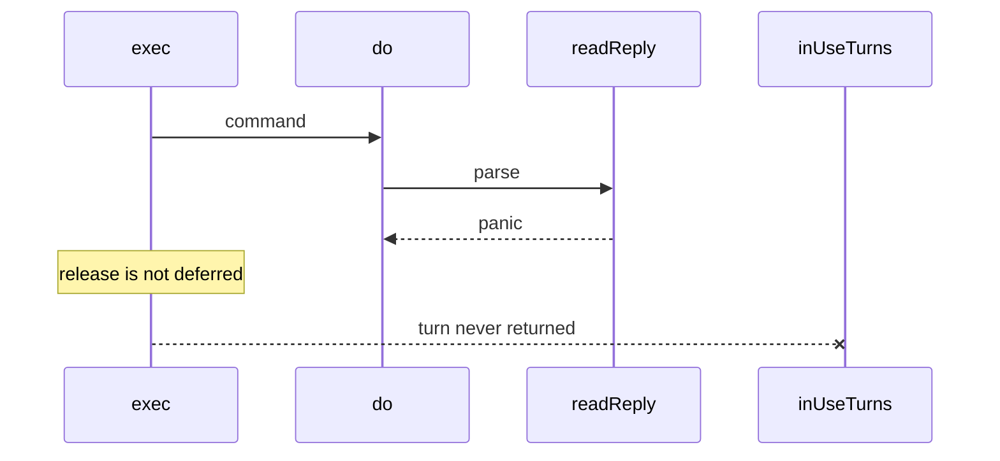

Developer review: in progress — 2026-09-13T08:53:27Z

## What this changes
**Operators.** None.

**Admin users.** None.

**Developers.** None.

**End users.** None.

## Motivation
Dest `simpleredis` already survived a hunt for production killers (races, leaked pool turns, silent cross-key replies). Three real defects are owned by other PRs. The probes that came back healthy are not locked in on dest: there is no chaos fake, no `FuzzReadReply`, no 200-cycle lifecycle lock, no interpreted error-path Yaegi coverage, no concurrent MSetEX fallback race lock, and no RESP injection test for `\r\n` plus an inline PING payload. `simpleredis/BUGS.md` is also missing on dest.

Cost of not merging: the next edit can reintroduce a turn leak or a cross-key reply and CI will still look green. A decoder panic in `readReply` is a permanent pool-turn leak because `exec` releases without `defer`.

## Merge readiness
Prepare grounded the ticket and opened the stub PR. Tests and `simpleredis/BUGS.md` are not in this diff. 1 item remains.

Priority: P3 — spec, docs, tests, or internal clarity, no current user or operator harm
Reviewed head: 1a09c15
Owner decision: None.

## Review scores
| Measure | Result | What it means |
| --- | --- | --- |
| Overall readiness | 1/6 | CI not seen after push; prepare only |
| CI proof | 1/6 | pushed, checks not seen |
| Local tests proof | N/A | before implement; remote PR |
| Review resolution | 6/6 | OPEN PR, no review comments |

## Verification
| Check | Result | Evidence |
| --- | --- | --- |
| Branch | 2026-09-13-simpleredis-resilience-test-coverage pushed | git / origin |
| OpenSpec | none | `openspec/` |
| Pull request | https://github.com/david-garcia-garcia/traefik-middleware-utilities/pull/68 | pr-host Create |
| CI | not seen | pr-host CI |
| Local tests | none | handoff.yaml localTests |
| PR comments | no comments | no comments.md |

## Specs
None.

## Deviations from the ask
None.

## Follow-up issues
None.

## How this fits together
Local spec dumped into the run bus, branch `2026-09-13-simpleredis-resilience-test-coverage` off `origin/master`, stub PR 68. Product tests are not started. CI not seen.

## Explore Decisions
None.

## Before merge
- [ ] Land the six healthy-probe tests and reframed `simpleredis/BUGS.md` (tests and docs only)
- [ ] Human: `reclaim/BUGS.md`, `tokenbucket/BUGS.md`, and `windowcounter/BUGS.md` are untracked in the caller workspace — decide whether `BUGS.md` stays local rather than silently dropping `simpleredis/BUGS.md`
- [x] Stub PR opened

## Findings
None.

## Axis review
None.

## Agent review details

### Review metrics
| Metric | Value | Why it matters |
| --- | --- | --- |
| Specs in this PR | none | Same list as ## Specs; do not paste diff --stat |
| Open reviewer comments walked | 0 FIX / 0 ANSWER / 0 open | Unanswered review is merge risk |
| Reviewed head | 1a09c15c6c26c78a9f3299f7eee99152c116f690 | Card must match the branch you measured |

### Stored data model
None.

### Technical review
Best possible solution: dest already behaves as the healthy probes measured; this ticket adds the missing locks and the written record, not a product patch.

Do we have a high-confidence way to reproduce? Yes, the Rejected table on `origin/bugfixes20260913:simpleredis/BUGS.md` lists measurements; dest helpers (`holdGetsForTest`, `setRejectMSetEX`, `writeGopathSimpleredis`, `startStallRedis`, `raceDetectorOn`) exist.

Is this the best way to solve the issue? Yes vs dest: lock the healthy probes as tests instead of hunting them again.

### Evidence
What I checked:
- dest `simpleredis/` on `origin/master` (`c5118f1`) has no `BUGS.md`, no `Fuzz*`, no `chaosFake` (git ls-tree / worktree)
- `simpleredis/yaegi_test.go` happy paths only; `handshakeFailure` still on dest `pool.go`
- Stub PR 68, comment inventory empty (GitHub MCP)
- GitHub identity `david-garcia-garcia` / David / deivid.garcia.garcia@gmail.com

### Rank-up moves
None.
