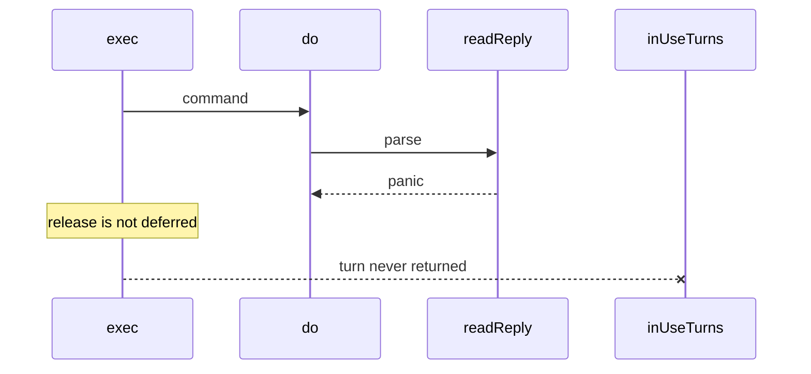

Developer review: in progress — 2026-09-13T09:14:07Z

## What this changes
**Operators.** None.

**Admin users.** None.

**Developers.** Dest SimpleRedis now has permanent tests for the healthy hunt probes (`TestChaosPoolInvariants`, `FuzzReadReply` / `FuzzParseLen`, lifecycle Close cycles, Yaegi error paths, concurrent MSetEX fallback, RESP injection) and `simpleredis/BUGS.md` pointing the three real defects at their other PRs.

**End users.** None.

## Motivation
Dest `simpleredis` already survived a hunt for production killers (races, leaked pool turns, silent cross-key replies). Three real defects are owned by other PRs. The probes that came back healthy were not locked in on dest, so a later edit could reintroduce a turn leak or a cross-key reply while CI still looked green. A decoder panic in `readReply` is a permanent pool-turn leak because `exec` releases without `defer`.

## Merge readiness
Implement landed the tests and `simpleredis/BUGS.md`. Local `go test ./simpleredis/` passed. CI is in progress. 1 item remains (CI green).

Priority: P3 — spec, docs, tests, or internal clarity, no current user or operator harm
Reviewed head: 5130f35
Owner decision: None.

## Review scores
| Measure | Result | What it means |
| --- | --- | --- |
| Overall readiness | 3/6 | CI in progress |
| CI proof | 3/6 | 8 checks in progress, run 34749156784 |
| Local tests proof | N/A | remote PR; CI is the proof axis |
| Review resolution | 6/6 | OPEN PR, no review comments |

## Verification
| Check | Result | Evidence |
| --- | --- | --- |
| Branch | 2026-09-13-simpleredis-resilience-test-coverage pushed | git / origin |
| OpenSpec | simpleredis-resilience-test-coverage | `openspec/changes/simpleredis-resilience-test-coverage/` |
| Pull request | https://github.com/david-garcia-garcia/traefik-middleware-utilities/pull/68 | pr-host |
| CI | build 34749156784 in progress https://github.com/david-garcia-garcia/traefik-middleware-utilities/actions/runs/34749156784 | Lint, Unit, Unit race, Go E2E Redis, Go E2E Dragonfly, Integration Tests, Integration Tests Redis, Integration Tests Dragonfly |
| Local tests | passed | go vet; go test 13.8s 92.5%; go test -short 12.2s; FuzzReadReply 2.07M execs / 30s |
| PR comments | no comments | no comments.md |

## Specs
- [std_go_simpleredis_tcp-session](https://github.com/david-garcia-garcia/traefik-middleware-utilities/blob/2026-09-13-simpleredis-resilience-test-coverage/openspec/changes/simpleredis-resilience-test-coverage/proposal.md) — modified
- [std_go_simpleredis_resp-decode](https://github.com/david-garcia-garcia/traefik-middleware-utilities/blob/2026-09-13-simpleredis-resilience-test-coverage/openspec/changes/simpleredis-resilience-test-coverage/proposal.md) — modified
- [std_go_simpleredis_resp-commands](https://github.com/david-garcia-garcia/traefik-middleware-utilities/blob/2026-09-13-simpleredis-resilience-test-coverage/openspec/changes/simpleredis-resilience-test-coverage/proposal.md) — modified

## Deviations from the ask
None.

## Follow-up issues
None.

## How this fits together
Implement is on PR 68 off `origin/master`. Code review has not started. CI in progress.

## Explore Decisions
| Question | Rank | Decision | By |
| --- | --- | --- | --- |
| What are the new test file and function names? | additive asked | assumed — chaos_pool_test.go, resp_fuzz_test.go, lifecycle_test.go, yaegi_errorpath_test.go, commands_msetex_concurrent_test.go, resp_injection_test.go | explore |
| Is BUGS.md a tracked package record or a local-only artifact? | additive asked | assumed — commit simpleredis/BUGS.md; leave reclaim/tokenbucket/windowcounter BUGS.md untracked | explore |
| Does propose add an OpenSpec coverage requirement, or are tests-only enough? | additive asked | assumed — add coverage requirements on the three existing SimpleRedis spec leaves, no new family | explore |
| What chaos duration and lifecycle iteration counts keep the default suite in the low seconds and keep go test -race from timing out? | additive asked | assumed — Short skips chaos/lifecycle; default 24 goroutines x 1s and 200 cycles; raceDetectorOn lowers those plus concurrent MSetEX | explore |
| Who already owns client identity (address, user, tenant, Host, trust hop)? | additive asked | assumed — none; this PR does not set or reconstruct identity | explore |

## Before merge
- [ ] Wait for CI on PR 68 to succeed
- [ ] Human: `reclaim/BUGS.md`, `tokenbucket/BUGS.md`, and `windowcounter/BUGS.md` are untracked in the caller workspace — decide whether `BUGS.md` stays local rather than silently dropping `simpleredis/BUGS.md`
- [x] Land the six healthy-probe tests and reframed `simpleredis/BUGS.md`
- [x] Propose folded coverage onto three existing spec leaves
- [x] Stub PR opened

## Findings
None.

## Axis review
None.

## Agent review details

### Review metrics
| Metric | Value | Why it matters |
| --- | --- | --- |
| Specs in this PR | 0 added / 3 modified | Same list as ## Specs |
| Open reviewer comments walked | 0 FIX / 0 ANSWER / 0 open | Unanswered review is merge risk |
| Reviewed head | 5130f358c222c91309a682df1820b687aa5f6455 | Card must match the branch you measured |

### Stored data model
None.

### Technical review
Best possible solution: dest already behaves as the healthy probes measured; this PR adds the missing locks and the written record, not a product patch.

Do we have a high-confidence way to reproduce? Yes. Default suite passed locally (13.8s, 92.5%). FuzzReadReply 2.07M execs / 30s, no panic.

Is this the best way to solve the issue? Yes vs dest: lock the healthy probes as tests instead of hunting them again.

### Evidence
What I checked:
- `go vet ./simpleredis/` clean
- `go test -count=1 -timeout 300s ./simpleredis/` pass, 13.8s, 92.5% statements (ticket cited ~12s / 91.9% before)
- `go test -short` 12.2s pass
- `go test -run XXX -fuzz FuzzReadReply -fuzztime 30s` 2071648 execs, PASS
- All six probes passed; none failed so no product fix and no Issues row

### Rank-up moves
None.
