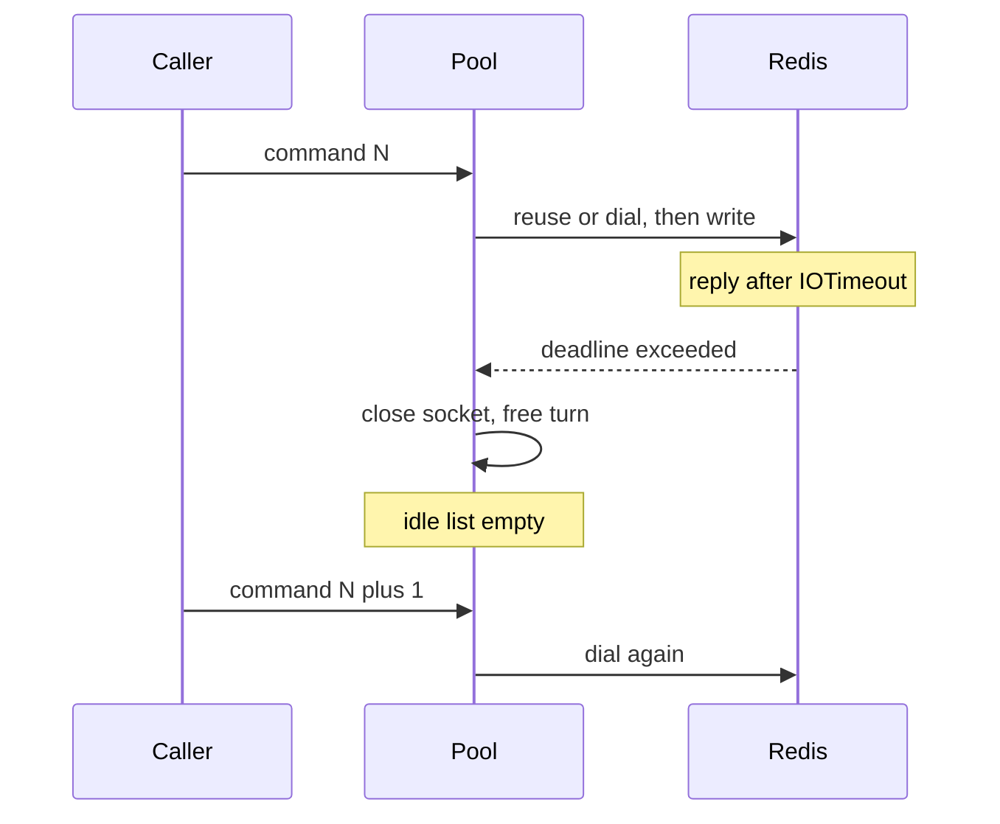

Developer review: in progress — 2026-09-13T17:14:31Z

## What this changes
**Operators.** None.

**Admin users.** None.

**Developers.** None.

**End users.** None.

## Motivation
A Redis peer that answers just above `IOTimeout` makes this client close the pooled socket on every command. Idle reuse drops to zero: connect-per-command. The slow peer then receives a dial storm, plus AUTH and SELECT when those knobs are set, on top of the load that made it slow. Default `IOTimeout` is 100ms, inside a loaded Redis p99, so this does not need an outage to start.

On `master`, that close is specified and correct — the reply is still outstanding. Timeouts are not retried, so retry backoff never runs. Nothing else caps the dial rate across later independent commands. Closing the socket is not optional. Explore measured the composition and chose documentation over a breaker: peak Redis-side sockets are about `2 x PoolSize` per client from overlap, not an unbounded race toward `maxclients`. Sequential churn is about `1/IOTimeout` (10 dials/s at the 100ms default). AUTH and SELECT add two successful round trips per reconnect when the handshake is fast, and AUTH-only failures when the handshake is also slow.

Not merging leaves that operator note unwritten. The simplicity gate says a breaker or dial-rate limiter is not a success if it is not small and elegant; documenting "do not fix in code" is the explore outcome.

## Merge readiness
Explore reproduced the 15-dial collapse, quantified churn and handshake tax, and resolved against a code limiter. Propose next is docs-only. 2 items remain.

Priority: P2 — real operator pain (connect-per-command under slowness) with a workaround (raise IOTimeout) and a docs-only outcome
Reviewed head: 58f6dd2
Owner decision: None.

## Review scores
| Measure | Result | What it means |
| --- | --- | --- |
| Overall readiness | 3/6 | Explore recorded; CI in progress; no apply yet |
| CI proof | 3/6 | Checks queued on the explore push |
| Local tests proof | N/A | Before implement (`localTests: none`) |
| Review resolution | 6/6 | OPEN PR; no reviewer comments |

## Verification
| Check | Result | Evidence |
| --- | --- | --- |
| Branch | 2026-09-13-simpleredis-slow-peer-reconnect-storm pushed | `git` / origin |
| OpenSpec | none | `openspec/` |
| Pull request | https://github.com/david-garcia-garcia/traefik-middleware-utilities/pull/85 | pr-host List |
| CI | build 34770973792 in progress https://github.com/david-garcia-garcia/traefik-middleware-utilities/actions/runs/34770973792 | pr-host check runs queued |
| Local tests | none | handoff.yaml localTests |
| PR comments | no comments | no comments.md; empty inventory |

## Specs
None.

## Deviations from the ask
None.

## Follow-up issues
None.

## How this fits together
Local spec on branch `2026-09-13-simpleredis-slow-peer-reconnect-storm`. Stub PR #85 is the durable card host. Explore resolved: document, do not ship a breaker. Propose writes the docs-only change.

## Explore Decisions
None.

## Before merge
- [x] [P2] Confirm the 15-dial / 0-idle measurement and quantify extra connections per second plus AUTH/SELECT tax
- [x] [P2] Decide whether dial-rate policy belongs in this package; default IOTimeout change is a human decision
- [ ] [P3] Propose the documentation change (usage gotcha); no behaviour-changing PR
- [x] Stub PR opened
- [x] Requirement grounded on dest (`qualified-with-gaps`)

## Findings
None.

## Axis review
None.

## Agent review details

### Review metrics
| Metric | Value | Why it matters |
| --- | --- | --- |
| Specs in this PR | none | Same list as ## Specs |
| Open reviewer comments walked | 0 FIX / 0 ANSWER / 0 open | Unanswered review is merge risk |
| Reviewed head | 58f6dd2f5499444a5e0bfa03f0e86c005568780a | Card must match the branch you measured |

### Stored data model
None.

### Technical review
Best possible solution versus `master`: document the timeout to connect-per-command composition. Close-on-outstanding-reply stays. A breaker or dial-rate limiter adds failure-memory this package should not own.

Do we have a high-confidence way to reproduce? Yes. Tagged `TestBugSlowPeerDestroysEveryPooledSocket`: 15 commands, 15 dials, idle 0. Throwaway serial/concurrent/AUTH cases on dest `simpleredis` matched: 9.9 dials/s at default 100ms, peak server open 2 serial and 16 (`2 x PoolSize`) concurrent, AUTH+SELECT = one extra pair per reconnect, `OverFrees() == 0`. Fast peer and 80ms-under-timeout still reuse one socket.

Is this the best way to solve the issue? Yes versus shipping a breaker. Operator raises `IOTimeout`. Peak live Redis sockets stay pool-capped; the cost is churn, TIME_WAIT, and handshake round trips.

### Evidence
What I checked:
- Tagged reproduction failed as designed: 15 dials, idle 0 (`go test -tags simpleredis_bugs ./simpleredis/ -run TestBugSlowPeerDestroysEveryPooledSocket`)
- Serial default 100ms / 110ms delay: 20/20 timeouts, 20 dials, 9.9 dials/s, peak server open 2
- Concurrent 32 Gets, PoolSize 8: 24 dials, peak server open 16, last 8 lost to the 300ms library budget
- AUTH+SELECT + slow GET: AUTH=15 SELECT=15 GET=15; slow AUTH: AUTH=10 SELECT=0 GET=0
- Control fast peer and 80ms under 100ms: 1 dial, idle 1
- Dest `shouldRetry` never retries `redis:timeout` (`simpleredis/commands_exec.go`)
- Existing dial-failure breaker debt is a different trigger (`knowledge/debt/2026-09-12-simpleredis-dial-circuit-breaker.md`)

### Rank-up moves
None.
