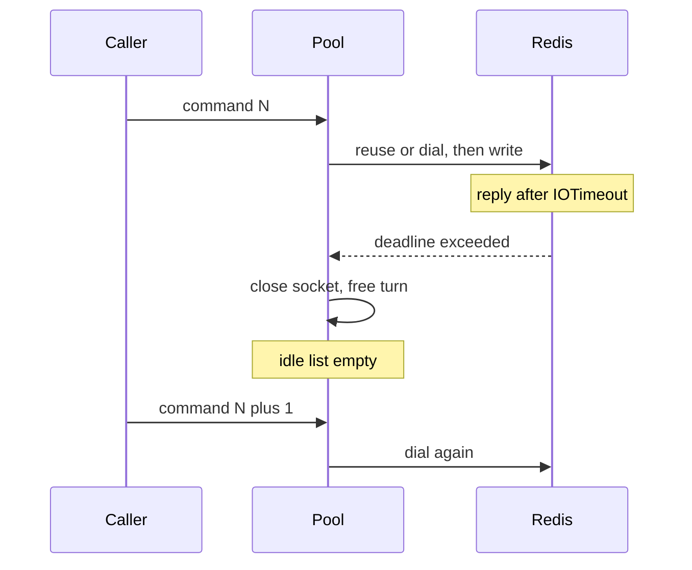

Developer review: in progress — 2026-09-13T17:19:18Z

## What this changes
**Operators.** None yet (the usage gotcha is proposed, not applied).

**Admin users.** None.

**Developers.** OpenSpec change `simpleredis-timeout-connect-per-command`: ADDED requirement that the timeout second-connection rule is per command; later independent commands follow idle-empty dial. No `simpleredis/*.go` edit.

**End users.** None.

## Motivation
A Redis peer that answers just above `IOTimeout` makes this client close the pooled socket on every command. Idle reuse drops to zero: connect-per-command. The slow peer then receives dial churn, plus AUTH and SELECT when those knobs are set, on top of the load that made it slow. Default `IOTimeout` is 100ms, inside a loaded Redis p99, so this does not need an outage to start.

On `master`, that close is specified and correct. Timeouts are not retried. Explore measured the composition (15 dials for 15 commands; 9.9 dials/s at the 100ms default; peak Redis-side sockets about `2 x PoolSize` per client, not an unbounded race toward `maxclients`) and rejected a breaker. The existing "timeout MUST NOT open a second connection" sentence is easy to read as a cap on later commands; this change disambiguates that in the session spec and writes the operator lever (`IOTimeout`, `PoolSize` vs `maxclients`) as a usage gotcha.

Not merging leaves that misread in place and leaves operators without the measured costs. The simplicity gate stopped the runtime path: no breaker, no default-timeout change, no churn-bound test.

## Merge readiness
Propose is complete and valid. Simplicity gate: do not implement a limiter. Remaining work is the human's: apply the docs-only tasks, or decline. 1 item remains.

Priority: P2 — real operator pain (connect-per-command under slowness) with a workaround (raise IOTimeout) and a docs-only proposed outcome
Reviewed head: 03ee790
Owner decision: Required. Apply or decline the docs-only tasks. Do not ship a breaker.

## Review scores
| Measure | Result | What it means |
| --- | --- | --- |
| Overall readiness | 3/6 | Propose landed; CI in progress; apply gated |
| CI proof | 3/6 | Checks queued on the propose push |
| Local tests proof | N/A | Before implement (`localTests: none`) |
| Review resolution | 6/6 | OPEN PR; no reviewer comments |

## Verification
| Check | Result | Evidence |
| --- | --- | --- |
| Branch | 2026-09-13-simpleredis-slow-peer-reconnect-storm pushed | `git` / origin |
| OpenSpec | simpleredis-timeout-connect-per-command | `openspec/changes/simpleredis-timeout-connect-per-command/` |
| Pull request | https://github.com/david-garcia-garcia/traefik-middleware-utilities/pull/85 | pr-host List |
| CI | build 34771230542 in progress https://github.com/david-garcia-garcia/traefik-middleware-utilities/actions/runs/34771230542 | pr-host check runs |
| Local tests | none | handoff.yaml localTests |
| PR comments | no comments | no comments.md; empty inventory |

## Specs
- [std_go_simpleredis_tcp-session](https://github.com/david-garcia-garcia/traefik-middleware-utilities/blob/2026-09-13-simpleredis-slow-peer-reconnect-storm/openspec/changes/simpleredis-timeout-connect-per-command/proposal.md) — modified

## Deviations from the ask
None.

## Follow-up issues
None.

## How this fits together
Local spec on branch `2026-09-13-simpleredis-slow-peer-reconnect-storm`. Stub PR #85 is the durable card host. Explore resolved against a code limiter. Propose wrote change `simpleredis-timeout-connect-per-command`. Implement is gated: docs-only tasks wait on the human; no runtime apply.

## Explore Decisions
None.

## Before merge
- [x] [P2] Confirm the 15-dial / 0-idle measurement and quantify extra connections per second plus AUTH/SELECT tax
- [x] [P2] Decide whether dial-rate policy belongs in this package; default IOTimeout change is a human decision
- [x] [P3] Propose the documentation change (usage gotcha); no behaviour-changing session code
- [ ] [P3] Human: apply the docs-only tasks on `simpleredis-timeout-connect-per-command`, or decline. Do not ship a breaker
- [x] Stub PR opened
- [x] Requirement grounded on dest (`qualified-with-gaps`)

## Findings
None.

## Axis review
None.

## Agent review details

### Review metrics
| Metric | Value | Why it matters |
| --- | --- | --- |
| Specs in this PR | 0 added / 1 modified | Same list as ## Specs |
| Open reviewer comments walked | 0 FIX / 0 ANSWER / 0 open | Unanswered review is merge risk |
| Reviewed head | 03ee7909f36858bf1f76cd7e6c7cddd4575bc97d | Card must match the branch you measured |

### Stored data model
None.

### Technical review
Best possible solution versus `master`: document the timeout to connect-per-command composition and disambiguate the per-command second-connection rule. Close-on-outstanding-reply stays. A breaker or dial-rate limiter adds failure-memory this package should not own.

Do we have a high-confidence way to reproduce? Yes. Tagged `TestBugSlowPeerDestroysEveryPooledSocket`: 15 commands, 15 dials, idle 0. Throwaway serial/concurrent/AUTH cases on dest `simpleredis`: 9.9 dials/s at default 100ms, peak server open 2 serial and 16 (`2 x PoolSize`) concurrent, AUTH+SELECT = one extra pair per reconnect, `OverFrees() == 0`. Fast peer and 80ms-under-timeout still reuse one socket.

Is this the best way to solve the issue? Yes versus shipping a breaker. Operator raises `IOTimeout`. Peak live Redis sockets stay pool-capped; the cost is churn, TIME_WAIT, and handshake round trips.

### Evidence
What I checked:
- Tagged reproduction: 15 dials, idle 0
- Serial default 100ms / 110ms delay: 20 dials, 9.9 dials/s, peak server open 2
- Concurrent 32 Gets, PoolSize 8: 24 dials, peak server open 16
- AUTH+SELECT + slow GET: AUTH=15 SELECT=15 GET=15; slow AUTH: AUTH=10 SELECT=0 GET=0
- `openspec validate simpleredis-timeout-connect-per-command --type change --strict` valid
- `validate_artifact_names` OK
- `git diff origin/master -- simpleredis/` empty (no session code)

### Rank-up moves
None.
