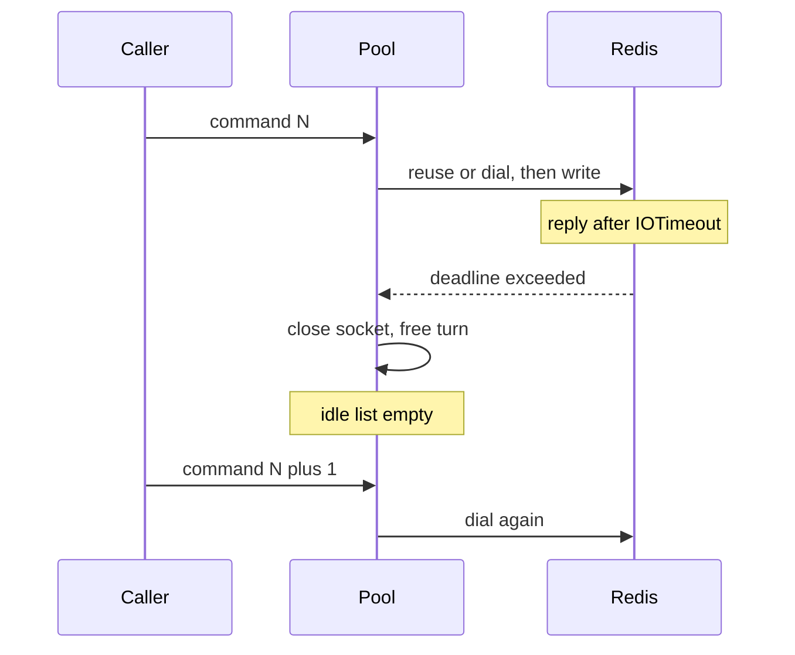

Developer review: in progress — 2026-09-13T17:06:18Z

## What this changes
**Operators.** None.

**Admin users.** None.

**Developers.** None.

**End users.** None.

## Motivation
A Redis peer that answers just above `IOTimeout` makes this client close the pooled socket on every command. Idle reuse drops to zero: connect-per-command. The slow peer then receives a dial storm, plus AUTH and SELECT when those knobs are set, on top of the load that made it slow. Default `IOTimeout` is 100ms, inside a loaded Redis p99, so this does not need an outage to start.

On `master`, that close is specified and correct — the reply is still outstanding. Timeouts are not retried, so retry backoff never runs. Nothing else caps the dial rate across later independent commands. Closing the socket is not optional; whether this package should govern dial rate, or only document `IOTimeout` × `PoolSize` vs server `maxclients`, is the ticket.

Not merging leaves operators with connect-per-command under ordinary slowness, TIME_WAIT on the client, and extra handshake round trips, with no recorded measurement or options. The simplicity gate says a breaker or dial-rate limiter is not a success if it is not small and elegant; documenting "do not fix in code" is a valid outcome.

## Merge readiness
Prepare grounded the ask on dest; no product delta versus `master` yet. 5 items remain.

Priority: P2 — real operator pain (dial storm toward maxclients) with a workaround (raise IOTimeout) and a possible docs-only outcome
Reviewed head: 36e1c0e
Owner decision: None.

## Review scores
| Measure | Result | What it means |
| --- | --- | --- |
| Overall readiness | 1/6 | Stub PR pushed; CI not seen; no apply yet |
| CI proof | 1/6 | Pushed; checks not seen |
| Local tests proof | N/A | Before implement (`localTests: none`) |
| Review resolution | 6/6 | OPEN PR; no reviewer comments |

## Verification
| Check | Result | Evidence |
| --- | --- | --- |
| Branch | 2026-09-13-simpleredis-slow-peer-reconnect-storm pushed | `git` / origin |
| OpenSpec | none | `openspec/` |
| Pull request | https://github.com/david-garcia-garcia/traefik-middleware-utilities/pull/85 | pr-host Create |
| CI | not seen | pr-host CI |
| Local tests | none | handoff.yaml localTests |
| PR comments | no comments | no comments.md; empty inventory |

## Specs
None.

## Deviations from the ask
None.

## Follow-up issues
None.

## How this fits together
Local spec dumped into this run's bus on branch `2026-09-13-simpleredis-slow-peer-reconnect-storm`. Stub PR #85 is the durable card host. Explore next; implement only if a small elegant fix exists.

## Explore Decisions
None.

## Before merge
- [ ] [P2] Confirm the 15-dial / 0-idle measurement and quantify extra connections per second plus AUTH/SELECT tax
- [ ] [P2] Decide whether dial-rate policy belongs in this package; default IOTimeout change is a human decision
- [ ] [P3] If no elegant code fix: measurements, options with costs, recommendation, and a documentation change
- [x] Stub PR opened
- [x] Requirement grounded on dest (`qualified-with-gaps`)

## Findings
None.

## Axis review
None.

## Agent review details

### Review metrics
| Metric | Value | Why it matters |
| --- | --- | --- |
| Specs in this PR | none | Same list as ## Specs |
| Open reviewer comments walked | 0 FIX / 0 ANSWER / 0 open | Unanswered review is merge risk |
| Reviewed head | 36e1c0e3ff083e33e875ab30f4d2022b489d8e63 | Card must match the branch you measured |

### Stored data model
None.

### Technical review
Best possible solution: not chosen yet — dest close-on-timeout is correct; later phases weigh docs vs a small code change, and must not ship a breaker to close the ticket.

Do we have a high-confidence way to reproduce? Yes, tagged reproduction in the original checkout (`TestBugSlowPeerDestroysEveryPooledSocket`); not on dest. Prepare did not re-run it.

Is this the best way to solve the issue? Not decided. Prepare records the gate; explore/propose choose.

### Evidence
What I checked:
- Dest `do` / `runOnConn` / `release` / `shouldRetry` / `defaultIOTimeout` 100ms (`simpleredis/resp.go`, `commands_exec.go`, `pool.go`, `config.go`, dest SHA a239a9e)
- Spec forbids retry-on-timeout of the same command (`openspec/specs/std_go_simpleredis_tcp-session/spec.md`)
- Existing large debt note is dial-*failure* breaker, different trigger (`knowledge/debt/2026-09-12-simpleredis-dial-circuit-breaker.md`)
- Stub PR #85 created; comment inventory empty

### Rank-up moves
None.
