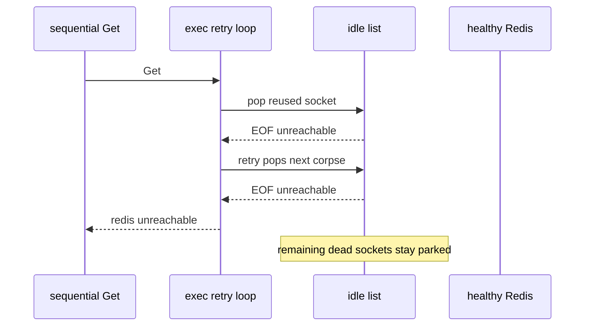

Developer review: in progress — 2026-09-13T17:17:47Z

## What this changes
**Operators.** None.

**Admin users.** None.

**Developers.** OpenSpec change `simpleredis-stale-pooled-socket-retry` folds sequential recovery after a full idle vintage drop into `std_go_simpleredis_tcp-session`. Session code is not applied yet.

**End users.** None.

## Motivation
After a Redis restart, a failover, or CLIENT KILL of every idle socket, sequential SimpleRedis commands on the quiet path return `redis:unreachable` while the peer is healthy and accepting. Parallel traffic hides it. Dest `borrow` does not tell `exec` that the socket came from idle, so the retry spends `MaxRetries+1` corpses and the rest of the vintage stays parked. Measured burst at defaults is 4 failed requests.

If this PR does not land, a low-traffic route after Redis failover keeps failing a burst of limiter commands against a healthy backend.

## Merge readiness
Propose chose the cheap reuse signal plus one hard-bounded force-dial. Product apply is not started. 3 items remain.

Priority: P1 — sequential commands after a Redis restart fail against a healthy peer
Reviewed head: 4f4ca07
Owner decision: None.

## Review scores
| Measure | Result | What it means |
| --- | --- | --- |
| Overall readiness | 3/6 | CI queued, apply not started |
| CI proof | 3/6 | in progress [CI run 34771158309](https://github.com/david-garcia-garcia/traefik-middleware-utilities/actions/runs/34771158309) |
| Local tests proof | N/A | before implement, remote PR |
| Review resolution | 6/6 | OPEN PR #87, no reviewer comments |

## Verification
| Check | Result | Evidence |
| --- | --- | --- |
| Branch | 2026-09-13-simpleredis-stale-pooled-socket-retry pushed | `git` HEAD 4f4ca07 |
| OpenSpec | simpleredis-stale-pooled-socket-retry | `openspec/changes/` |
| Pull request | https://github.com/david-garcia-garcia/traefik-middleware-utilities/pull/87 | GitHub |
| CI | build 34771158309 in progress https://github.com/david-garcia-garcia/traefik-middleware-utilities/actions/runs/34771158309 | GitHub: 8 checks queued |
| Local tests | none | handoff.yaml localTests |
| PR comments | no comments | comments: none |

## Specs
- [std_go_simpleredis_tcp-session](https://github.com/david-garcia-garcia/traefik-middleware-utilities/blob/2026-09-13-simpleredis-stale-pooled-socket-retry/openspec/changes/simpleredis-stale-pooled-socket-retry/proposal.md) — modified

## Deviations from the ask
None.

## Follow-up issues
None.

## How this fits together
Local spec → branch `2026-09-13-simpleredis-stale-pooled-socket-retry` from `origin/master` → GitHub PR #87 → propose on HEAD 4f4ca07 → CI 34771158309 queued.

## Explore Decisions
| Question | Rank | Decision | By |
| --- | --- | --- | --- |
| When MaxRetries is -1 (one send on dest), does a reused-socket I/O failure still get one hard-bounded force-dial? | bounded asked | assumed — yes. One extra send per command, only when the failed socket came from idle, only once. | explore |
| After a successful force-dial, do leftover idle corpses stay on the list? | additive asked | assumed — leave them. Each later sequential command spends one corpse then force-dials. | explore |
| How is force a fresh dial plumbed into borrow without a config knob and without colliding with BUG-6 on takeIdleConn? | additive asked | assumed — unexported shared body with skipIdle; package borrow stays the three-value wrapper. | explore |

## Before merge
- [ ] [P1] Sequential commands after every idle socket is dropped must succeed while the peer is accepting
- [ ] Permanent untagged test: warm idle with simultaneous in-flight commands, drop every server socket, sequential Gets succeed
- [ ] In-use-turn semaphore stays sound (`OverFrees() == 0`), no fd leak, no goroutine leak

## Findings
None.

## Axis review
None.

## Agent review details

### Review metrics
| Metric | Value | Why it matters |
| --- | --- | --- |
| Specs in this PR | 0 added / 1 modified | Same list as ## Specs |
| Open reviewer comments walked | 0 FIX / 0 ANSWER / 0 open | Unanswered review is merge risk |
| Reviewed head | 4f4ca07b55f031b18a7f93232578e6e7a1e3bb8d | Card must match the branch you measured |

### Stored data model
None.

### Technical review
Best possible solution: reuse signal plus skip-idle on the next borrow of that command, one extra send that does not consume MaxRetries. Epoch is not required.

Do we have a high-confidence way to reproduce? Yes. Tagged `TestBugDeadIdlePoolFailsRequestsAfterPeerRestart` failed with 4 consecutive `redis:unreachable` at PoolSize 8 / MaxRetries 1.

Is this the best way to solve the issue? Yes versus dest. The proposed shape is small and sufficient.

### Evidence
What I checked:
- `openspec validate simpleredis-stale-pooled-socket-retry --strict` valid
- `validate_artifact_names` OK
- FindSpecHost: fold `std_go_simpleredis_tcp-session` (existing one-socket peer-close leaf)
- CI run 34771158309 queued

### Rank-up moves
None.
