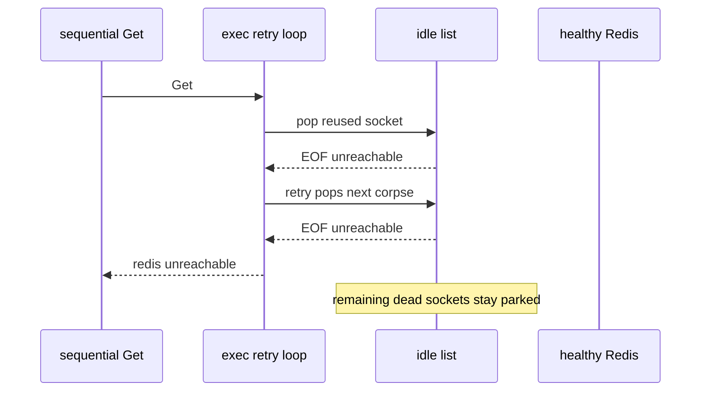

Developer review: in progress — 2026-09-13T17:41:45Z

## What this changes
**Operators.** None.

**Admin users.** None.

**Developers.** After an I/O failure on a socket taken from idle, later attempts of that SimpleRedis command skip idle and dial instead of popping the next dead unused socket. `borrowSocket` is the only borrow path. Sequential Gets after a full idle vintage drop succeed at default MaxRetries. Lost-reply Incr with MaxRetries off still fails with `redis:unreachable`. The SimpleRedis usage packet names that skip-idle recovery.

**End users.** None.

## Motivation
After a Redis restart, a failover, or CLIENT KILL of every idle socket, sequential SimpleRedis commands on the quiet path return `redis:unreachable` while the peer is healthy and accepting. Dest `borrow` does not tell `exec` that the socket came from idle, so the retry spends `MaxRetries+1` corpses. Measured burst at defaults is 4 failed requests.

If this PR does not land, a low-traffic route after Redis failover keeps failing a burst of limiter commands against a healthy backend.

## Merge readiness
Seven-axis review applied. Usage packet updated for skip-idle sequential recovery. Local tests passed. CI is still running on the reviewed head. 2 items remain.

Priority: P1 — sequential commands after a Redis restart fail against a healthy peer
Reviewed head: d46375f
Owner decision: None.

## Review scores
| Measure | Result | What it means |
| --- | --- | --- |
| Overall readiness | 3/6 | CI in progress |
| CI proof | 3/6 | in progress [CI run 34772377023](https://github.com/david-garcia-garcia/traefik-middleware-utilities/actions/runs/34772377023) |
| Local tests proof | N/A | remote PR; localTests passed |
| Review resolution | 6/6 | OPEN PR #87, no reviewer comments |

## Verification
| Check | Result | Evidence |
| --- | --- | --- |
| Branch | 2026-09-13-simpleredis-stale-pooled-socket-retry pushed | `git` HEAD d46375f |
| OpenSpec | simpleredis-stale-pooled-socket-retry | `openspec/changes/` |
| Pull request | https://github.com/david-garcia-garcia/traefik-middleware-utilities/pull/87 | GitHub |
| CI | build 34772377023 in progress https://github.com/david-garcia-garcia/traefik-middleware-utilities/actions/runs/34772377023 | GitHub: 8 checks in progress |
| Local tests | passed | handoff.yaml localTests |
| PR comments | no comments | comments: none |

## Specs
- [std_go_simpleredis_tcp-session](https://github.com/david-garcia-garcia/traefik-middleware-utilities/blob/2026-09-13-simpleredis-stale-pooled-socket-retry/openspec/changes/simpleredis-stale-pooled-socket-retry/proposal.md) — modified

## Deviations from the ask
- taken: unused-socket I/O does not consume MaxRetries → remaining attempts skip idle and still consume MaxRetries — `simpleredis/commands_exec.go` — a dead unused socket can fail after write succeeds, same shape as a lost reply. Requester: not asked.

## Follow-up issues
None.

## How this fits together
Local spec → branch `2026-09-13-simpleredis-stale-pooled-socket-retry` from `origin/master` → GitHub PR #87 → apply on HEAD d46375f → CI 34772377023 in progress.

## Explore Decisions
| Question | Rank | Decision | By |
| --- | --- | --- | --- |
| When MaxRetries is -1 (one send on dest), does a reused-socket I/O failure still get one hard-bounded force-dial? | bounded asked | assumed — no. Remaining attempts skip idle. MaxRetries still counts, so -1 still fails that command. Default MaxRetries recovers sequential Gets. | implement |
| After a successful force-dial, do leftover idle corpses stay on the list? | additive asked | assumed — leave them. Each later sequential command spends one corpse then force-dials. | explore |
| How is force a fresh dial plumbed into borrow without a config knob and without colliding with BUG-6 on takeIdleConn? | additive asked | assumed — unexported shared body with skipIdle; package borrow stays the three-value wrapper. | explore |

## Before merge
- [x] Sequential Gets after every idle socket is dropped succeed at default MaxRetries (`TestPeerDropAllSequentialGetsSucceedAfterPeerDrop`)
- [x] In-use-turn semaphore stays sound (`OverFrees() == 0`)
- [x] Seven-axis hard findings applied (fake rename, serve comment, leftover `borrow` deleted)
- [x] SimpleRedis usage packet names skip-idle sequential recovery
- [ ] CI on PR #87 succeeded
- [ ] Drop WIP from the PR title when ready

## Findings
None.

## Axis review
[Standards](https://github.com/david-garcia-garcia/traefik-middleware-utilities/blob/2026-09-13-simpleredis-stale-pooled-socket-retry/devstate/2026/09/2026-09-13-simpleredis-stale-pooled-socket-retry/codereview_standards.md) — 2 total, 0 pending, 2 completed
[Nitpicks](https://github.com/david-garcia-garcia/traefik-middleware-utilities/blob/2026-09-13-simpleredis-stale-pooled-socket-retry/devstate/2026/09/2026-09-13-simpleredis-stale-pooled-socket-retry/codereview_nitpicks.md) — 0 total, 0 pending, 0 completed
[Spec](https://github.com/david-garcia-garcia/traefik-middleware-utilities/blob/2026-09-13-simpleredis-stale-pooled-socket-retry/devstate/2026/09/2026-09-13-simpleredis-stale-pooled-socket-retry/codereview_spec.md) — 0 total, 0 pending, 0 completed
[Security](https://github.com/david-garcia-garcia/traefik-middleware-utilities/blob/2026-09-13-simpleredis-stale-pooled-socket-retry/devstate/2026/09/2026-09-13-simpleredis-stale-pooled-socket-retry/codereview_security.md) — 0 total, 0 pending, 0 completed
[Performance](https://github.com/david-garcia-garcia/traefik-middleware-utilities/blob/2026-09-13-simpleredis-stale-pooled-socket-retry/devstate/2026/09/2026-09-13-simpleredis-stale-pooled-socket-retry/codereview_performance.md) — 0 total, 0 pending, 0 completed
[Dead](https://github.com/david-garcia-garcia/traefik-middleware-utilities/blob/2026-09-13-simpleredis-stale-pooled-socket-retry/devstate/2026/09/2026-09-13-simpleredis-stale-pooled-socket-retry/codereview_dead.md) — 1 total, 0 pending, 1 completed
[Test coverage](https://github.com/david-garcia-garcia/traefik-middleware-utilities/blob/2026-09-13-simpleredis-stale-pooled-socket-retry/devstate/2026/09/2026-09-13-simpleredis-stale-pooled-socket-retry/codereview_coverage.md) — 0 total, 0 pending, 0 completed

## Agent review details

### Review metrics
| Metric | Value | Why it matters |
| --- | --- | --- |
| Specs in this PR | 0 added / 1 modified | Same list as ## Specs |
| Open reviewer comments walked | 0 FIX / 0 ANSWER / 0 open | Unanswered review is merge risk |
| Reviewed head | d46375f5a786928f6f2d636f9cdd9a527bb10468 | Card must match the branch you measured |

### Stored data model
None.

### Technical review
Best possible solution: skip idle on later attempts of the same command after unused-socket unreachable. A free extra send would retry lost-reply Incr when MaxRetries is off. Epoch is not required.

Do we have a high-confidence way to reproduce? Yes. Tagged `TestBugDeadIdlePoolFailsRequestsAfterPeerRestart` is 0 failures after the fix (was 4). Default-suite `TestPeerDropAllSequentialGetsSucceedAfterPeerDrop` failed before, passed after.

Is this the best way to solve the issue? Yes versus dest. MaxRetries -1 still fails that one command; that is the reshape that keeps lost-reply Incr honest.

### Evidence
What I checked:
- `go vet ./simpleredis/` and `go build ./...` clean
- `go test ./simpleredis/ -count=1` passed; `go test ./... -count=1 -short` passed
- tagged BUG-1: 0 failures at default MaxRetries; MaxRetries -1 still 4 (accepted)
- `TestLostReplyIncrMaxRetriesOff` still green
- CI run 34772377023 in progress

### Rank-up moves
None.
