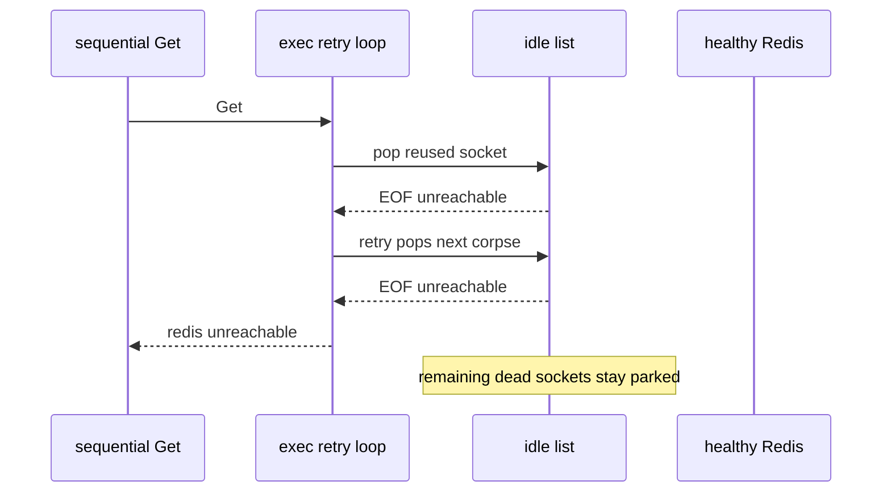

Developer review: in progress — 2026-09-13T17:13:25Z

## What this changes
**Operators.** None.

**Admin users.** None.

**Developers.** None.

**End users.** None.

## Motivation
After a Redis restart, a failover, or CLIENT KILL of every idle socket, sequential SimpleRedis commands on the quiet path return `redis:unreachable` while the peer is healthy and accepting. Parallel traffic hides it: twelve workers drain the dead sockets together and every retry then dials. A Traefik rate-limiter after failover is usually the sequential case.

On dest, `borrow` hands back a reused idle socket or a fresh dial with the same three-value return. `exec` treats both I/O failures as the same unreachable sentinel, spends `MaxRetries+1` corpses, and gives up. The rest of the vintage stays on the idle list. Measured burst is `PoolSize / (MaxRetries+1)` failed requests (defaults: 4). Live CLIENT KILL recovery and the peer-closed-idle spec only cover one idle socket, so they stay green.

If this PR does not land, a low-traffic route after Redis failover keeps failing a burst of limiter commands against a healthy backend.

## Merge readiness
Explore reproduced the burst and chose the cheap reuse signal plus one hard-bounded force-dial. Product is not applied. 3 items remain.

Priority: P1 — sequential commands after a Redis restart fail against a healthy peer
Reviewed head: 6bd4818
Owner decision: None.

## Review scores
| Measure | Result | What it means |
| --- | --- | --- |
| Overall readiness | 3/6 | CI in progress, no product yet |
| CI proof | 3/6 | in progress [CI run 34770927394](https://github.com/david-garcia-garcia/traefik-middleware-utilities/actions/runs/34770927394) |
| Local tests proof | N/A | before implement, remote PR |
| Review resolution | 6/6 | OPEN PR #87, no reviewer comments |

## Verification
| Check | Result | Evidence |
| --- | --- | --- |
| Branch | 2026-09-13-simpleredis-stale-pooled-socket-retry pushed | `git` HEAD 6bd4818 |
| OpenSpec | none | `openspec/` |
| Pull request | https://github.com/david-garcia-garcia/traefik-middleware-utilities/pull/87 | GitHub |
| CI | build 34770927394 in progress https://github.com/david-garcia-garcia/traefik-middleware-utilities/actions/runs/34770927394 | GitHub: all 8 checks in progress |
| Local tests | none | handoff.yaml localTests |
| PR comments | no comments | comments: none |

## Specs
None.

## Deviations from the ask
None.

## Follow-up issues
None.

## How this fits together
Local spec → branch `2026-09-13-simpleredis-stale-pooled-socket-retry` from `origin/master` → GitHub PR #87 → explore on HEAD 6bd4818 → CI 34770927394 in progress.

## Explore Decisions
| Question | Rank | Decision | By |
| --- | --- | --- | --- |
| When MaxRetries is -1 (one send on dest), does a reused-socket I/O failure still get one hard-bounded force-dial? | bounded asked | assumed — yes. One extra send per command, only when the failed socket came from idle, only once. Deadline stays (maxRetries+1) hops; FIN/RST EOF is fast enough. | explore |
| After a successful force-dial, do leftover idle corpses stay on the list? | additive asked | assumed — leave them. Each later sequential command spends one corpse then force-dials. No idle wipe from exec. | explore |
| How is force a fresh dial plumbed into borrow without a config knob and without colliding with BUG-6 on takeIdleConn? | additive asked | assumed — unexported shared body with skipIdle; package borrow stays the three-value wrapper. skipIdle skips takeIdleConn. | explore |

## Before merge
- [ ] [P1] Sequential commands after every idle socket is dropped must succeed while the peer is accepting
- [ ] Permanent untagged test: warm idle with simultaneous in-flight commands, drop every server socket, sequential Gets succeed
- [ ] In-use-turn semaphore stays sound (`OverFrees() == 0`), no fd leak, no goroutine leak

## Findings
None.

## Axis review
None.

## Agent review details

### Review metrics
| Metric | Value | Why it matters |
| --- | --- | --- |
| Specs in this PR | none | Same list as ## Specs; do not paste diff --stat |
| Open reviewer comments walked | 0 FIX / 0 ANSWER / 0 open | Unanswered review is merge risk |
| Reviewed head | 6bd481863385f7e1fbd5a57476d2ba9b477dfb0d | Card must match the branch you measured |

### Stored data model
None.

### Technical review
Best possible solution: reuse signal plus skip-idle on the next borrow of that command, one extra send that does not consume MaxRetries. Epoch is not required.

Do we have a high-confidence way to reproduce? Yes. Tagged `TestBugDeadIdlePoolFailsRequestsAfterPeerRestart` failed with 4 consecutive `redis:unreachable` at PoolSize 8 / MaxRetries 1 against a healthy in-process peer.

Is this the best way to solve the issue? Yes versus dest. The cheap shape is small and sufficient. A pool-generation epoch would discard the whole vintage in one step and is the over-engineered stop-at-gate alternative.

### Evidence
What I checked:
- tagged reproduction on caller checkout: 4 sequential failures at defaults (`go test -tags simpleredis_bugs`)
- dest `simpleredis/pool.go` `borrow` and `simpleredis/commands_exec.go` `exec`
- `borrow` call sites: 1 production (`commands_exec.go`) plus 3 tests (`pool_test.go`, `pool_e2e_test.go`, `panic_safety_test.go`)
- PR #87 comment inventory empty
- CI run 34770927394 in progress (GitHub `get_check_runs`)

### Rank-up moves
None.
