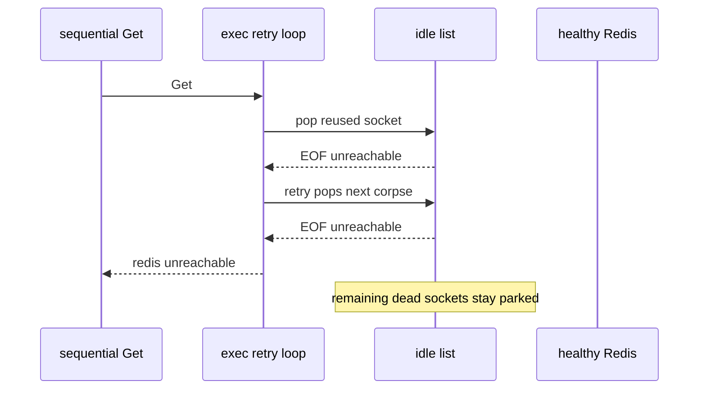

Developer review: in progress — 2026-09-13T17:06:34Z

## What this changes
**Operators.** None.

**Admin users.** None.

**Developers.** None.

**End users.** None.

## Motivation
After a Redis restart, a failover, or CLIENT KILL of every idle socket, sequential SimpleRedis commands on the quiet path return `redis:unreachable` while the peer is healthy and accepting. Parallel traffic hides it: twelve workers drain the dead sockets together and every retry then dials. A Traefik rate-limiter after failover is usually the sequential case.

On dest, `borrow` hands back a reused idle socket or a fresh dial with the same three-value return. `exec` treats both I/O failures as the same unreachable sentinel, spends `MaxRetries+1` corpses, and gives up. The rest of the vintage stays on the idle list. Measured burst is `PoolSize / (MaxRetries+1)` failed requests (defaults: 4). Live CLIENT KILL recovery and the peer-closed-idle spec only cover one idle socket, so they stay green.

If this PR does not land, a low-traffic route after Redis failover keeps failing a burst of limiter commands against a healthy backend. A pool-generation epoch is the textbook drain of the whole vintage and is likely over-engineered here; the cheap shape is a reuse signal plus one hard-bounded force-dial. If that shape is not small and correct, stop after propose.

## Merge readiness
Prepare grounded the ticket and opened the stub PR. Product is not applied. 4 items remain.

Priority: P1 — sequential commands after a Redis restart fail against a healthy peer
Reviewed head: aa27cdd
Owner decision: None.

## Review scores
| Measure | Result | What it means |
| --- | --- | --- |
| Overall readiness | 3/6 | CI in progress, no product yet |
| CI proof | 3/6 | in progress [CI run 34770530857](https://github.com/david-garcia-garcia/traefik-middleware-utilities/actions/runs/34770530857) |
| Local tests proof | N/A | before implement, remote PR |
| Review resolution | 6/6 | OPEN PR #87, no reviewer comments |

## Verification
| Check | Result | Evidence |
| --- | --- | --- |
| Branch | 2026-09-13-simpleredis-stale-pooled-socket-retry pushed | `git` HEAD aa27cdd |
| OpenSpec | none | `openspec/` |
| Pull request | https://github.com/david-garcia-garcia/traefik-middleware-utilities/pull/87 | GitHub |
| CI | build 34770530857 in progress https://github.com/david-garcia-garcia/traefik-middleware-utilities/actions/runs/34770530857 | GitHub: Lint success, Unit race success, Unit / Integration Tests / Integration Tests Redis / Integration Tests Dragonfly / Go E2E Redis / Go E2E Dragonfly in progress |
| Local tests | none | handoff.yaml localTests |
| PR comments | no comments | comments: none |

## Specs
None.

## Deviations from the ask
None.

## Follow-up issues
None.

## How this fits together
Local spec → branch `2026-09-13-simpleredis-stale-pooled-socket-retry` from `origin/master` → GitHub PR #87 → prepare bus on HEAD aa27cdd → CI 34770530857 in progress.

## Explore Decisions
None.

## Before merge
- [ ] [P1] Sequential commands after every idle socket is dropped must succeed while the peer is accepting
- [ ] Choose the cheap reuse-flag plus hard-bounded force-dial, or stop after propose if that shape is not small and correct
- [ ] Permanent untagged test: warm idle with simultaneous in-flight commands, drop every server socket, sequential Gets succeed
- [ ] In-use-turn semaphore stays sound (`OverFrees() == 0`), no fd leak, no goroutine leak

## Findings
None.

## Axis review
None.

## Agent review details

### Review metrics
| Metric | Value | Why it matters |
| --- | --- | --- |
| Specs in this PR | none | Same list as ## Specs; do not paste diff --stat |
| Open reviewer comments walked | 0 FIX / 0 ANSWER / 0 open | Unanswered review is merge risk |
| Reviewed head | aa27cdd87b9064c10c9593fe93845831dac33e82 | Card must match the branch you measured |

### Stored data model
None.

### Technical review
Best possible solution: not chosen yet. Dest spends `MaxRetries+1` dead idle sockets per command and leaves the rest of the vintage parked.

Do we have a high-confidence way to reproduce? Yes. Tagged `TestBugDeadIdle*` against an in-process RESP fake that drops every accepted socket, plus dest `borrow`/`exec` on `origin/master` a239a9e.

Is this the best way to solve the issue? Not decided. The ticket names a reuse flag plus one hard-bounded force-dial. A pool-generation epoch would discard the whole vintage and is the stop-at-gate alternative.

### Evidence
What I checked:
- dest `simpleredis/pool.go` `borrow` and `simpleredis/commands_exec.go` `exec` on `origin/master` a239a9e
- dest spec peer-closed idle and live `runLivePeerCloseRecovery` cover one idle socket (`idle == 1`)
- dest `fakeRedis` counts accepts and does not keep sockets to drop them all
- PR #87 comment inventory empty (GitHub `get_comments` / `get_review_comments`)
- CI run 34770530857 in progress (GitHub `get_check_runs`)

### Rank-up moves
None.
