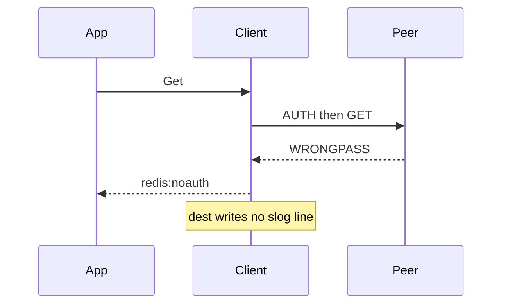

Developer review: ready for review — 2026-09-13T16:47:33Z

## What this changes
**Operators.** None.

**Admin users.** None.

**Developers.** `Config.Logger *slog.Logger` is frozen at `New` (nil stays silent, no discard handler). Twenty exported `simpleredis_*` slog events fire at the decision site, never logging `Pass` or Redis keys or values.

**End users.** None.

## Motivation
SimpleRedis already classifies AUTH rejection, pool wait, truncated bulk, leftover RESP, handshake failure, NOSCRIPT reload, over-free, and a panic inside `do`. Dest returns those as errors (or lets the panic reach Traefik) and writes no slog line. `reclaim` already emits `reclaim_*` on a `*slog.Logger`. This package did not.

On dest, operators watching Traefik logs cannot tell a defended peer glitch from a broken in-use-turn invariant. Until merge, production SimpleRedis misbehavior stays silent. Defaulting nil to a discard handler would also allocate on every `Get` even when nobody is listening.

## Merge readiness
Logging is on the branch, local short tests passed, and CI on this head succeeded. 0 items remain.

Priority: P2 — operators cannot diagnose dest SimpleRedis failures that the library already classifies
Reviewed head: fd60fb3
Owner decision: Required. See Explore Decisions.

## Review scores
| Measure | Result | What it means |
| --- | --- | --- |
| Overall readiness | 6/6 | CI succeeded, no open comments, product logging landed |
| CI proof | 6/6 | succeeded — [run 34769496269](https://github.com/david-garcia-garcia/traefik-middleware-utilities/actions/runs/34769496269) |
| Local tests proof | N/A | prHost remote; CI is the proof axis |
| Review resolution | 6/6 | OPEN PR, no comments |

## Verification
| Check | Result | Evidence |
| --- | --- | --- |
| Branch | 2026-09-13-simpleredis-structured-logging pushed | `git` origin fd60fb3 |
| OpenSpec | simpleredis-structured-logging | `openspec/changes/archive/2026-09-13-simpleredis-structured-logging/` |
| Pull request | https://github.com/david-garcia-garcia/traefik-middleware-utilities/pull/74 | pr-host |
| CI | build 34769496269 success https://github.com/david-garcia-garcia/traefik-middleware-utilities/actions/runs/34769496269 | Lint, Unit, Unit race, Integration Tests, Integration Tests Redis, Integration Tests Dragonfly, Go E2E Redis, Go E2E Dragonfly all success |
| Local tests | passed | handoff.yaml localTests |
| PR comments | no comments | no comments.md |

## Specs
- [std_go_simpleredis_slog-events](https://github.com/david-garcia-garcia/traefik-middleware-utilities/blob/2026-09-13-simpleredis-structured-logging/openspec/changes/archive/2026-09-13-simpleredis-structured-logging/proposal.md) — added
- [std_go_simpleredis_tcp-session](https://github.com/david-garcia-garcia/traefik-middleware-utilities/blob/2026-09-13-simpleredis-structured-logging/openspec/changes/archive/2026-09-13-simpleredis-structured-logging/proposal.md) — modified

## Deviations from the ask
None.

## Follow-up issues
None.

## How this fits together
Local spec is the dump. Branch `2026-09-13-simpleredis-structured-logging` from `origin/master` is PR 74. The OpenSpec change is archived. CI succeeded on fd60fb3.

## Explore Decisions
| Question | Rank | Decision | By |
| --- | --- | --- | --- |
| Exact MsgOpen attribute set (frozen knobs besides never Pass)? | additive asked | assumed — host, database, pool_size, max_idle_conns, pool_timeout, idle_timeout, dial_timeout, io_timeout, max_retries, min_retry_backoff, max_retry_backoff. Never Pass. | explore |
| Exact reason strings for MsgDial and MsgSocketClosed? | additive asked | assumed — idle_miss / stale, cancel / idle_cap | explore |
| Whether MsgNoAuth error is the Redis payload or redis:noauth? | additive asked | assumed — err.Error() after mapping (redis:noauth) | explore |
| Whether short-bulk read is bytes received before the short ReadFull? | additive asked | assumed — capture n from ReadFull, announced is RESP dollar length, read is n | explore |
| Whether MsgCapability path is native/lua or the groupWritePath names? | additive asked | assumed — native or lua, logged when storeGroupWrite records the cache | explore |
| Whether non-per-command Debug (MsgOpen / MsgClose) still needs the Enabled guard? | additive asked | assumed — still wrap with Enabled, cost test targets per-command Debug sites | explore |
| MsgSocketClosed idle-cap is decided inside release, where does that event go? | additive asked | assumed — dest #27 parks only under maxIdleConns, emit idle_cap in parkIdleConn, do not change release signature | implement |
| Caller DeadlineExceeded — MsgTimeout or silence? | additive asked | assumed — MsgTimeout only for errTimeout, MsgCanceled only for Canceled, caller deadline stays silent | explore |

## Before merge
None.

## Findings
None.

## Axis review
[Standards](https://github.com/david-garcia-garcia/traefik-middleware-utilities/blob/2026-09-13-simpleredis-structured-logging/devstate/2026/09/2026-09-13-simpleredis-structured-logging/codereview_standards.md) — 7 total, 0 pending, 4 completed, 3 skipped
[Nitpicks](https://github.com/david-garcia-garcia/traefik-middleware-utilities/blob/2026-09-13-simpleredis-structured-logging/devstate/2026/09/2026-09-13-simpleredis-structured-logging/codereview_nitpicks.md) — 0 total, 0 pending, 0 completed
[Spec](https://github.com/david-garcia-garcia/traefik-middleware-utilities/blob/2026-09-13-simpleredis-structured-logging/devstate/2026/09/2026-09-13-simpleredis-structured-logging/codereview_spec.md) — 0 total, 0 pending, 0 completed
[Security](https://github.com/david-garcia-garcia/traefik-middleware-utilities/blob/2026-09-13-simpleredis-structured-logging/devstate/2026/09/2026-09-13-simpleredis-structured-logging/codereview_security.md) — 0 total, 0 pending, 0 completed
[Performance](https://github.com/david-garcia-garcia/traefik-middleware-utilities/blob/2026-09-13-simpleredis-structured-logging/devstate/2026/09/2026-09-13-simpleredis-structured-logging/codereview_performance.md) — 0 total, 0 pending, 0 completed
[Dead](https://github.com/david-garcia-garcia/traefik-middleware-utilities/blob/2026-09-13-simpleredis-structured-logging/devstate/2026/09/2026-09-13-simpleredis-structured-logging/codereview_dead.md) — 0 total, 0 pending, 0 completed
[Test coverage](https://github.com/david-garcia-garcia/traefik-middleware-utilities/blob/2026-09-13-simpleredis-structured-logging/devstate/2026/09/2026-09-13-simpleredis-structured-logging/codereview_coverage.md) — 3 total, 0 pending, 2 completed, 1 skipped

## Agent review details

### Review metrics
| Metric | Value | Why it matters |
| --- | --- | --- |
| Specs in this PR | 1 added / 1 modified | Same list as ## Specs |
| Open reviewer comments walked | 0 FIX / 0 ANSWER / 0 open | Unanswered review is merge risk |
| Reviewed head | fd60fb32cacfdb8581980a2680531cba351c84c6 | Card must match the branch you measured |

### Stored data model
None.

### Technical review
Best possible solution: Same slog shape as reclaim, with nil meaning silent instead of rejected, so DestBranch Get paths stay allocation-free.

Do we have a high-confidence way to reproduce? Yes, capturing slog.Handler tests cover each dest-detectable event, secrets, panic, Yaegi, and AllocsPerRun 0.

Is this the best way to solve the issue? Yes versus DestBranch silence: call-site Enabled guards beat a discard handler.

### Evidence
What I checked:
- `go test -short ./...` passed and `go vet ./simpleredis/...` passed (local, fd60fb3)
- Debug allocs/run = 0 for nil logger and Debug-disabled (TestAllocDebugGuardNilAndDisabled)
- Secrets test: PassW0rd-UNIQUE-9f3a and tenant-user-KEY-7c2e absent from captured Debug output
- Panic test: turn returned, idle 0, OverFrees 0, panic reaches caller, MsgPanic emitted
- PR #69 was not on master at prepare, then landed on dest during implement Sync, leftover events fire in `do`
- GitHub check runs on [34769496269](https://github.com/david-garcia-garcia/traefik-middleware-utilities/actions/runs/34769496269): Lint, Unit, Unit race, Integration Tests, Integration Tests Redis, Integration Tests Dragonfly, Go E2E Redis, Go E2E Dragonfly all success

### Rank-up moves
- Wire `Logger` through the Traefik e2e plugin YAML so operators can attach slog without a custom caller.
