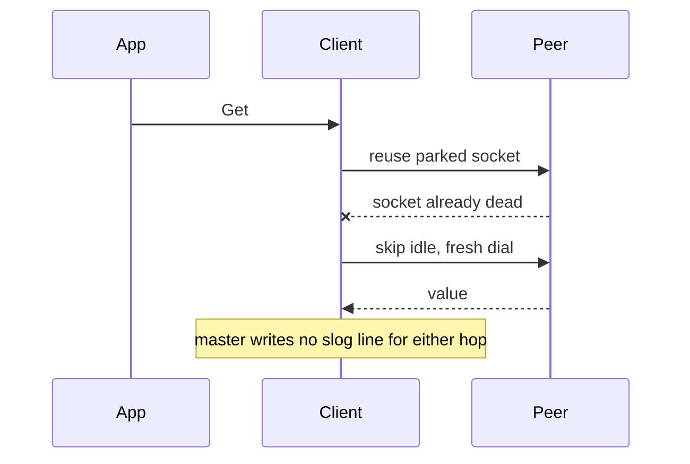

Developer review: ready for review — 2026-09-14T09:53:22Z

## What this changes
**Operators.** None.

**Admin users.** None.

**Developers.** `Config.Logger *slog.Logger` is frozen at `New`; nil becomes a discard logger (`slog.NewTextHandler` on `io.Discard`) so call sites never nil-check. Seventeen inline `simpleredis_*` slog messages fire at the decision site, with no exported message constants and no `log.go`: `simpleredis_dial` carries `reason` (`idle_miss` / `skip_idle`), `simpleredis_handshake_failed` carries `verb` (`AUTH` / `SELECT`) and never the peer's reply, and `simpleredis_timeout` fires in `exec` where the `CommandTimeout` budget is classified. New package consts `verbAuth` / `verbSelect` replace the duplicated handshake literals.

**End users.** None.

## Motivation
SimpleRedis already classifies AUTH rejection, pool wait, truncated bulk, leftover RESP, handshake failure, NOSCRIPT reload, over-free, and a panic inside `do`. On `master` it returns those as errors (or lets the panic reach Traefik) and writes no slog line, while `reclaim` in this same tree already emits `reclaim_*` on a `*slog.Logger`.

Two `master` changes made that silence worse rather than better. PR #84 collapsed `IOTimeout` into a whole-command `CommandTimeout`, so a command that runs out of budget now surfaces as `redis:timeout` from `exec` with nothing on the way explaining which of dial, AUTH, SELECT, or the command spent the 900ms. PR #87 added a `skipIdle` borrow path for the case where a peer restart, a failover, or a `CLIENT KILL` leaves every parked socket dead but younger than `IdleTimeout`: the first attempt spends a corpse, later attempts bypass the unused list and dial. That recovery is invisible. An operator watching Traefik logs sees the same nothing whether the pool is under pressure, the peer just restarted, or an in-use-turn invariant broke.

Without this, production SimpleRedis misbehaviour stays silent, and the `skipIdle` recovery `master` just shipped cannot be confirmed from logs at all.

## Merge readiness
Merged `origin/master` (`da1d245`), re-placed every log site onto the `CommandTimeout` and `skipIdle` shapes, and CI on this head succeeded. 0 items remain.

Priority: P2 — operators cannot diagnose SimpleRedis failures the library already classifies, including the idle-corpse recovery master just added
Reviewed head: ec1f840
Owner decision: Required. See Explore Decisions.

## Review scores
| Measure | Result | What it means |
| --- | --- | --- |
| Overall readiness | 6/6 | CI succeeded on the merged head, no open comments |
| CI proof | 6/6 | succeeded — [run 34830112658](https://github.com/david-garcia-garcia/traefik-middleware-utilities/actions/runs/34830112658) |
| Local tests proof | N/A | prHost remote; CI is the proof axis |
| Review resolution | 6/6 | OPEN PR, no comments |

## Verification
| Check | Result | Evidence |
| --- | --- | --- |
| Branch | 2026-09-13-simpleredis-structured-logging pushed | `git` origin ec1f840 |
| OpenSpec | simpleredis-structured-logging | `openspec/changes/archive/2026-09-13-simpleredis-structured-logging/` |
| Pull request | https://github.com/david-garcia-garcia/traefik-middleware-utilities/pull/74 | pr-host |
| CI | build 34830112658 success https://github.com/david-garcia-garcia/traefik-middleware-utilities/actions/runs/34830112658 | Lint, Unit, Unit race, Integration Tests, Integration Tests Redis, Integration Tests Dragonfly, Go E2E Redis, Go E2E Dragonfly all success |
| Local tests | passed | handoff.yaml localTests |
| PR comments | no comments | no comments.md |

## Specs
- [std_go_simpleredis_slog-events](https://github.com/david-garcia-garcia/traefik-middleware-utilities/blob/2026-09-13-simpleredis-structured-logging/openspec/changes/archive/2026-09-13-simpleredis-structured-logging/proposal.md) — added
- [std_go_simpleredis_tcp-session](https://github.com/david-garcia-garcia/traefik-middleware-utilities/blob/2026-09-13-simpleredis-structured-logging/openspec/changes/archive/2026-09-13-simpleredis-structured-logging/proposal.md) — modified

## Deviations from the ask
- taken: optional `Config.Logger` with nil staying silent, exported `Msg*` constants in `log.go`, and extra attrs → discard logger at `New`, inline `simpleredis_*` strings, no constants and no `log.go` — `simpleredis/simpleredis.go` `New` — honouring the catalog added a logging facade whose only job was attributes. Requester: confirmed.
- taken: instrument `redis:timeout` at the I/O site in `do` → emit in `libraryTimeout`, now a method on `*SimpleRedis` — `simpleredis/commands_exec.go` `libraryTimeout` — PR #84 made `ioOrContext` report the socket deadline as a context deadline so `exec` decides library budget versus caller deadline, which left a `do`-side emit unreachable on the exec path. Requester: not asked.
- taken: `simpleredis_handshake_failed` carries the mapped error → it carries `verb` and no peer text — `simpleredis/pool.go` `dial` — Redis 7.4 answers a nopass default user with `ERR AUTH <password> called without any password configured`, which is not an AUTH-class prefix, so that attribute published `Config.Pass`. Requester: not asked.

## Follow-up issues
None.

## How this fits together
Local spec is the dump. Branch `2026-09-13-simpleredis-structured-logging` carries `origin/master` through `da1d245` and is PR 74. The OpenSpec change is archived; the live `std_go_simpleredis_slog-events` leaf now also states the `reason` and `verb` attribute contracts and where `simpleredis_timeout` emits. CI succeeded on ec1f840.

## Explore Decisions
| Question | Rank | Decision | By |
| --- | --- | --- | --- |
| master PR #87 added a `skipIdle` borrow reason. Does `simpleredis_dial` still carry no reason attr? | additive asked | assumed — `reason` is `idle_miss` or `skip_idle`; without it a poisoned unused list and ordinary pool pressure log identically | mergeconflictresolve |
| master PR #84 moved the `redis:timeout` decision out of `do`. Where does `simpleredis_timeout` emit? | additive asked | assumed — in `libraryTimeout`, now a method on `*SimpleRedis`; `do` no longer emits. Measured: disabling that emit fails `TestLogTimeout` | mergeconflictresolve |

Earlier explore rows (`MsgOpen` attribute set, dial/socket-closed reason strings, `MsgNoAuth` error, short-bulk `n`, `MsgCapability` path, Enabled guard, idle-cap event placement, caller deadline) are all `resolved` on `devstate/explore.md`; the attribute dump they debated, including `io_timeout`, was dropped by the catalog reshape, and `IOTimeout` no longer exists on `Config`.

## Before merge
None.

## Findings
- [[P2] AUTH reply echoed `Config.Pass` onto a log line](https://github.com/david-garcia-garcia/traefik-middleware-utilities/blob/2026-09-13-simpleredis-structured-logging/simpleredis/pool.go) — FIX — `simpleredis_handshake_failed` logged the mapped error, and Redis 7.4 puts the password in `ERR AUTH <password> called without any password configured`, which is not AUTH-class. The event now carries `verb`; the caller's error still carries the full text. Path: `simpleredis/pool.go` `dial`. Reply none (self-found).

## Axis review
[Standards](https://github.com/david-garcia-garcia/traefik-middleware-utilities/blob/2026-09-13-simpleredis-structured-logging/devstate/2026/09/2026-09-13-simpleredis-structured-logging/codereview_standards.md) — 7 total, 0 pending, 4 completed, 3 skipped
[Nitpicks](https://github.com/david-garcia-garcia/traefik-middleware-utilities/blob/2026-09-13-simpleredis-structured-logging/devstate/2026/09/2026-09-13-simpleredis-structured-logging/codereview_nitpicks.md) — 0 total, 0 pending, 0 completed
[Spec](https://github.com/david-garcia-garcia/traefik-middleware-utilities/blob/2026-09-13-simpleredis-structured-logging/devstate/2026/09/2026-09-13-simpleredis-structured-logging/codereview_spec.md) — 0 total, 0 pending, 0 completed
[Security](https://github.com/david-garcia-garcia/traefik-middleware-utilities/blob/2026-09-13-simpleredis-structured-logging/devstate/2026/09/2026-09-13-simpleredis-structured-logging/codereview_security.md) — 0 total, 0 pending, 0 completed
[Performance](https://github.com/david-garcia-garcia/traefik-middleware-utilities/blob/2026-09-13-simpleredis-structured-logging/devstate/2026/09/2026-09-13-simpleredis-structured-logging/codereview_performance.md) — 0 total, 0 pending, 0 completed
[Dead](https://github.com/david-garcia-garcia/traefik-middleware-utilities/blob/2026-09-13-simpleredis-structured-logging/devstate/2026/09/2026-09-13-simpleredis-structured-logging/codereview_dead.md) — 0 total, 0 pending, 0 completed
[Test coverage](https://github.com/david-garcia-garcia/traefik-middleware-utilities/blob/2026-09-13-simpleredis-structured-logging/devstate/2026/09/2026-09-13-simpleredis-structured-logging/codereview_coverage.md) — 3 total, 0 pending, 2 completed, 1 skipped

## Agent review details

### Review metrics
| Metric | Value | Why it matters |
| --- | --- | --- |
| Specs in this PR | 1 added / 1 modified | Same list as ## Specs |
| Open reviewer comments walked | 0 FIX / 0 ANSWER / 0 open | Unanswered review is merge risk |
| Reviewed head | ec1f8403bd45bee6ebb68f504630dd22ac906cfc | Card must match the branch you measured |

### Stored data model
None.

### Technical review
Best possible solution: The same slog shape `reclaim` already uses, emitted inline at each decision site on master's current control flow, with nil meaning a discard logger so no call site nil-checks.

Do we have a high-confidence way to reproduce? Yes — a capturing `slog.Handler` covers every event, the secret and key non-leak, the panic path, the `skip_idle` dial reason against a peer whose accepted sockets are all dropped, and a Yaegi GOPATH probe.

Is this the best way to solve the issue? Yes versus master's silence. The one judgement the merge forced is that timeout classification has a single owner now (`libraryTimeout`) rather than a duplicate in `do`.

### Evidence
What I checked:
- `go build ./...`, `go vet ./...`, `go test ./simpleredis/ -count=1`, and `go test ./... -count=1 -short` all pass (local, ec1f840)
- `golangci-lint v1.63.4 run ./...` reports no findings other than the pre-existing CRLF-only `gofmt` flags on this Windows checkout; CI Lint on Linux is green (local, ec1f840)
- `TestYaegi_StructuredLogging` passes: interpreted code builds a `*slog.Logger`, calls `simpleredis.New` with its error return, and observes `simpleredis_open` — that is the proof `log/slog` loads under Yaegi v0.16.1
- `simpleredis_timeout` relocation is load-bearing: with the `libraryTimeout` emit disabled, `TestLogTimeout` fails and the captured dump holds only `simpleredis_open` and `simpleredis_dial`
- `TestSecretsNeverAppearInLogs` and `TestLogHandshakeFailedNeverEchoesPass` both pass; the second one was written after a fake peer reproduced the password on a log line
- GitHub check runs on [34830112658](https://github.com/david-garcia-garcia/traefik-middleware-utilities/actions/runs/34830112658): Lint, Unit, Unit race, Integration Tests, Integration Tests Redis, Integration Tests Dragonfly, Go E2E Redis, Go E2E Dragonfly all success

### Rank-up moves
- Wire `Logger` through the Traefik e2e plugin YAML so operators can attach slog without a custom caller.
- The archived change folder still holds the pre-merge `std_go_simpleredis_slog-events` delta; the live leaf is the current contract.
