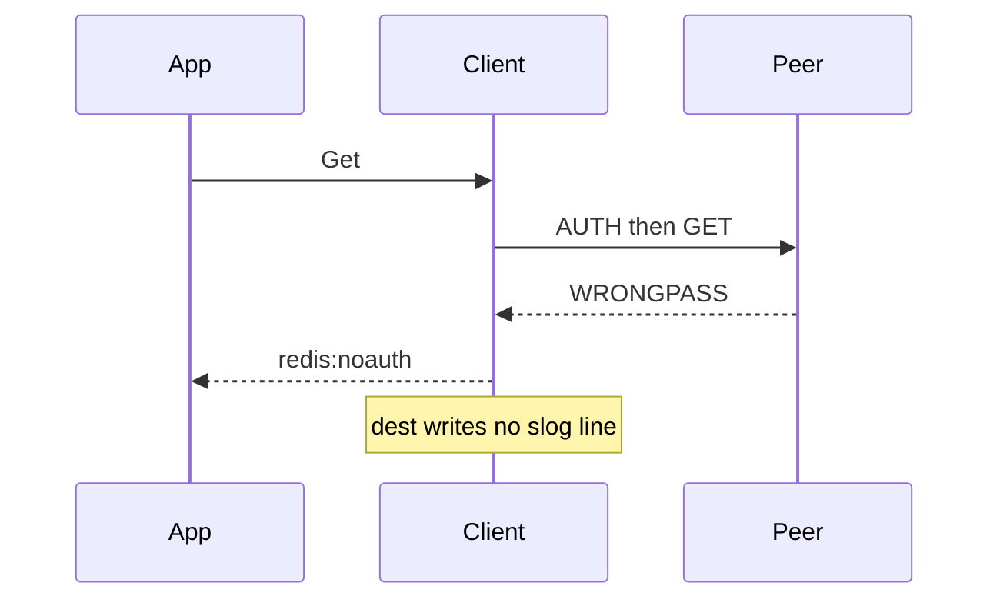

Developer review: in progress — 2026-09-13T15:57:16Z

## What this changes
**Operators.** None.

**Admin users.** None.

**Developers.** A debt note that `simpleredis_socket_poisoned` and `simpleredis_auth_leftover` wait on PR #69. No `Config.Logger` on dest yet.

**End users.** None.

## Motivation
SimpleRedis already classifies AUTH rejection, pool wait, truncated bulk, malformed RESP, handshake failure, NOSCRIPT reload, over-free, and a panic inside `do`. Dest returns those as errors (or lets the panic reach Traefik) and writes no slog line. `reclaim` already emits `reclaim_*` on a `*slog.Logger`. This package does not.

On dest, `New` copies host, password, pool, and retry knobs and freezes them. There is no logger field. `runOnConn` releases the socket on panic (PR #71) but does not log. `freeInUseTurn` increments `OverFrees` and continues. AUTH `WRONGPASS` becomes `redis:noauth` with no event. A waiter past `PoolTimeout` becomes `redis:unreachable` with no event. Under load, operators watching Traefik logs cannot tell a defended peer glitch from a broken in-use-turn invariant.

Until merge, production SimpleRedis misbehavior stays silent. A discard-handler default on every `Get` would also regress interpreted alloc (`interpretedcost_test.go`) even when nobody is listening.

## Merge readiness
Prepare grounded. Product logging has not landed. 3 items remain.

Priority: P2 — operators cannot diagnose dest SimpleRedis failures that the library already classifies
Reviewed head: 659c098
Owner decision: None.

## Review scores
| Measure | Result | What it means |
| --- | --- | --- |
| Overall readiness | 1/6 | Pushed stub, CI not seen |
| CI proof | 1/6 | pushed, not seen |
| Local tests proof | N/A | localTests none, before implement |
| Review resolution | 6/6 | OPEN PR, no comments |

## Verification
| Check | Result | Evidence |
| --- | --- | --- |
| Branch | 2026-09-13-simpleredis-structured-logging pushed | `git` origin |
| OpenSpec | none | `openspec/` |
| Pull request | https://github.com/david-garcia-garcia/traefik-middleware-utilities/pull/74 | pr-host Create |
| CI | not seen | pr-host CI |
| Local tests | none | handoff.yaml localTests |
| PR comments | no comments | no comments.md |

## Specs
None.

## Deviations from the ask
None.

## Follow-up issues
- [ ] [Add leftover-RESP log events after PR #69](https://github.com/david-garcia-garcia/traefik-middleware-utilities/blob/2026-09-13-simpleredis-structured-logging/knowledge/debt/2026-09-13-simpleredis-leftover-resp-log-events.md) — `MsgSocketPoisoned` and `MsgAuthLeftover` have no dest detection site until PR #69 merges.

## How this fits together
Local spec is the dump. Branch `2026-09-13-simpleredis-structured-logging` from `origin/master` opened PR 74. CI has not been measured.

## Explore Decisions
None.

## Before merge
- [ ] [P2] Ship optional `Config.Logger` and the 18 dest-detectable events (not leftover-RESP)
- [ ] Tests: capturing handler, nil logger, secrets, Debug alloc=0, Yaegi, panic log then re-raise
- [ ] Merge last after OPEN #69, #72, and #73

## Findings
None.

## Axis review
None.

## Agent review details

### Review metrics
| Metric | Value | Why it matters |
| --- | --- | --- |
| Specs in this PR | none | Same list as ## Specs |
| Open reviewer comments walked | 0 FIX / 0 ANSWER / 0 open | Unanswered review is merge risk |
| Reviewed head | 659c098fd9743e6ebaec109e22beabb59c1a20a5 | Card must match the branch you measured |

### Stored data model
None.

### Technical review
Best possible solution: dest still has no slog in `simpleredis`. The agreed shape is reclaim's `Msg*` constants plus optional `Config.Logger`, with call-site nil/Enabled guards, not a discard handler.

Do we have a high-confidence way to reproduce? Yes — dest `simpleredis/` has zero `log/slog` imports; reclaim `table.go` already shows the convention; leftover-RESP sites are absent until PR #69.

Is this the best way to solve the issue? Yes — freeze `Logger` at `New` like other knobs, emit at the decision site, re-panic after `simpleredis_panic`, and defer the two leftover events.

### Evidence
What I checked:
- dest `Config` has no Logger (`simpleredis/config.go`, `origin/master` `c14cbec`)
- dest `runOnConn` defers release only (`simpleredis/commands_exec.go`); panic test recovers in the test (`panic_safety_test.go`)
- dest `replyError` maps WRONGPASS/NOAUTH/NOPERM/`ERR Client sent AUTH` (`simpleredis/resp.go`)
- dest `do` has no `Buffered()` check (`simpleredis/resp.go`); PR #69 still OPEN
- reclaim `Open` rejects nil logger; this ticket requires accepting nil
- PR 74 open, comments empty (GitHub MCP)

### Rank-up moves
None.
