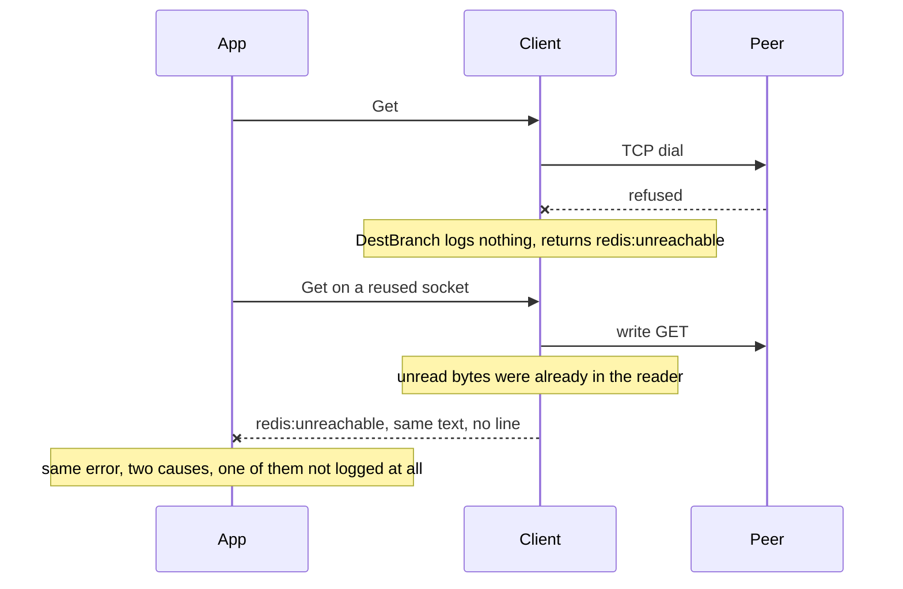

Developer review: ready for review — 2026-09-14T12:28:19Z

## What this changes
**Operators.** Set `Logger` on the middleware's SimpleRedis config to see session lines, and grep the site rather than an event name: a failure logs as `<site>: <cause>` (`dial: redis:unreachable`, `borrowSocket: redis:unreachable` with `reason` `pool_wait`, `do: redis:noauth`, `exec: redis:timeout`), while `simpleredis_dial` with `reason` `skip_idle` stays the signal that a peer restart or `CLIENT KILL` left the parked sockets dead.

**Admin users.** None.

**Developers.** `Config.Logger *slog.Logger` is frozen at `New`; nil becomes a discard logger. Failures now go through one log-only helper, `logSite(level, site, err, attrs...)`, which emits `"<site>: <cause>"` and returns nothing — it MUST NOT wrap, so `err.Error()` for `RedisUnreachable` and every other exported sentinel is byte-for-byte what it was and no consumer package changed. `loggableCause` is the single sink that decides publishable text: a sentinel this package owns or a context error prints itself, any other error prints only the leading `A`-`Z` token of the peer's reply. Nine `simpleredis_*` failure tokens are gone (`_canceled`, `_timeout`, `_noauth`, `_pool_exhausted`, `_handshake_failed`, `_bad_reply`, `_short_bulk`, `_auth_leftover`, `_noscript`); eight non-failure events stay (`_open`, `_dial`, `_idle_swept`, `_retry`, `_capability`, `_over_free`, `_socket_poisoned`, `_panic`). `errorsIsCanceled` is deleted.

**End users.** None.

## Motivation
SimpleRedis returns one text, `redis:unreachable`, from six different places: a TCP dial that failed, a `SetDeadline` that failed, unread bytes found before a write, a short read on the reply, a command on a closed client, and a command on a client that never came from `New`. On `DestBranch` the log cannot tell them apart. The event catalog names the *classification* an operator can already read off the returned error, and says nothing about where it happened, so `simpleredis_short_bulk` and `simpleredis_pool_exhausted` exist while the two most common unreachable paths — dial refused and leftover before a write — share one anonymous sentinel and no line at all. Adding a token per site would mean hand-maintaining a vocabulary that grows with every new branch in `do` and `borrowSocket`.

Keeping the catalog also costs correctness at the AUTH step. `simpleredis_handshake_failed` may not carry the peer's reply, because Redis 7.4 answers `AUTH` against a nopass default user with `ERR AUTH <password> called without any password configured for the default user` — the credential, in a reply that is not AUTH-class and so is never mapped to `redis:noauth`. On `DestBranch` that is held off the line by one `verb`-only emit in `dial`; every other site is free to log an error text, and the reply that quotes the password is not the only dangerous one — Redis refuses an unknown verb by quoting the command's own arguments back, which is Redis key names and values.

If this does not merge, an operator diagnosing a Redis incident still cannot tell a refused dial from a poisoned socket from a saturated pool, and the one guard that keeps `Config.Pass` out of the log stays a property of a single call site instead of a rule the code enforces.

## Merge readiness
Ported the parked site-logging redesign forward onto `CommandTimeout` and `borrowSocket`, log-only and without the rejected error wrap, and CI succeeded on this head. 0 items remain.

Priority: P2 — operators cannot tell six causes of one error text apart, and the rule that keeps `Config.Pass` off a log line is one call site's property rather than something the code enforces
Reviewed head: c0abbd7
Owner decision: Required. See Explore Decisions.

## Review scores
| Measure | Result | What it means |
| --- | --- | --- |
| Overall readiness | 6/6 | CI succeeded on the measured head, no open comments |
| CI proof | 6/6 | succeeded — [run 34843298272](https://github.com/david-garcia-garcia/traefik-middleware-utilities/actions/runs/34843298272) |
| Local tests proof | N/A | prHost remote; CI is the proof axis |
| Review resolution | 6/6 | OPEN PR, no comments |

## Verification
| Check | Result | Evidence |
| --- | --- | --- |
| Branch | 2026-09-13-simpleredis-structured-logging pushed | `git` origin c0abbd7 |
| OpenSpec | simpleredis-structured-logging | `openspec/changes/archive/2026-09-13-simpleredis-structured-logging/` |
| Pull request | https://github.com/david-garcia-garcia/traefik-middleware-utilities/pull/74 | pr-host |
| CI | build 34843298272 success https://github.com/david-garcia-garcia/traefik-middleware-utilities/actions/runs/34843298272 | Lint, Unit, Unit race, Integration Tests, Integration Tests Redis, Integration Tests Dragonfly, Go E2E Redis, Go E2E Dragonfly all success |
| Local tests | passed | handoff.yaml localTests |
| PR comments | no comments | no comments.md |

## Specs
- [std_go_simpleredis_slog-events](https://github.com/david-garcia-garcia/traefik-middleware-utilities/blob/2026-09-13-simpleredis-structured-logging/openspec/changes/archive/2026-09-13-simpleredis-structured-logging/proposal.md) — added
- [std_go_simpleredis_tcp-session](https://github.com/david-garcia-garcia/traefik-middleware-utilities/blob/2026-09-13-simpleredis-structured-logging/openspec/changes/archive/2026-09-13-simpleredis-structured-logging/proposal.md) — modified

## Deviations from the ask
- taken: optional `Config.Logger` with nil staying silent, exported `Msg*` constants in `log.go`, and extra attrs → discard logger at `New`, no constants and no `log.go` — `simpleredis/simpleredis.go` `New` — honouring the catalog added a logging facade whose only job was attributes. Requester: confirmed.
- taken: instrument `redis:timeout` at the I/O site in `do` → emit from `libraryTimeout` on `*SimpleRedis` — `simpleredis/commands_exec.go` `libraryTimeout` — #84 made `ioOrContext` report the socket deadline as a context deadline so `exec` decides library budget versus caller deadline, which leaves a `do`-side emit unreachable. Requester: not asked.
- taken: log the peer's reply text everywhere except on the AUTH verb → publish only the leading `A`-`Z` token of a peer reply, decided in `loggableCause` — `simpleredis/simpleredis.go` `loggableCause` — a verb gate protects `Pass` but not keys, because `ERR unknown command '<verb>', with args beginning with: '<key>', '<value>'` is not on the AUTH path; one sink means no site, level, or verb can bypass the rule. Requester: not asked.
- taken: fold the failure catalog and keep `_open`, `_dial`, `_idle_swept` → keep `_retry`, `_capability`, `_over_free`, `_socket_poisoned` and `_panic` as well — `openspec/specs/std_go_simpleredis_slog-events/spec.md` — same test as the three named in the ask: none of the five has an error value, and inventing one is exactly the awkwardness the parked draft was asked to remove. Requester: not asked.

## Follow-up issues
None.

## How this fits together
Local spec is the dump. Branch `2026-09-13-simpleredis-structured-logging` carries `origin/master` through `6d3e381` and is PR 74. The OpenSpec change is archived; the live `std_go_simpleredis_slog-events` leaf is rewritten to the site-logging contract, the peer-error-code trim, and the eight surviving events. CI succeeded on c0abbd7.

## Explore Decisions
| Question | Rank | Decision | By |
| --- | --- | --- | --- |
| Does the site helper wrap the error it logs, as the parked draft did? | structural asked | resolved — no. Owner rejected the wrap: `RedisUnreachable` and its siblings are exported text that four consumer packages compare against and ten `tcp-session` requirements pin | implement |
| Which `simpleredis_*` events survive the catalog removal? | additive asked | assumed — the eight that report a condition with no error value; the nine that classified a failure are folded into site lines | implement |
| How is `Config.Pass` kept off a log line once sites log error text? | structural asked | assumed — one sink, `loggableCause`, publishes a peer reply as its leading error code only. Measured: publishing the raw text fails `TestLogHandshakeFailedNeverEchoesPass` on the password and `TestLogPeerReplyIsCodeOnlyNotItsArguments` on the key name | implement |
| master PR #84 moved the `redis:timeout` decision out of `do`. Where does that classification log? | additive asked | assumed — `libraryTimeout` on `*SimpleRedis` is the single owner and the single emit; `TestLogTimeout` also asserts `do` does not emit it | mergeconflictresolve |

## Before merge
None.

## Findings
- [[P2] The parked redesign reintroduced the `Config.Pass` leak through `do`](https://github.com/david-garcia-garcia/traefik-middleware-utilities/blob/2026-09-13-simpleredis-structured-logging/simpleredis/simpleredis.go) — FIX — the draft deleted `dial`'s `verb`-only handshake emit but made `do` log raw error text, and `do` is what executes AUTH, so the nopass-default-user reply would have reached the log with no mitigation. The trim now lives in `loggableCause`. Path: `simpleredis/simpleredis.go` `loggableCause`. Reply none (self-found).
- [[P3] Publishing peer text would also have published Redis key names and values](https://github.com/david-garcia-garcia/traefik-middleware-utilities/blob/2026-09-13-simpleredis-structured-logging/simpleredis/slog_test.go) — FIX — `ERR unknown command '<verb>', with args beginning with: '<key>', '<value>'` is a Redis reply on the MSetEX capability probe path, not the AUTH path, so an AUTH-only gate would not have caught it. `TestLogPeerReplyIsCodeOnlyNotItsArguments` pins it. Path: `simpleredis/slog_test.go`. Reply none (self-found).

## Axis review
[Standards](https://github.com/david-garcia-garcia/traefik-middleware-utilities/blob/2026-09-13-simpleredis-structured-logging/devstate/2026/09/2026-09-13-simpleredis-structured-logging/codereview_standards.md) — 7 total, 0 pending, 4 completed, 3 skipped
[Nitpicks](https://github.com/david-garcia-garcia/traefik-middleware-utilities/blob/2026-09-13-simpleredis-structured-logging/devstate/2026/09/2026-09-13-simpleredis-structured-logging/codereview_nitpicks.md) — 0 total, 0 pending, 0 completed
[Spec](https://github.com/david-garcia-garcia/traefik-middleware-utilities/blob/2026-09-13-simpleredis-structured-logging/devstate/2026/09/2026-09-13-simpleredis-structured-logging/codereview_spec.md) — 0 total, 0 pending, 0 completed
[Security](https://github.com/david-garcia-garcia/traefik-middleware-utilities/blob/2026-09-13-simpleredis-structured-logging/devstate/2026/09/2026-09-13-simpleredis-structured-logging/codereview_security.md) — 0 total, 0 pending, 0 completed
[Performance](https://github.com/david-garcia-garcia/traefik-middleware-utilities/blob/2026-09-13-simpleredis-structured-logging/devstate/2026/09/2026-09-13-simpleredis-structured-logging/codereview_performance.md) — 0 total, 0 pending, 0 completed
[Dead](https://github.com/david-garcia-garcia/traefik-middleware-utilities/blob/2026-09-13-simpleredis-structured-logging/devstate/2026/09/2026-09-13-simpleredis-structured-logging/codereview_dead.md) — 0 total, 0 pending, 0 completed
[Test coverage](https://github.com/david-garcia-garcia/traefik-middleware-utilities/blob/2026-09-13-simpleredis-structured-logging/devstate/2026/09/2026-09-13-simpleredis-structured-logging/codereview_coverage.md) — 3 total, 0 pending, 2 completed, 1 skipped

## Agent review details

### Review metrics
| Metric | Value | Why it matters |
| --- | --- | --- |
| Specs in this PR | 1 added / 1 modified | Same list as ## Specs |
| Open reviewer comments walked | 0 FIX / 0 ANSWER / 0 open | Unanswered review is merge risk |
| Reviewed head | c0abbd7969ac58f16ac457183a73c4a42f79dff5 | Card must match the branch you measured |

### Stored data model
None.

### Technical review
Best possible solution: one log-only helper that names the function which saw the failure, with the publishable-text rule at that one sink, instead of a message token per classification that an operator can already read off the returned error.

Do we have a high-confidence way to reproduce? Yes — a capturing `slog.Handler` covers every site line and every surviving event, the two leak proofs run against fake peers that reply with the exact Redis 7.4 nopass text and the unknown-command text, and a Yaegi GOPATH probe runs `Logger.Log` under the interpreter.

Is this the best way to solve the issue? Yes versus `DestBranch`. The judgement calls are that the site helper does not wrap (so exported error text is untouched), that timeout classification keeps one owner in `exec`, and that a peer reply is published as its error code rather than in full.

### Evidence
What I checked:
- `go build ./...`, `go vet ./...`, `go test ./simpleredis/ -count=1`, `go test ./... -count=1 -short` all pass (local, c0abbd7)
- `golangci-lint v1.63.4` with the repo config reports no findings; the only `gofmt` flags on this Windows checkout are the pre-existing CRLF artifact and hit every package, and the eight files this PR touches are clean once normalised to LF (local, c0abbd7)
- `TestYaegi_StructuredLogging` passes and now exercises the site helper under the interpreter: interpreted code observes `simpleredis_open`, then fails one `Get` and must find `dial: redis:unreachable`, which is `Logger.Log` with a level rather than the `Debug` / `Warn` calls already proven (local, c0abbd7)
- The `Pass` guard is load-bearing by mutation: returning `err.Error()` instead of `peerErrorCode(err.Error())` in `loggableCause` fails `TestLogHandshakeFailedNeverEchoesPass` with `do: ERR AUTH PassW0rd-UNIQUE-9f3a called without any password configured for the default user` in the captured dump, and fails `TestLogPeerReplyIsCodeOnlyNotItsArguments` with the key name. `TestSecretsNeverAppearInLogs` passes under that same mutation, so it is not sufficient coverage on its own (local, c0abbd7)
- `openspec/specs/std_go_simpleredis_tcp-session/spec.md` is byte-identical to the pre-change file and still carries 27 requirements; `windowcounter`, `tokenbucket`, `leakybucket` and `e2e/simpleredisprobe` are untouched (`git diff`, c0abbd7)
- `validate_artifact_names` and `validate_spec_map` both OK against this worktree (opd-mcp)
- GitHub check runs on [34843298272](https://github.com/david-garcia-garcia/traefik-middleware-utilities/actions/runs/34843298272): Lint, Unit, Unit race, Integration Tests, Integration Tests Redis, Integration Tests Dragonfly, Go E2E Redis, Go E2E Dragonfly all success

### Rank-up moves
- Wire `Logger` through the Traefik e2e plugin YAML so operators can attach slog without a custom caller.
- The archived change folder still holds the proposal-time `std_go_simpleredis_slog-events` delta, which already disagreed with the live leaf before this commit; the live leaf is the current contract.
