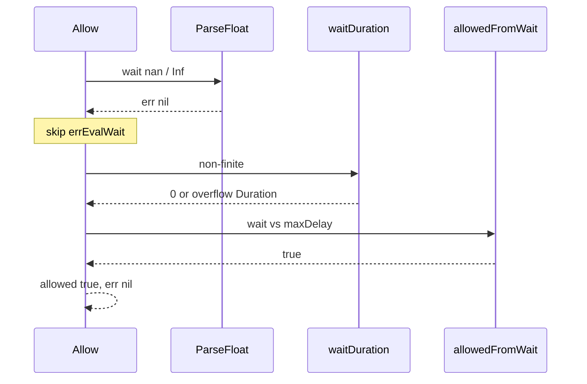

Developer review: in progress — 2026-09-13T06:26:11Z

## What this changes
**Operators.** None.

**Admin users.** None.

**Developers.** `Redis.Allow` returns `errEvalWait` (`tokenbucket: eval wait is not a number`) when the 3-field Eval wait is `nan`, `+Inf`, `-Inf`, or `inf`. `TestRepro_EvalWaitNaNFailOpen` proves it. Usage Gotcha on `std_go_tokenbucket.md`.

**End users.** None.

## Motivation
On dest, `Redis.Allow` maps a 3-field Eval wait with `strconv.ParseFloat`. A garbage string becomes `errEvalWait`. `nan`, `+Inf`, `-Inf`, and `inf` parse with `err == nil`, skip that sentinel, and go through `waitDuration` then `allowedFromWait`.

That path admits. Measured on dest: wait `"nan"` / `"+Inf"` / `"inf"` returned `allowed=true`, wait `MinInt64` Duration, `err=nil`. `"-Inf"` returned `allowed=true`, wait `0`, `err=nil`. `-Inf <= maxDelayMicro` is true, so bug 1’s microsecond compare would still admit `-Inf`.

If this stays unmerged, a 3-field Eval wait that is not a finite number fail-opens instead of `errEvalWait`. Callers treat that as a successful consume.

## Merge readiness
Implement landed the finite check. Seven-axis review of `origin/master...HEAD` is clean.

Priority: P1 — serving a wrong public contract today
Reviewed head: 99cabd4
Owner decision: Required. See Explore Decisions.

## Review scores
| Measure | Result | What it means |
| --- | --- | --- |
| Overall readiness | 3/6 | Remote CI still queued |
| CI proof | 3/6 | Checks queued on the implement push |
| Local tests proof | N/A | `prHost` remote; CI proof covers remote |
| Review resolution | 6/6 | OPEN PR, no review comments |

## Verification
| Check | Result | Evidence |
| --- | --- | --- |
| Branch | 2026-09-13-tokenbucket-bug-eval-finite-wait pushed | `git` / pr-host |
| OpenSpec | tokenbucket-eval-finite-wait | `openspec/changes/tokenbucket-eval-finite-wait/` |
| Pull request | https://github.com/david-garcia-garcia/traefik-middleware-utilities/pull/53 | pr-host List |
| CI | build 34742576798 in progress https://github.com/david-garcia-garcia/traefik-middleware-utilities/actions/runs/34742576798 | pr-host check_runs |
| Local tests | passed | handoff.yaml localTests |
| PR comments | no comments | pr-host get_comments empty |

## Specs
- [std_go_tokenbucket_allow](https://github.com/david-garcia-garcia/traefik-middleware-utilities/blob/2026-09-13-tokenbucket-bug-eval-finite-wait/openspec/changes/tokenbucket-eval-finite-wait/proposal.md) — modified

## Deviations from the ask
None.

## Follow-up issues
None.

## How this fits together
Local ticket, branch `2026-09-13-tokenbucket-bug-eval-finite-wait`, stub PR #53. Code review of the apply diff is clean. Next is usage-doc impact.

## Explore Decisions
| Question | Rank | Decision | By |
| --- | --- | --- | --- |
| Must the errEvalWait cases also assert wait is 0? | additive incidental | assumed — assert wait 0 and `errors.Is(err, errEvalWait)` like `TestRedis_EvalBadReply`. Do not give non-finite wait a Duration meaning. | explore |
| Can live Lua `tostring(wait_duration)` emit `nan` / `inf`, or only a fake 3-field override? | additive asked | assumed — still require finite after ParseFloat. Proof is the fake override. Do not wait for a live Lua nan path. Do not change Lua in this ticket. | explore |

## Before merge
- [x] Land tokenbucket tests that fail on dest for Eval wait `nan` / `+Inf` / `-Inf` / `inf`, then require finite `ParseFloat` or `errEvalWait`
- [ ] Fold the finite-wait contract into the live allow spec (archive)

## Findings
None.

## Axis review
[Standards](https://github.com/david-garcia-garcia/traefik-middleware-utilities/blob/2026-09-13-tokenbucket-bug-eval-finite-wait/devstate/2026/09/2026-09-13-tokenbucket-bug-eval-finite-wait/codereview_standards.md) — 0 total, 0 pending, 0 completed
[Nitpicks](https://github.com/david-garcia-garcia/traefik-middleware-utilities/blob/2026-09-13-tokenbucket-bug-eval-finite-wait/devstate/2026/09/2026-09-13-tokenbucket-bug-eval-finite-wait/codereview_nitpicks.md) — 0 total, 0 pending, 0 completed
[Spec](https://github.com/david-garcia-garcia/traefik-middleware-utilities/blob/2026-09-13-tokenbucket-bug-eval-finite-wait/devstate/2026/09/2026-09-13-tokenbucket-bug-eval-finite-wait/codereview_spec.md) — 0 total, 0 pending, 0 completed
[Security](https://github.com/david-garcia-garcia/traefik-middleware-utilities/blob/2026-09-13-tokenbucket-bug-eval-finite-wait/devstate/2026/09/2026-09-13-tokenbucket-bug-eval-finite-wait/codereview_security.md) — 0 total, 0 pending, 0 completed
[Performance](https://github.com/david-garcia-garcia/traefik-middleware-utilities/blob/2026-09-13-tokenbucket-bug-eval-finite-wait/devstate/2026/09/2026-09-13-tokenbucket-bug-eval-finite-wait/codereview_performance.md) — 0 total, 0 pending, 0 completed
[Dead](https://github.com/david-garcia-garcia/traefik-middleware-utilities/blob/2026-09-13-tokenbucket-bug-eval-finite-wait/devstate/2026/09/2026-09-13-tokenbucket-bug-eval-finite-wait/codereview_dead.md) — 0 total, 0 pending, 0 completed
[Test coverage](https://github.com/david-garcia-garcia/traefik-middleware-utilities/blob/2026-09-13-tokenbucket-bug-eval-finite-wait/devstate/2026/09/2026-09-13-tokenbucket-bug-eval-finite-wait/codereview_coverage.md) — 0 total, 0 pending, 0 completed

## Agent review details

### Review metrics
| Metric | Value | Why it matters |
| --- | --- | --- |
| Specs in this PR | 0 added / 1 modified | Same list as ## Specs; do not paste diff --stat |
| Open reviewer comments walked | 0 FIX / 0 ANSWER / 0 open | Unanswered review is merge risk |
| Reviewed head | 99cabd4714bef5f5abc230d18684679f88fe4cbe | Card must match the branch you measured |

### Stored data model
None.

### Technical review
Best possible solution: `Redis.Allow` now returns `errEvalWait` after ParseFloat when wait is not finite, same sentinel as `"xyz"`.

Do we have a high-confidence way to reproduce? Yes. `TestRepro_EvalWaitNaNFailOpen` failed on dest (all four waits `allowed=true` `err=nil`) then passed after the finite check.

Is this the best way to solve the issue? Yes vs dest: one finite check, same sentinel, no second error, no deny-with-nil.

### Evidence
What I checked:
- Seven-axis review: all `none.`
- FAIL then PASS: `go test -short -count=1 -timeout 60s -run TestRepro_EvalWaitNaNFailOpen ./tokenbucket`
- `go test -short -count=1 ./tokenbucket` passed after the fix
- `tokenbucket/redis.go` finite check (`8f38739`)
- CI run 34742576798 queued (pr-host check_runs)

### Rank-up moves
None.
