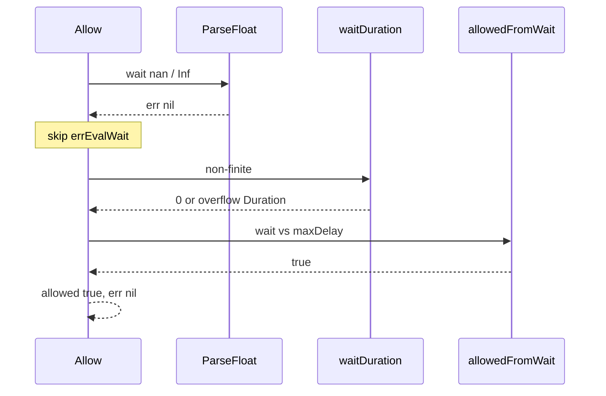

Developer review: in progress — 2026-09-13T06:11:16Z

## What this changes
**Operators.** None.

**Admin users.** None.

**Developers.** None.

**End users.** None.

## Motivation
On dest, `Redis.Allow` maps a 3-field Eval wait with `strconv.ParseFloat`. A garbage string becomes `errEvalWait`. `nan`, `+Inf`, `-Inf`, and `inf` parse with `err == nil`, skip that sentinel, and go through `waitDuration` then `allowedFromWait`.

That path admits. `-Inf` becomes wait `0` (`<= 0`) so `0 <= maxDelay` is true. `NaN` / `+Inf` still compare as allowed after the Duration cast. The existing unit test only covers wait `"xyz"`. A fake 3-field reply with a non-finite wait is treated as a successful consume.

If this stays unmerged, a Redis/Dragonfly script that returns a non-finite wait (or a 3-field override) fail-opens instead of returning `errEvalWait`. Bug 1’s microsecond compare does not close this: `-Inf <= maxDelayMicro` is still true, and `NaN` / `+Inf` would deny with `err=nil`, which this ticket forbids.

## Merge readiness
Prepare is grounded; product apply has not started. Explore is next.

Priority: P1 — serving a wrong public contract today
Reviewed head: fab924b
Owner decision: None.

## Review scores
| Measure | Result | What it means |
| --- | --- | --- |
| Overall readiness | 3/6 | CI still queued; no product apply yet |
| CI proof | 3/6 | Checks queued/in progress on the stub PR |
| Local tests proof | N/A | Before implement (`localTests: none`) |
| Review resolution | 6/6 | OPEN PR, no review comments |

## Verification
| Check | Result | Evidence |
| --- | --- | --- |
| Branch | 2026-09-13-tokenbucket-bug-eval-finite-wait pushed | `git push` `fab924b` |
| OpenSpec | none | no change folder |
| Pull request | https://github.com/david-garcia-garcia/traefik-middleware-utilities/pull/53 | pr-host Create |
| CI | build 34742104376 in progress https://github.com/david-garcia-garcia/traefik-middleware-utilities/actions/runs/34742104376 | pr-host CI (head `fab924b`) |
| Local tests | none | handoff.yaml localTests |
| PR comments | no comments | inventory empty |

## Specs
None.

## Deviations from the ask
None.

## Follow-up issues
None.

## How this fits together
Local ticket, branch `2026-09-13-tokenbucket-bug-eval-finite-wait` from `origin/master` (`tokenbucket/` present; `origin/HEAD` is stale `initial`). Stub PR #53 is the durable card. Next is explore.

## Explore Decisions
None.

## Before merge
- [ ] Land tokenbucket tests that fail on dest for Eval wait `nan` / `+Inf` / `-Inf` / `inf`, then require finite `ParseFloat` or `errEvalWait`
- [ ] Fold the finite-wait contract into the allow spec and usage packet

## Findings
None.

## Axis review
None.

## Agent review details

### Review metrics
| Metric | Value | Why it matters |
| --- | --- | --- |
| Specs in this PR | none | Same list as ## Specs; do not paste diff --stat |
| Open reviewer comments walked | 0 FIX / 0 ANSWER / 0 open | Unanswered review is merge risk |
| Reviewed head | fab924b1f368c2a6c6699a33f2521fea92797553 | Card must match the branch you measured |

### Stored data model
None.

### Technical review
Best possible solution: dest still admits a non-finite Eval wait; the agreed fix is `errEvalWait` after `ParseFloat` when the number is not finite.

Do we have a high-confidence way to reproduce? Yes, fake Redis 3-field reply via `startTestFakeRedis` / `setEvalReply` / `arrayBulks` already in `tokenbucket/` tests. Dest has no nan/Inf case yet (`TestRedis_EvalBadReply` covers `"xyz"` only). Fail-then-pass is implement (tests first).

Is this the best way to solve the issue? Yes vs dest: one finite check, same sentinel as a garbage string, no second error type, no deny-with-nil.

### Evidence
What I checked:
- `tokenbucket/redis.go` ParseFloat then only `convErr` (`fab924b`, dest `d69f89d`)
- `tokenbucket/clock.go` `waitDuration` / `allowedFromWait` / `errEvalWait` (`d69f89d`)
- `tokenbucket/limiter_test.go` `TestRedis_EvalBadReply` (`d69f89d`)
- Specs `std_go_tokenbucket_allow` / `std_go_tokenbucket_lua-eval` (`d69f89d`)
- Stub PR #53 OPEN, comments empty (pr-host List)
- CI run 34742104376 queued (pr-host check_runs)

### Rank-up moves
None.
