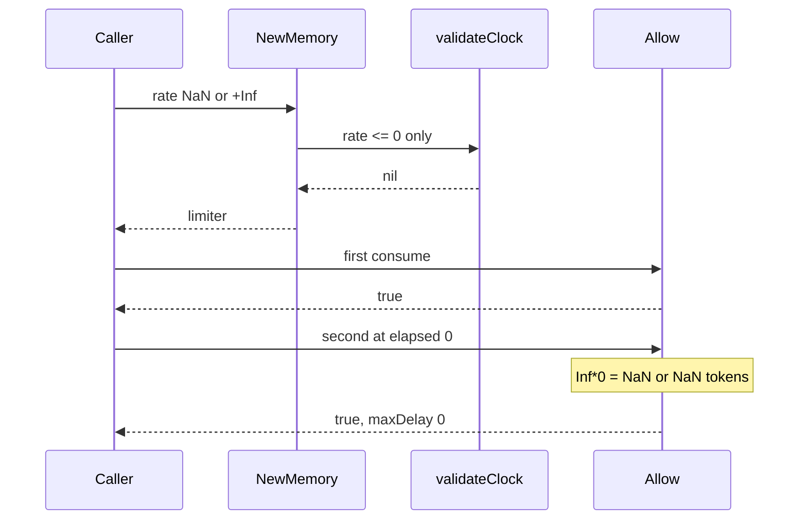

Developer review: in progress — 2026-09-13T06:14:31Z

## What this changes
**Operators.** None.

**Admin users.** None.

**Developers.** None.

**End users.** None.

## Motivation
On dest, `NewMemory` and `NewRedis` are the only gates before a token-bucket `Allow`. Passthrough is skipping construction; this package has no unlimited-rate constructor.

`validateClock` only rejects `rate <= 0`. `NaN <= 0` is false and `+Inf > 0` is true, so both constructors accept those rates. A NaN rate makes every `Allow` true. A +Inf rate does `Inf*0 = NaN` on the second `Allow` at elapsed=0, so `maxDelay=0` still admits.

If this stays unmerged, a caller that passes a non-finite rate gets a limiter that fail-opens instead of an `errRate`. The agreed fix is reject NaN and Inf at `New` as `errRate`; do not special-case `Allow`.

## Merge readiness
Explore reproduced the dest fail-open; product apply has not started. Propose is next.

Priority: P1 — serving a wrong public contract today
Reviewed head: c2a691c
Owner decision: None.

## Review scores
| Measure | Result | What it means |
| --- | --- | --- |
| Overall readiness | 3/6 | CI still queued; no product apply yet |
| CI proof | 3/6 | Checks queued on the stub PR |
| Local tests proof | N/A | Before implement (`localTests: none`) |
| Review resolution | 6/6 | OPEN PR, no review comments |

## Verification
| Check | Result | Evidence |
| --- | --- | --- |
| Branch | 2026-09-13-tokenbucket-bug-finite-rate pushed | `git push` `c2a691c` |
| OpenSpec | none | no change folder |
| Pull request | https://github.com/david-garcia-garcia/traefik-middleware-utilities/pull/52 | pr-host List |
| CI | build 34742230790 in progress https://github.com/david-garcia-garcia/traefik-middleware-utilities/actions/runs/34742230790 | pr-host CI |
| Local tests | none | handoff.yaml localTests |
| PR comments | no comments | inventory empty |

## Specs
None.

## Deviations from the ask
None.

## Follow-up issues
None.

## How this fits together
Local ticket, branch `2026-09-13-tokenbucket-bug-finite-rate` from `origin/master`. Stub PR #52 is the durable card. Explore reproduced NaN/+Inf constructor accept; propose next.

## Explore Decisions
| Question | Rank | Decision | By |
| --- | --- | --- | --- |
| Do new tests land as the named `repro_*.go` files or fold into `limiter_test.go`? | additive asked | assumed — land `repro_nan_rate_test.go` and `repro_hunt_inf_rate_nan_test.go`; adapt dest Allow signature | explore |
| Does `-Inf` get its own constructor test, given dest already rejects it via `rate <= 0`? | additive incidental | assumed — include `-Inf` beside +Inf; dest-green `-Inf` is not the fail-first proof | explore |
| Does `TestRepro_NaNRateAllowFailOpen` stay as a skip-after-fix witness or become New-reject only? | additive asked | assumed — keep the test; Skip when New rejects NaN | explore |
| Should `errRate` text change from "greater than 0" to mention finite? | additive incidental | assumed — keep the existing string; callers match `errors.Is` | explore |

## Before merge
- [ ] Land tokenbucket tests that fail on dest for NaN and Inf at `New`, then reject non-finite rate in `validateClock` as `errRate`
- [ ] Fold non-finite rate into the tokenbucket allow spec and usage packet

## Findings
None.

## Axis review
None.

## Agent review details

### Review metrics
| Metric | Value | Why it matters |
| --- | --- | --- |
| Specs in this PR | none | Same list as ## Specs |
| Open reviewer comments walked | 0 FIX / 0 ANSWER / 0 open | Unanswered review is merge risk |
| Reviewed head | c2a691cbe8a0fcf07d60ef75e9ef6736c0455800 | Card must match the branch you measured |

### Stored data model
None.

### Technical review
Best possible solution: Dest still accepts NaN and Inf at `New`; the ticket’s `validateClock` finite-rate gate is the how.

Do we have a high-confidence way to reproduce? Yes — throwaway `go test` on dest: `NewMemory(NaN)` and `NewRedis(NaN)` return a limiter; five frozen-clock Allows all `true, 0, nil`; `NewMemory(+Inf)` then second Allow at elapsed=0 also admits; `-Inf` already returns `errRate`.

Is this the best way to solve the issue? Yes — special-casing `Allow` or `consumeOne` for NaN tokens would paper over a constructor that should have failed, and +Inf is not an unlimited-rate constructor.

### Evidence
What I checked:
- `NaN <= 0` false; `+Inf > 0` true; `-Inf <= 0` true (`go test` throwaway, then deleted)
- `NewMemory(NaN)` limiter=true err=nil; five Allows all allowed=true wait=0
- `NewMemory(+Inf)` limiter=true; Allow[0] and Allow[1] at frozen now both true
- `NewMemory(-Inf)` err=`tokenbucket: rate must be greater than 0`
- `NewRedis(NaN)` limiter=true err=nil
- `validateClock` rate `<= 0` only (`tokenbucket/clock.go`)
- CI run 34742230790 queued after explore push

### Rank-up moves
None.
