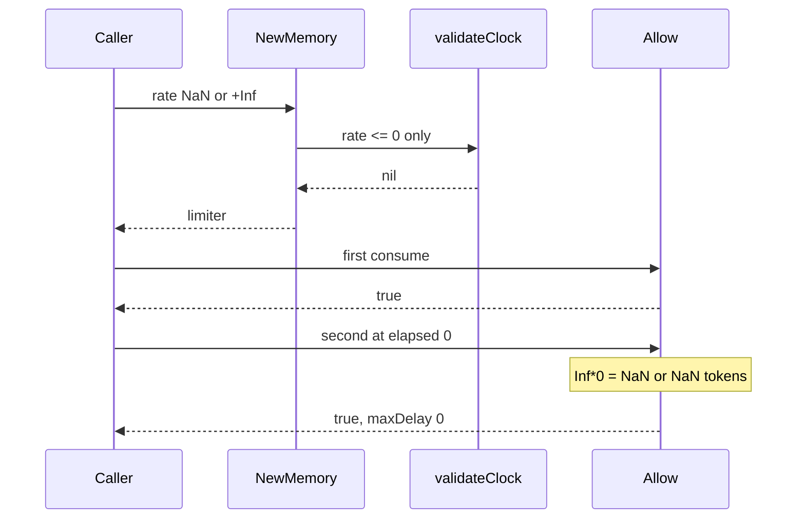

Developer review: in progress — 2026-09-13T06:28:15Z

## What this changes
**Operators.** None.

**Admin users.** None.

**Developers.** `validateClock` rejects NaN and Inf as `errRate`. Unit tests `TestRepro_NaNRateRejected` and `TestRepro_InfRateRejected` prove dest used to accept those rates; `TestRepro_NaNRateAllowFailOpen` skips after New rejects.

**End users.** None.

## Motivation
On dest, `NewMemory` and `NewRedis` are the only gates before a token-bucket `Allow`. Passthrough is skipping construction; this package has no unlimited-rate constructor.

`validateClock` only rejected `rate <= 0`. `NaN <= 0` is false and `+Inf > 0` is true, so both constructors accepted those rates. A NaN rate made every `Allow` true. A +Inf rate did `Inf*0 = NaN` on the second `Allow` at elapsed=0, so `maxDelay=0` still admitted.

If this stays unmerged, a caller that passes a non-finite rate gets a limiter that fail-opens instead of an `errRate`.

## Merge readiness
Seven-axis review applied the Inf test rename. Remote CI still queued.

Priority: P1 — serving a wrong public contract today
Reviewed head: 9c94dc7
Owner decision: None.

## Review scores
| Measure | Result | What it means |
| --- | --- | --- |
| Overall readiness | 3/6 | CI still queued |
| CI proof | 3/6 | Checks queued after the review rename |
| Local tests proof | N/A | prHost remote; CI proof covers remote |
| Review resolution | 6/6 | OPEN PR, no review comments |

## Verification
| Check | Result | Evidence |
| --- | --- | --- |
| Branch | 2026-09-13-tokenbucket-bug-finite-rate pushed | `git push` `9c94dc7` |
| OpenSpec | tokenbucket-reject-nonfinite-rate | `openspec/changes/tokenbucket-reject-nonfinite-rate/` |
| Pull request | https://github.com/david-garcia-garcia/traefik-middleware-utilities/pull/52 | pr-host List |
| CI | build 34742817732 in progress https://github.com/david-garcia-garcia/traefik-middleware-utilities/actions/runs/34742817732 | pr-host CI |
| Local tests | passed | `go test -short ./tokenbucket` after rename |
| PR comments | no comments | inventory empty |

## Specs
- [std_go_tokenbucket_allow](https://github.com/david-garcia-garcia/traefik-middleware-utilities/blob/2026-09-13-tokenbucket-bug-finite-rate/openspec/changes/tokenbucket-reject-nonfinite-rate/proposal.md) — modified

## Deviations from the ask
None.

## Follow-up issues
None.

## How this fits together
Local ticket, branch `2026-09-13-tokenbucket-bug-finite-rate` from `origin/master`. Stub PR #52 is the durable card. Code review done; archive next after usage-doc impact.

## Explore Decisions
| Question | Rank | Decision | By |
| --- | --- | --- | --- |
| Do new tests land as the named `repro_*.go` files or fold into `limiter_test.go`? | additive asked | assumed — land `repro_nan_rate_test.go`; Inf tests as `repro_inf_rate_test.go` after review renamed the hunt filename | codereview |
| Does `-Inf` get its own constructor test, given dest already rejects it via `rate <= 0`? | additive incidental | assumed — include `-Inf` beside +Inf; dest-green `-Inf` is not the fail-first proof | explore |
| Does `TestRepro_NaNRateAllowFailOpen` stay as a skip-after-fix witness or become New-reject only? | additive asked | assumed — keep the test; Skip when New rejects NaN | explore |
| Should `errRate` text change from "greater than 0" to mention finite? | additive incidental | assumed — keep the existing string; callers match `errors.Is` | explore |

## Before merge
- [x] Land tokenbucket tests that fail on dest for NaN and Inf at `New`, then reject non-finite rate in `validateClock` as `errRate`
- [ ] Archive the allow spec so the live catalog names non-finite rate
- [ ] Wait for CI on PR #52

## Findings
- [Standards 1](https://github.com/david-garcia-garcia/traefik-middleware-utilities/blob/2026-09-13-tokenbucket-bug-finite-rate/devstate/2026/09/2026-09-13-tokenbucket-bug-finite-rate/codereview_standards.md) — FIX — Inf test file renamed to `repro_inf_rate_test.go`. Path: `tokenbucket/repro_inf_rate_test.go`. Reply none.
- [Nitpicks 1](https://github.com/david-garcia-garcia/traefik-middleware-utilities/blob/2026-09-13-tokenbucket-bug-finite-rate/devstate/2026/09/2026-09-13-tokenbucket-bug-finite-rate/codereview_nitpicks.md) — FIX — Inf test renamed to `TestRepro_InfRateRejected`. Path: `tokenbucket/repro_inf_rate_test.go`. Reply none.

## Axis review
[Standards](https://github.com/david-garcia-garcia/traefik-middleware-utilities/blob/2026-09-13-tokenbucket-bug-finite-rate/devstate/2026/09/2026-09-13-tokenbucket-bug-finite-rate/codereview_standards.md) — 2 total, 0 pending, 1 completed, 1 skipped
[Nitpicks](https://github.com/david-garcia-garcia/traefik-middleware-utilities/blob/2026-09-13-tokenbucket-bug-finite-rate/devstate/2026/09/2026-09-13-tokenbucket-bug-finite-rate/codereview_nitpicks.md) — 1 total, 0 pending, 1 completed
[Spec](https://github.com/david-garcia-garcia/traefik-middleware-utilities/blob/2026-09-13-tokenbucket-bug-finite-rate/devstate/2026/09/2026-09-13-tokenbucket-bug-finite-rate/codereview_spec.md) — 0 total, 0 pending, 0 completed
[Security](https://github.com/david-garcia-garcia/traefik-middleware-utilities/blob/2026-09-13-tokenbucket-bug-finite-rate/devstate/2026/09/2026-09-13-tokenbucket-bug-finite-rate/codereview_security.md) — 0 total, 0 pending, 0 completed
[Performance](https://github.com/david-garcia-garcia/traefik-middleware-utilities/blob/2026-09-13-tokenbucket-bug-finite-rate/devstate/2026/09/2026-09-13-tokenbucket-bug-finite-rate/codereview_performance.md) — 0 total, 0 pending, 0 completed
[Dead](https://github.com/david-garcia-garcia/traefik-middleware-utilities/blob/2026-09-13-tokenbucket-bug-finite-rate/devstate/2026/09/2026-09-13-tokenbucket-bug-finite-rate/codereview_dead.md) — 0 total, 0 pending, 0 completed
[Test coverage](https://github.com/david-garcia-garcia/traefik-middleware-utilities/blob/2026-09-13-tokenbucket-bug-finite-rate/devstate/2026/09/2026-09-13-tokenbucket-bug-finite-rate/codereview_coverage.md) — 0 total, 0 pending, 0 completed

## Agent review details

### Review metrics
| Metric | Value | Why it matters |
| --- | --- | --- |
| Specs in this PR | 0 added / 1 modified | Same list as ## Specs |
| Open reviewer comments walked | 0 FIX / 0 ANSWER / 0 open | Unanswered review is merge risk |
| Reviewed head | 9c94dc716c6ace547d08e25416139e166cdde84d | Card must match the branch you measured |

### Stored data model
None.

### Technical review
Best possible solution: `validateClock` rejects NaN and Inf as `errRate`; Inf tests named for constructor reject, not dest Inf*0 fail-open.

Do we have a high-confidence way to reproduce? Yes — fail-then-pass on dest then the gate; rename kept the same assertions.

Is this the best way to solve the issue? Yes — the shared constructor gate is the owner. `errRate` string left as dest (public Error() text).

### Evidence
What I checked:
- FAIL then PASS on NaN/+Inf New (implement)
- Standards 2 / Nitpicks 1 applied or skipped; Spec/Security/Performance/Dead/Coverage none
- CI run 34742817732 queued on `9c94dc7`

### Rank-up moves
None.
