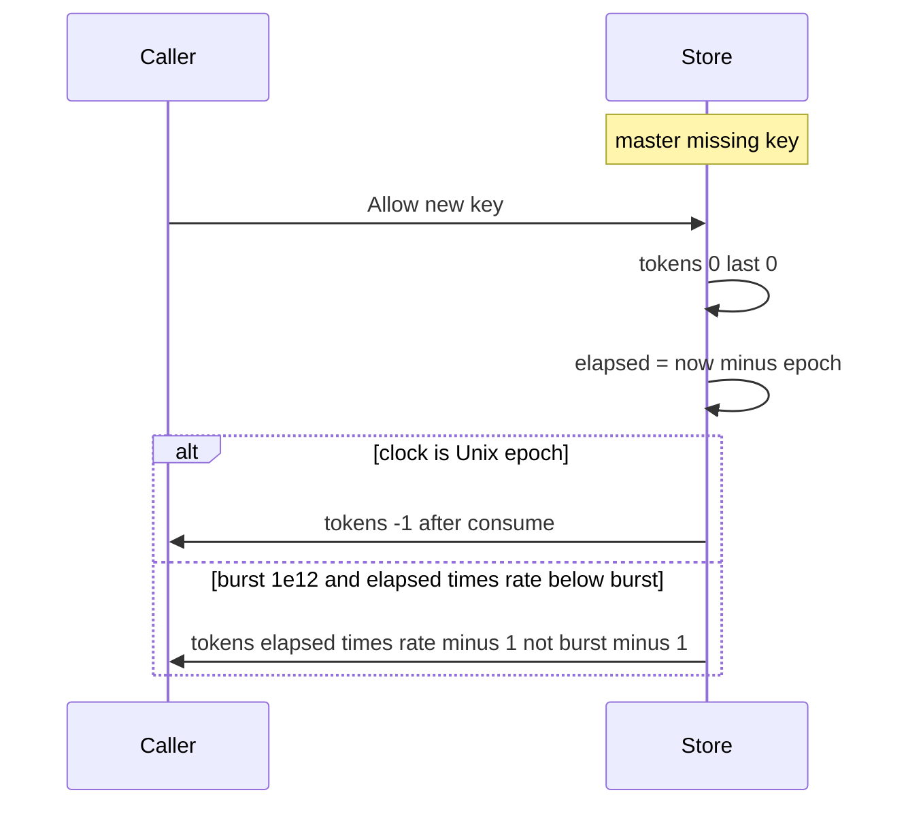

Developer review: ready for review — 2026-09-13T06:50:25Z

## What this changes
**Operators.** None.

**Admin users.** None.

**Developers.** Missing token-bucket state is a full bucket then consume 1: Lua empty `HGETALL` sets `tokens = burst` `last = t`; Memory new `memEntry` (including after TTL delete) starts the same; fake Redis missing hash matches. Tests at Unix epoch (burst 5) and burst `1e12`. Do not import `x/time/rate`.

**End users.** None.

## Motivation
A new token-bucket key is supposed to start full (`burst`) then consume 1. On master, Memory and Redis Lua seed missing state as `tokens=0` `last=0` and refill from elapsed since Unix epoch.

That fill is empty at `Unix(0,0)` (elapsed 0, first consume goes to `-1`). It is also short of burst when `burst` is huge (e.g. `1e12`) and `elapsed*rate` from epoch is still below burst — first Allow leaves about `1.7e9` tokens instead of `burst-1`. Existing unit tests freeze at `Unix(1_700_000_000)` with small burst, so they pass without proving a true full start.

If this stays unmerged, a new or TTL-expired key can under-grant relative to the Allow spec whenever elapsed-from-epoch cannot cover burst. Typical small burst at wall-clock now coincidentally looks full.

## Merge readiness
Apply landed. Seven-axis review is clean. CI on PR 56 succeeded. 0 items remain.

Priority: P2 — real under-grant on new keys when elapsed-from-epoch cannot cover burst; typical small burst at wall-clock now coincidentally fills
Reviewed head: 81db278
Owner decision: Required. See Explore Decisions.

## Review scores
| Measure | Result | What it means |
| --- | --- | --- |
| Overall readiness | 6/6 | Apply landed; seven-axis clean; CI succeeded |
| CI proof | 6/6 | All 8 checks succeeded on run 34743045134 |
| Local tests proof | N/A | Remote PR; CI proof covers remote |
| Review resolution | 6/6 | OPEN PR; no review comments |

## Verification
| Check | Result | Evidence |
| --- | --- | --- |
| Branch | 2026-09-13-tokenbucket-bug-idle-fill-burst pushed | `git` origin/2026-09-13-tokenbucket-bug-idle-fill-burst |
| OpenSpec | 2026-09-13-fill-new-key-to-burst (archived) | `openspec/changes/archive/2026-09-13-fill-new-key-to-burst/` |
| Pull request | https://github.com/david-garcia-garcia/traefik-middleware-utilities/pull/56 | pr-host List |
| CI | build 34743045134 succeeded https://github.com/david-garcia-garcia/traefik-middleware-utilities/actions/runs/34743045134 | pr-host CI |
| Local tests | passed | `go test -short -count=1 -timeout 60s ./tokenbucket` ok after 5ba03a1 |
| PR comments | no comments | no comments.md |

## Specs
- [std_go_tokenbucket_allow](https://github.com/david-garcia-garcia/traefik-middleware-utilities/blob/2026-09-13-tokenbucket-bug-idle-fill-burst/openspec/changes/archive/2026-09-13-fill-new-key-to-burst/proposal.md) — modified
- [std_go_tokenbucket_lua-eval](https://github.com/david-garcia-garcia/traefik-middleware-utilities/blob/2026-09-13-tokenbucket-bug-idle-fill-burst/openspec/changes/archive/2026-09-13-fill-new-key-to-burst/proposal.md) — modified

## Deviations from the ask
None.

## Follow-up issues
None.

## How this fits together
Local ticket 2026-09-13-tokenbucket-bug-idle-fill-burst is on its branch from origin/master. PR 56 is the durable card host. Change archived; CI succeeded.

## Explore Decisions
| Question | Rank | Decision | By |
| --- | --- | --- | --- |
| How is Redis empty-hash fill proved under `-short` without live engines? | additive asked | assumed — fake missing-hash seeds burst/now like Lua; same epoch and huge-burst cases on Redis/fake; `allowScript` contains the empty-hash seed; agreement still passes | explore |
| Does TTL-delete need its own epoch subtest? | additive asked | assumed — no extra epoch TTL subtest; one `memEntry` constructor then seed burst/`nowMicro`; existing TTL test stays as delete-then-Allow | explore |

## Before merge
None.

## Findings
None.

## Axis review
[Standards](https://github.com/david-garcia-garcia/traefik-middleware-utilities/blob/2026-09-13-tokenbucket-bug-idle-fill-burst/devstate/2026/09/2026-09-13-tokenbucket-bug-idle-fill-burst/codereview_standards.md) — 0 total, 0 pending, 0 completed
[Nitpicks](https://github.com/david-garcia-garcia/traefik-middleware-utilities/blob/2026-09-13-tokenbucket-bug-idle-fill-burst/devstate/2026/09/2026-09-13-tokenbucket-bug-idle-fill-burst/codereview_nitpicks.md) — 0 total, 0 pending, 0 completed
[Spec](https://github.com/david-garcia-garcia/traefik-middleware-utilities/blob/2026-09-13-tokenbucket-bug-idle-fill-burst/devstate/2026/09/2026-09-13-tokenbucket-bug-idle-fill-burst/codereview_spec.md) — 0 total, 0 pending, 0 completed
[Security](https://github.com/david-garcia-garcia/traefik-middleware-utilities/blob/2026-09-13-tokenbucket-bug-idle-fill-burst/devstate/2026/09/2026-09-13-tokenbucket-bug-idle-fill-burst/codereview_security.md) — 0 total, 0 pending, 0 completed
[Performance](https://github.com/david-garcia-garcia/traefik-middleware-utilities/blob/2026-09-13-tokenbucket-bug-idle-fill-burst/devstate/2026/09/2026-09-13-tokenbucket-bug-idle-fill-burst/codereview_performance.md) — 0 total, 0 pending, 0 completed
[Dead](https://github.com/david-garcia-garcia/traefik-middleware-utilities/blob/2026-09-13-tokenbucket-bug-idle-fill-burst/devstate/2026/09/2026-09-13-tokenbucket-bug-idle-fill-burst/codereview_dead.md) — 0 total, 0 pending, 0 completed
[Test coverage](https://github.com/david-garcia-garcia/traefik-middleware-utilities/blob/2026-09-13-tokenbucket-bug-idle-fill-burst/devstate/2026/09/2026-09-13-tokenbucket-bug-idle-fill-burst/codereview_coverage.md) — 0 total, 0 pending, 0 completed

## Agent review details

### Review metrics
| Metric | Value | Why it matters |
| --- | --- | --- |
| Specs in this PR | 0 added / 2 modified | Same list as ## Specs |
| Open reviewer comments walked | 0 FIX / 0 ANSWER / 0 open | Unanswered review is merge risk |
| Reviewed head | 81db2782d26ff86ed09d7d532ebd88368398728a | Card must match the branch you measured |

### Stored data model
- Changed: Redis hash per Allow key / field `last` — Unix microseconds string — sample at epoch miss `0` → now (`t`). Upgrade: existing hashes still valid; missing hash rewritten on next Allow.
- Changed: Redis hash per Allow key / field `tokens` — float string — sample at epoch miss `-1` → `burst-1`. Upgrade: existing hashes still valid; missing hash rewritten on next Allow.

### Technical review
Best possible solution: missing state is a full bucket then consume 1 on both stores; `consumeOne` stays consume math.

Do we have a high-confidence way to reproduce? Yes — FAIL at a432483 (`TestRepro_NewKeyFillsToBurstAtEpoch` five subtests: Memory epoch tokens=-1, huge 1.7e9, fake Redis same, script missing seed); PASS at 5ba03a1.

Is this the best way to solve the issue? Yes — seed Lua empty hash and Memory new `memEntry` full; fake missing hash matches Lua.

### Evidence
What I checked:
- FAIL `go test -short -count=1 -timeout 60s -run TestRepro_NewKeyFillsToBurstAtEpoch ./tokenbucket` at a432483 (all 5 subtests)
- PASS same test and `go test -short -count=1 -timeout 60s ./tokenbucket` after 5ba03a1
- MIT notice kept in `tokenbucket/lua.go`
- `openspec validate fill-new-key-to-burst --strict` valid
- OPEN PR 56; CI run 34743045134 succeeded (Lint, Unit, Unit race, Go E2E Redis, Go E2E Dragonfly, Integration Tests, Integration Tests Redis, Integration Tests Dragonfly)

### Rank-up moves
None.
