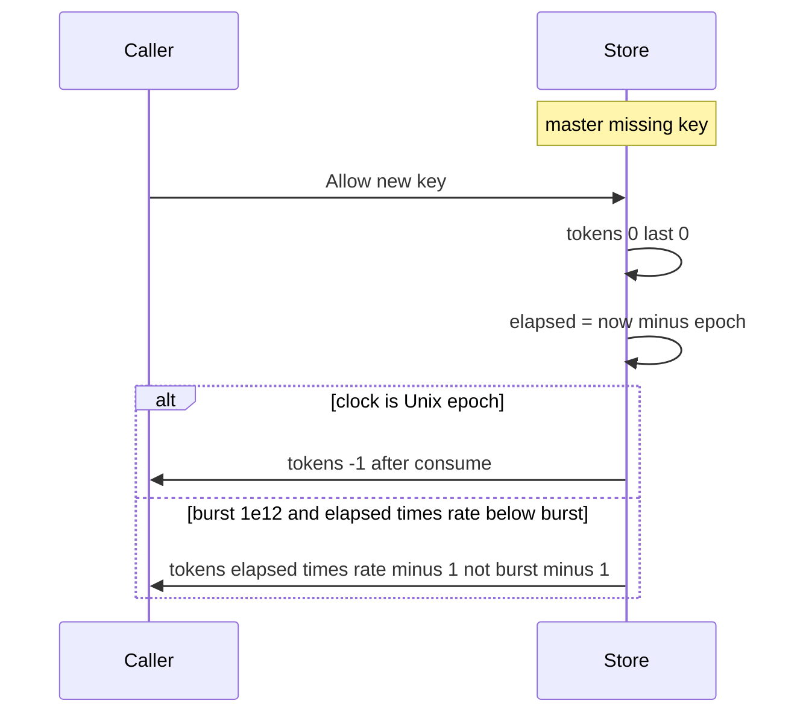

Developer review: in progress — 2026-09-13T06:17:21Z

## What this changes
**Operators.** None.

**Admin users.** None.

**Developers.** None.

**End users.** None.

## Motivation
A new token-bucket key is supposed to start full (`burst`) then consume 1. On master, Memory and Redis Lua seed missing state as `tokens=0` `last=0` and refill from elapsed since Unix epoch.

That fill is empty at `Unix(0,0)` (elapsed 0, first consume goes to `-1`). It is also short of burst when `burst` is huge (e.g. `1e12`) and `elapsed*rate` from epoch is still below burst — first Allow leaves about `1.7e9` tokens instead of `burst-1`. Existing unit tests freeze at `Unix(1_700_000_000)` with small burst, so they pass without proving a true full start.

If this stays unmerged, a new or TTL-expired key can under-grant relative to the Allow spec whenever elapsed-from-epoch cannot cover burst. Typical small burst at wall-clock now coincidentally looks full.

## Merge readiness
Explore reproduced dest under-grant and recorded proceed policy. Product apply has not started. 5 items remain.

Priority: P2 — real under-grant on new keys when elapsed-from-epoch cannot cover burst; typical small burst at wall-clock now coincidentally fills
Reviewed head: 24bb998
Owner decision: Required. See Explore Decisions.

## Review scores
| Measure | Result | What it means |
| --- | --- | --- |
| Overall readiness | 3/6 | Explore done; CI in progress; no product apply |
| CI proof | 3/6 | Checks queued on run 34742375672 |
| Local tests proof | N/A | Before implement |
| Review resolution | 6/6 | OPEN PR; no review comments |

## Verification
| Check | Result | Evidence |
| --- | --- | --- |
| Branch | 2026-09-13-tokenbucket-bug-idle-fill-burst pushed | `git` origin/2026-09-13-tokenbucket-bug-idle-fill-burst |
| OpenSpec | none | `openspec/` |
| Pull request | https://github.com/david-garcia-garcia/traefik-middleware-utilities/pull/56 | pr-host List |
| CI | build 34742375672 queued https://github.com/david-garcia-garcia/traefik-middleware-utilities/actions/runs/34742375672 | pr-host CI |
| Local tests | none | handoff.yaml localTests |
| PR comments | no comments | no comments.md |

## Specs
None.

## Deviations from the ask
None.

## Follow-up issues
None.

## How this fits together
Local ticket 2026-09-13-tokenbucket-bug-idle-fill-burst is on its branch from origin/master. Stub PR 56 is the durable card host. Explore reproduced dest Memory and fake Redis; propose is next.

## Explore Decisions
| Question | Rank | Decision | By |
| --- | --- | --- | --- |
| How is Redis empty-hash fill proved under `-short` without live engines? | additive asked | assumed — fake missing-hash seeds burst/now like Lua; same epoch and huge-burst cases on Redis/fake; `allowScript` contains the empty-hash seed; agreement still passes | explore |
| Does TTL-delete need its own epoch subtest? | additive asked | assumed — no extra epoch TTL subtest; one `memEntry` constructor then seed burst/`nowMicro`; existing TTL test stays as delete-then-Allow | explore |

## Before merge
- [ ] Tests that fail on dest (`epoch_clock` burst 5; `huge_burst_elapsed_below_burst` burst 1e12), then Lua empty-hash and Memory new-entry fill, then PASS
- [ ] Memory and Redis/fake still agree under `-short`
- [ ] CI succeeded on PR 56
- [x] Stub PR open
- [x] Requirement grounded on dest Lua and Memory
- [x] Dest failure reproduced (Memory epoch/huge; fake Redis epoch)

## Findings
None.

## Axis review
None.

## Agent review details

### Review metrics
| Metric | Value | Why it matters |
| --- | --- | --- |
| Specs in this PR | none | Same list as ## Specs |
| Open reviewer comments walked | 0 FIX / 0 ANSWER / 0 open | Unanswered review is merge risk |
| Reviewed head | 24bb99819bf953a5108f204dc2cef946c492e91f | Card must match the branch you measured |

### Stored data model
None.

### Technical review
Best possible solution: dest still uses Traefik `last=0` elapsed-from-epoch; the agreed fill is missing state = full burst then consume 1 on both stores.

Do we have a high-confidence way to reproduce? Yes — throwaway dest `Allow(ctx, key)` at `Unix(0,0)` burst 5 left `tokens=-1 last=0`; huge burst `1e12` at `Unix(1_700_000_000)` left `1.699999999e9`; fake Redis missing hash matched (`last=0 tokens=-1`).

Is this the best way to solve the issue? Yes — seed Lua empty hash and Memory new `memEntry` full, keep `consumeOne` as consume math, match fake missing hash to Lua.

### Evidence
What I checked:
- dest `tokenbucket/lua.go` empty HGETALL leaves tokens=0 last=0
- dest `tokenbucket/memory.go` `entry = &memEntry{}` then `consumeOne`
- dest `tokenbucket/fake_redis_test.go` missing hash seeds zeros then `consumeOne`
- throwaway `TestExploreMeasure_*` FAIL then deleted (Memory epoch/huge; fake Redis epoch)
- spec `openspec/specs/std_go_tokenbucket_allow/spec.md` Idle fills to burst
- research `knowledge/research/ext_traefik_ratelimiter_token-bucket/notes.md` Traefik Redis last=0
- OPEN PR 56; CI run 34742375672 queued

### Rank-up moves
None.
